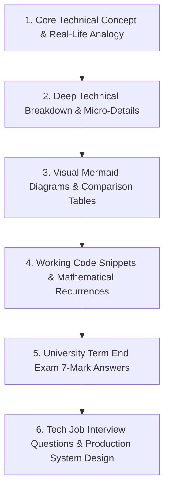

# 5th Semester Complete Exam & Tech Interview Master Guide

Welcome to the **100% Exhaustive Study Notes & Tech Interview Repository** for **5th Semester**.

> [!IMPORTANT]
> **Complete Syllabus Guarantee:** This guide covers **every single topic, sub-topic, formula, definition, small detail, code snippet, edge case, and diagram** from your syllabus and PDF e-notes — formatted exclusively as **7 Marks Long Questions**.

---

## 🚀 Learning Architecture

---

## 📚 Subject-Wise Exhaustive Syllabus Breakdown

### 1. 🤖 Artificial Intelligence (`ARTIFICIAL INTELLIGENCE/`)
- 🎯 [**AI CIA2 MCQ Question Bank**](file:///c:/Users/admin/Desktop/full_stack_development_2025/5th%20Semester/ARTIFICIAL%20INTELLIGENCE/CIA2_MCQ_Question_Bank.md) (All MCQs with Explanations)
- [**Unit 1: Introduction to AI & Intelligent Agents**](file:///c:/Users/admin/Desktop/full_stack_development_2025/5th%20Semester/ARTIFICIAL%20INTELLIGENCE/Unit_1_Term_End_Notes.md) (All 7 Marks Questions)
- [**Unit 2: Problem Solving & Search Techniques**](file:///c:/Users/admin/Desktop/full_stack_development_2025/5th%20Semester/ARTIFICIAL%20INTELLIGENCE/Unit_2_Term_End_Notes.md) (All 7 Marks Questions)
- [**Unit 3: Knowledge Representation, Logic & Machine Learning**](file:///c:/Users/admin/Desktop/full_stack_development_2025/5th%20Semester/ARTIFICIAL%20INTELLIGENCE/Unit_3_Term_End_Notes.md) (All 7 Marks Questions)

---

### 2. 🌐 Computer Networks (`s5_computer_network/`)
- 🎯 [**CN CIA2 MCQ Question Bank**](file:///c:/Users/admin/Desktop/full_stack_development_2025/5th%20Semester/s5_computer_network/CIA2_MCQ_Question_Bank.md) (All MCQs with Explanations)
- [**Unit 1: Introduction to Computer Networks**](file:///c:/Users/admin/Desktop/full_stack_development_2025/5th%20Semester/s5_computer_network/Unit_1_Term_End_Notes.md) (All 7 Marks Questions)
- [**Unit 2: The Reference Model, Topologies & Switching**](file:///c:/Users/admin/Desktop/full_stack_development_2025/5th%20Semester/s5_computer_network/Unit_2_Term_End_Notes.md) (All 7 Marks Questions)
- [**Unit 3: Transmission Media, IP Addressing & Routing**](file:///c:/Users/admin/Desktop/full_stack_development_2025/5th%20Semester/s5_computer_network/Unit_3_Term_End_Notes.md) (All 7 Marks Questions)
- [**Unit 4: Network Devices, Flow Control & Error Control**](file:///c:/Users/admin/Desktop/full_stack_development_2025/5th%20Semester/s5_computer_network/Unit_4_Term_End_Notes.md) (All 7 Marks Questions)
- [**Unit 5: Application Layer, Protocols, Security & CLI Commands**](file:///c:/Users/admin/Desktop/full_stack_development_2025/5th%20Semester/s5_computer_network/Unit_5_Term_End_Notes.md) (All 7 Marks Questions)

---

### 3. ⚡ Design and Analysis of Algorithms (`s5_design_and_analysis_of_algorithm/`)
- 🎯 [**DAA CIA2 MCQ Question Bank**](file:///c:/Users/admin/Desktop/full_stack_development_2025/5th%20Semester/s5_design_and_analysis_of_algorithm/CIA2_MCQ_Question_Bank.md) (All MCQs with Explanations)
- [**Unit 1: Asymptotic Notations & Recurrences**](file:///c:/Users/admin/Desktop/full_stack_development_2025/5th%20Semester/s5_design_and_analysis_of_algorithm/Unit_1_Term_End_Notes.md) (All 7 Marks Questions)
- [**Unit 2: Divide & Conquer Paradigm & Matrix Multiplication**](file:///c:/Users/admin/Desktop/full_stack_development_2025/5th%20Semester/s5_design_and_analysis_of_algorithm/Unit_2_Term_End_Notes.md) (All 7 Marks Questions)
- [**Unit 3: Greedy Approach, MSTs & Shortest Paths**](file:///c:/Users/admin/Desktop/full_stack_development_2025/5th%20Semester/s5_design_and_analysis_of_algorithm/Unit_3_Term_End_Notes.md) (All 7 Marks Questions)
- [**Unit 4: Dynamic Programming, Backtracking & Complexity Classes**](file:///c:/Users/admin/Desktop/full_stack_development_2025/5th%20Semester/s5_design_and_analysis_of_algorithm/Unit_4_Term_End_Notes.md) (All 7 Marks Questions)
- [**Unit 5: String Matching Algorithms, Complexity Classes P & NP, and Polynomial-Time Reductions**](file:///c:/Users/admin/Desktop/full_stack_development_2025/5th%20Semester/s5_design_and_analysis_of_algorithm/Unit_5_Term_End_Notes.md) (All 7 Marks Questions)

---

### 4. 🐍 Python with Django (`s5_python_with_django/`)
- 🎯 [**Python/Django CIA2 MCQ Question Bank**](file:///c:/Users/admin/Desktop/full_stack_development_2025/5th%20Semester/s5_python_with_django/CIA2_MCQ_Question_Bank.md) (All MCQs with Explanations)
- [**Unit 1: Python Core, OOP & Advanced Fundamentals**](file:///c:/Users/admin/Desktop/full_stack_development_2025/5th%20Semester/s5_python_with_django/Unit_1_Term_End_Notes.md) (All 7 Marks Questions)
- [**Unit 2: Django Web Architecture, Views, URLs & Templates**](file:///c:/Users/admin/Desktop/full_stack_development_2025/5th%20Semester/s5_python_with_django/Unit_2_Term_End_Notes.md) (All 7 Marks Questions)
- [**Unit 3: Django ORM, Models, Migrations & DB Operations**](file:///c:/Users/admin/Desktop/full_stack_development_2025/5th%20Semester/s5_python_with_django/Unit_3_Term_End_Notes.md) (All 7 Marks Questions)
