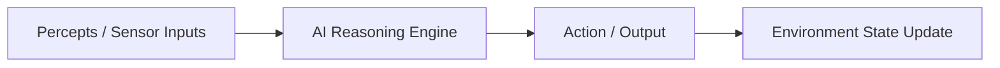
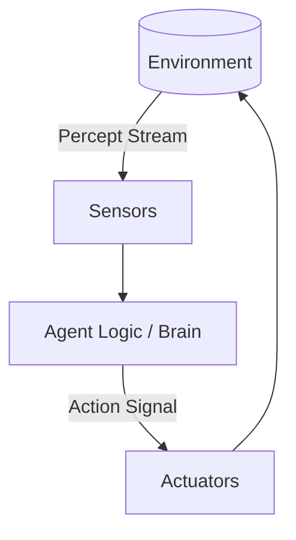
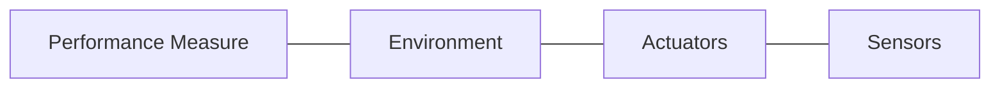
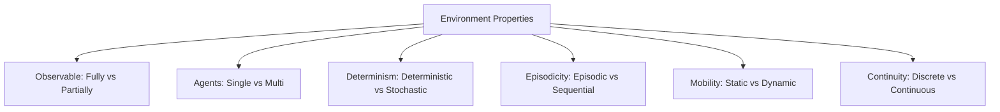
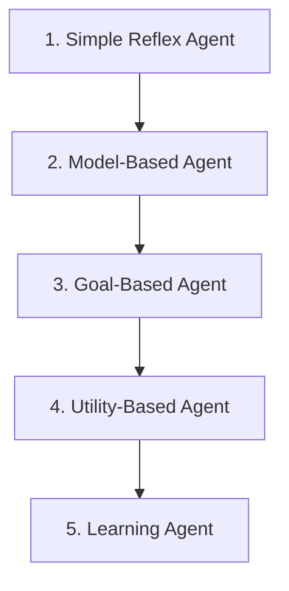
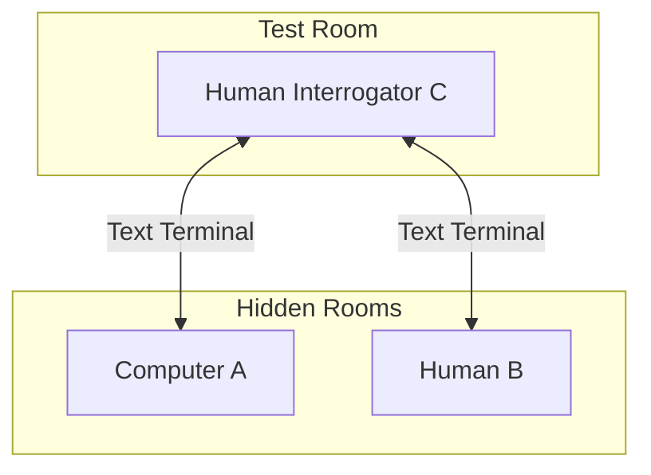
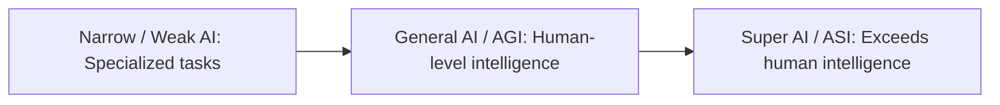
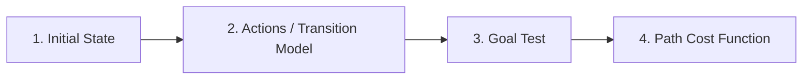
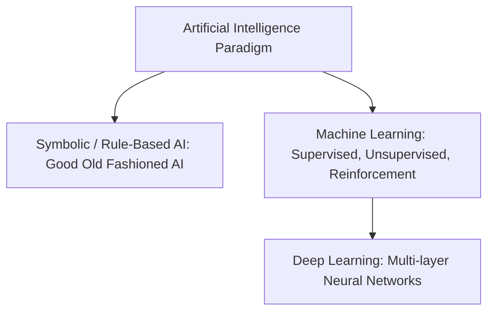

# Unit 1: Introduction to AI & Intelligent Agents - Term End Exam Notes (All 7 Marks Questions)

---

## Q1. What is Artificial Intelligence? Discuss the Four Views / Definitions of AI with examples. (7 Marks)

**Answer:**

**Artificial Intelligence (AI)** is the subfield of computer science dedicated to building software and hardware systems capable of performing tasks that traditionally require human intelligence, such as visual perception, speech recognition, decision-making, and problem-solving.

### The Four Views of AI

AI definitions are categorized along two dimensions: **Thought processes vs. Behavior** and **Human performance vs. Rational performance**.

| Dimension | **Like a Human** | **Rationally (Ideally Correct)** |
| :--- | :--- | :--- |
| **Thinking** | **1. Thinking Humanly:** Cognitive science & neural modeling of human brain processes. | **2. Thinking Rationally:** Laws of thought, formal logic, and deductive syllogisms. |
| **Acting** | **3. Acting Humanly:** Turing Test approach, behaving indistinguishably from humans. | **4. Acting Rationally:** Rational Agent approach, taking actions to achieve the best expected outcome. |

1. **Thinking Humanly (Cognitive Modeling):**
   - Focuses on determining how human brains think by studying cognitive psychology and neuroimaging (fMRI).
   - *Example:* Cognitive architectures (ACT-R, SOAR) simulating human memory recall and decision latency.

2. **Thinking Rationally (Laws of Thought):**
   - Relies on strict mathematical logic (e.g., "All humans are mortal; Socrates is human; therefore Socrates is mortal").
   - *Example:* Logic programming engines (Prolog) deriving conclusions from formal knowledge bases.

3. **Acting Humanly (Turing Test Approach):**
   - Emphasizes behavioral capability rather than internal brain replication.
   - *Example:* Modern conversational AI agents capable of passing natural dialogue evaluation tests.

4. **Acting Rationally (Rational Agent Approach):**
   - Focuses on autonomous agents that act to maximize their performance measure given available information.
   - *Example:* Autonomous drone navigation optimizing flight path safety and fuel consumption.

---

## Q2. Explain the concept of Intelligent Agents and the PEAS Framework with detailed examples. (7 Marks)

**Answer:**

An **Intelligent Agent** is an entity that perceives its environment through **sensors** and acts upon that environment through **actuators**.

- **Percept:** The current sensor input of an agent at any given instant.
- **Percept Sequence:** The complete history of all percepts received by the agent since inception.
- **Agent Function ($f$):** An abstract mathematical mapping from percept sequence to action ($f: P^* \to A$).
- **Agent Program:** The concrete software implementation executing on the physical agent architecture.

### PEAS Framework
To design a rational agent, we must specify its **PEAS** (Performance Measure, Environment, Actuators, Sensors) profile:

### PEAS Examples Table for Standard AI Domains:

| Agent Type | Performance Measure | Environment | Actuators | Sensors |
| :--- | :--- | :--- | :--- | :--- |
| **Automated Taxi Driver** | Safety, speed, legal compliance, passenger comfort, max profit. | City streets, traffic, pedestrians, weather. | Steering, accelerator, brakes, horn, turn signals. | Cameras, LiDAR, Radar, GPS, odometer, speedometer. |
| **Medical Diagnostic System** | Healthy patient, minimized costs, accurate diagnosis. | Patient, hospital staff, laboratory data. | Displayed diagnosis, test recommendations. | Keyboard (symptoms input), lab readings. |
| **Spam Filter Agent** | High precision (no false positives), high recall (catches spam). | Email inbox, incoming email stream. | Move to spam folder, flag message, mark clean. | Email headers, body text, links, sender IP. |
| **Vacuum Cleaner Robot** | Cleanliness score, time spent, battery usage. | Floor, carpet, furniture, dirt, obstacles. | Wheels, suction motor, brush assembly. | Bump sensor, cliff sensor, optical dirt sensor. |

---

## Q3. Discuss all Environment Properties in AI with comparative examples. (7 Marks)

**Answer:**

The difficulty of agent design is determined by the properties of the operating environment:

1. **Fully Observable vs. Partially Observable:**
   - *Fully Observable:* Sensors give complete access to full state at any time (e.g., **Chess**).
   - *Partially Observable:* Noise, inaccurate sensors, or unobserved variables obscure state (e.g., **Poker**, **Self-driving car in fog**).

2. **Single-Agent vs. Multi-Agent:**
   - *Single-Agent:* Agent operates independently without other decision-makers (e.g., **Sudoku solver**).
   - *Multi-Agent:* Includes competitive agents (Chess) or cooperative agents (Autonomous traffic management).

3. **Deterministic vs. Stochastic:**
   - *Deterministic:* Next state is completely determined by current state and agent action (e.g., **Tic-Tac-Toe**).
   - *Stochastic:* Next state contains randomness/uncertainty (e.g., **Ludo with dice**, **Real-world driving**).

4. **Episodic vs. Sequential:**
   - *Episodic:* Each episode is independent; current action does not affect future choices (e.g., **Defective part inspection on conveyor**).
   - *Sequential:* Current action influences all future states and choices (e.g., **Chess**, **Stock trading**).

5. **Static vs. Dynamic:**
   - *Static:* Environment does not change while agent is deliberating (e.g., **Crossword puzzle**).
   - *Dynamic:* Environment continuously changes while agent decides (e.g., **Taxi driving**).

6. **Discrete vs. Continuous:**
   - *Discrete:* Finite, distinct number of states and actions (e.g., **Chess**).
   - *Continuous:* Smooth, infinite range of continuous variables (e.g., **Robot arm position, velocity**).

---

## Q4. Explain the Five Basic Agent Architectures with structural block diagrams. (7 Marks)

**Answer:**

Agents are classified into five structures based on internal complexity:

### 1. Simple Reflex Agent
Acts based **only on the current percept**, ignoring history. Uses condition-action rules (`IF condition THEN action`).
- *Limitation:* Fails in partially observable environments.

### 2. Model-Based Reflex Agent
Maintains an **internal state** (world model) to track unobserved aspects of the environment.
- *Mechanism:* Updates state using: (1) How the world evolves, (2) How the agent's actions affect the world.

### 3. Goal-Based Agent
Combines internal state with explicit **goal descriptions** to evaluate which action will reach the desired state.
- *Mechanism:* Uses planning and search algorithms.

### 4. Utility-Based Agent
Uses a continuous **utility function** ($U: S \to \mathbb{R}$) to measure how *desirable* a state is, enabling trade-offs between competing goals (e.g., speed vs. safety).

### 5. Learning Agent
Divided into four components:
- **Learning Element:** Responsible for making improvements.
- **Performance Element:** Selects external actions (the traditional agent).
- **Critic:** Gives feedback on agent performance relative to a fixed standard.
- **Problem Generator:** Suggests exploratory actions to gain new experiences.

---

## Q5. What is the Turing Test? Explain its Setup, Variations, and Searle's Chinese Room Objection. (7 Marks)

**Answer:**

Proposed by **Alan Turing (1950)** in *"Computing Machinery and Intelligence"*, the **Turing Test** tests operational machine intelligence.

### Test Setup & Rule:
1. Human interrogator ($C$) communicates via text terminal with a computer ($A$) and a human ($B$).
2. $C$ asks questions to identify which is human and which is machine.
3. If $C$ cannot reliably tell the computer from the human after 5 minutes, the computer passes.

### Total Turing Test (Adds Physical Capabilities):
Includes **Computer Vision** (to perceive objects) and **Robotics** (to manipulate physical objects).

### Searle's Chinese Room Thought Experiment (Objection):
John Searle argued that passing the Turing Test does **not** prove true thinking or consciousness.
- *Analogy:* A person inside a room who doesn't know Chinese uses a rulebook (program) to match incoming Chinese symbols with output Chinese symbols. To outside observers, the person appears to speak Chinese, but in reality, they only manipulate symbols without **syntactic understanding** or **semantic intentionality**.

---

## Q6. Differentiate between Weak AI vs Strong AI, Narrow AI vs General AI (AGI), and Super AI (ASI). (7 Marks)

**Answer:**

### Definitions & Comparison:

1. **Weak / Narrow AI:**
   - Designed and trained for a **single specific task**. Cannot generalize knowledge to other domains.
   - *Examples:* AlphaGo, Siri, FaceID, Spam filters.

2. **Strong AI / Artificial General Intelligence (AGI):**
   - Theoretical AI possessing human-level cognitive capabilities across any intellectual task. Can reason, plan, learn, and transfer knowledge autonomously across domains.

3. **Artificial Superintelligence (ASI):**
   - Theoretical future AI that surpasses human intellect across every domain, including scientific creativity, social wisdom, and general problem solving.

---

## Q7. Explain AI Problem Formulation. What are the 5 Building Blocks of a Formulated Problem? Illustrate with the 8-Puzzle Problem. (7 Marks)

**Answer:**

In AI, **Problem Formulation** is the process of deciding what actions and states to consider, given a goal.

### The 5 Building Blocks:
1. **Initial State:** The state where the agent begins.
2. **Actions:** The set of legal moves $A(s)$ available in state $s$.
3. **Transition Model:** Returns the state resulting from doing action $a$ in state $s$: $\text{Result}(s, a)$.
4. **Goal Test:** Determines whether a given state is the goal state.
5. **Path Cost:** Function assigning a numeric cost to a path.

### 8-Puzzle Problem Formulation Case Study:
- **States:** A configuration of 8 numbered tiles (1–8) and 1 blank space on a $3 \times 3$ grid.
- **Initial State:** Any arbitrary starting arrangement of tiles.
- **Actions:** Move the blank space `{Left, Right, Up, Down}`.
- **Transition Model:** Moves blank tile to adjacent position, swapping with neighboring tile.
- **Goal Test:** Tiles arranged in numerical order `[1 2 3; 4 5 6; 7 8 _]`.
- **Path Cost:** Each move has a cost of $1$ (Path cost = total number of steps).

---

## Q8. Explain AI Techniques and Paradigms (Symbolic AI, Machine Learning, Deep Learning) and Ethics/Challenges in AI. (7 Marks)

**Answer:**

AI encompasses multiple technological paradigms and ethical considerations.

### 1. Key AI Paradigms:
- **Symbolic AI (Rule-Based):** Uses explicit logic rules and symbol manipulation (Expert Systems).
- **Machine Learning (ML):** Learns statistical patterns from data without explicit programming.
- **Deep Learning (DL):** Uses multi-layered Artificial Neural Networks (ANNs) for high-dimensional data (Images, Speech, LLMs).

### 2. Major Ethical Challenges in AI:
- **Bias & Fairness:** Training data biases lead to discriminatory model predictions.
- **Transparency & Explainability (XAI):** Solving the "Black Box" problem where deep models cannot explain *why* a decision was made.
- **Privacy & Surveillance:** Facial recognition and data mining risks.
- **Accountability:** Assigning legal responsibility for autonomous failure (e.g., self-driving crashes).
