# Unit 2: Problem Solving & Search Techniques - Term End Exam Notes (All 7 Marks Questions)

---

## Q1. Explain Problem Formulation in AI. What are the 5 components of a Problem Definition? Contrast State Space vs Search Tree. (7 Marks)

**Answer:**

In AI, **Problem Formulation** is the process of deciding what actions and states to consider, given a goal.

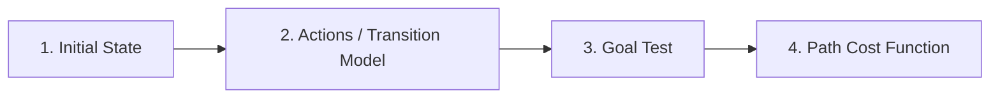

### 1. The 5 Components of Problem Definition:
1. **Initial State:** The starting point of the agent (e.g., `In(Arad)`).
2. **Actions:** The set of executable choices available to the agent at state $s$: $A(s)$.
3. **Transition Model:** A description of what each action does: $\text{Result}(s, a) = s'$.
4. **Goal Test:** A function determining whether a given state is a goal state (e.g., `State == In(Bucharest)`).
5. **Path Cost:** A function assigning a numeric cost to a path, typically sum of step costs $c(s, a, s')$.

### 2. State Space vs Search Tree:
- **State Space:** The set of all possible physical or abstract states reachable from initial state.
- **Search Tree:** A tree graph generated by expanding paths through state space. Multiple nodes in search tree can represent the exact same state (due to cycles/redundant paths).

---

## Q2. Explain Uninformed Search Strategies in detail: BFS, DFS, UCS, DLS, IDDFS, Bidirectional Search. (7 Marks)

**Answer:**

**Uninformed Search (Blind Search)** strategies have no domain-specific knowledge about the distance from a state to the goal.

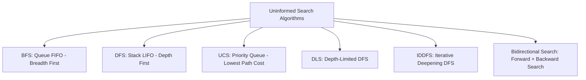

### Detailed Breakdown of Algorithms:

1. **Breadth-First Search (BFS):**
   - Expands root node first, then expands all nodes at depth 1, depth 2, etc. (Uses FIFO Queue).
   - **Completeness:** Complete (if branching factor $b$ is finite).
   - **Optimality:** Optimal if step cost = 1.
   - **Time Complexity:** $O(b^d)$
   - **Space Complexity:** $O(b^d)$ (High memory requirement).

2. **Depth-First Search (DFS):**
   - Expands deepest node in the search tree (Uses LIFO Stack).
   - **Completeness:** Incomplete in infinite spaces.
   - **Optimality:** Non-optimal.
   - **Time Complexity:** $O(b^m)$ (where $m$ is max depth).
   - **Space Complexity:** $O(b \cdot m)$ (Linear memory requirement).

3. **Uniform Cost Search (UCS / Dijkstra's Search):**
   - Expands node $n$ with lowest cumulative path cost $g(n)$ using Priority Queue.
   - **Completeness:** Complete if step cost $\ge \epsilon > 0$.
   - **Optimality:** Optimal for arbitrary positive step costs.
   - **Time & Space Complexity:** $O(b^{1 + \lfloor C^* / \epsilon \rfloor})$

4. **Iterative Deepening DFS (IDDFS):**
   - Combines spatial efficiency of DFS with completeness of BFS by running DLS with increasing limit $L = 0, 1, 2, \dots, d$.
   - **Time Complexity:** $O(b^d)$
   - **Space Complexity:** $O(b \cdot d)$

### Summary Comparison Table:

| Criterion | BFS | DFS | UCS | DLS | IDDFS | Bidirectional |
| :--- | :--- | :--- | :--- | :--- | :--- | :--- |
| **Complete?** | Yes | No | Yes | No (if $L < d$) | Yes | Yes |
| **Optimal?** | Yes (unit cost) | No | Yes | No | Yes (unit cost) | Yes |
| **Time** | $O(b^d)$ | $O(b^m)$ | $O(b^{1 + \lfloor C^* / \epsilon \rfloor})$ | $O(b^L)$ | $O(b^d)$ | $O(b^{d/2})$ |
| **Space** | $O(b^d)$ | $O(b \cdot m)$ | $O(b^{1 + \lfloor C^* / \epsilon \rfloor})$ | $O(b \cdot L)$ | $O(b \cdot d)$ | $O(b^{d/2})$ |

---

## Q3. Explain $A^*$ Search Algorithm. Discuss Admissibility and Consistency of Heuristics with proofs. (7 Marks)

**Answer:**

**$A^*$ Search** is an **Informed (Heuristic) Search** algorithm that evaluates nodes using:

$$f(n) = g(n) + h(n)$$

- $g(n)$: Actual cost from start node to node $n$.
- $h(n)$: Estimated heuristic cost from node $n$ to goal.
- $f(n)$: Estimated total cost of cheapest path through $n$ to goal.

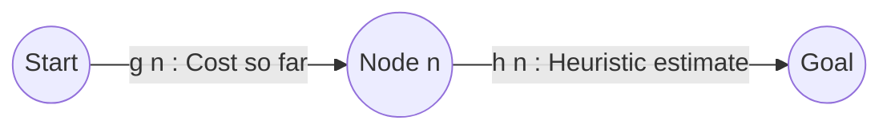

### 1. Admissibility of Heuristic ($h(n)$):
A heuristic $h(n)$ is **admissible** if it **never overestimates** the true cost to reach the goal.

$$0 \le h(n) \le h^*(n)$$

- *Theorem:* If $h(n)$ is admissible, $A^*$ using **Tree Search** is **guaranteed to be optimal**.

### 2. Consistency (Monotonicity) of Heuristic:
A heuristic $h(n)$ is **consistent** if for every node $n$ and every successor $n'$ generated by action $a$ with step cost $c(n, a, n')$:

$$h(n) \le c(n, a, n') + h(n')$$

- *Theorem:* If $h(n)$ is consistent, $f(n)$ is non-decreasing along any path, and $A^*$ using **Graph Search** is **optimal without needing to re-open nodes**.

---

## Q4. Explain Hill Climbing Search Variants (Simple, Steepest-Ascent, Stochastic) and major failures (Local Maxima, Ridge, Plateau) with solutions. (7 Marks)

**Answer:**

**Hill Climbing** is a local search algorithm that iteratively moves towards neighbor states with higher evaluation values.

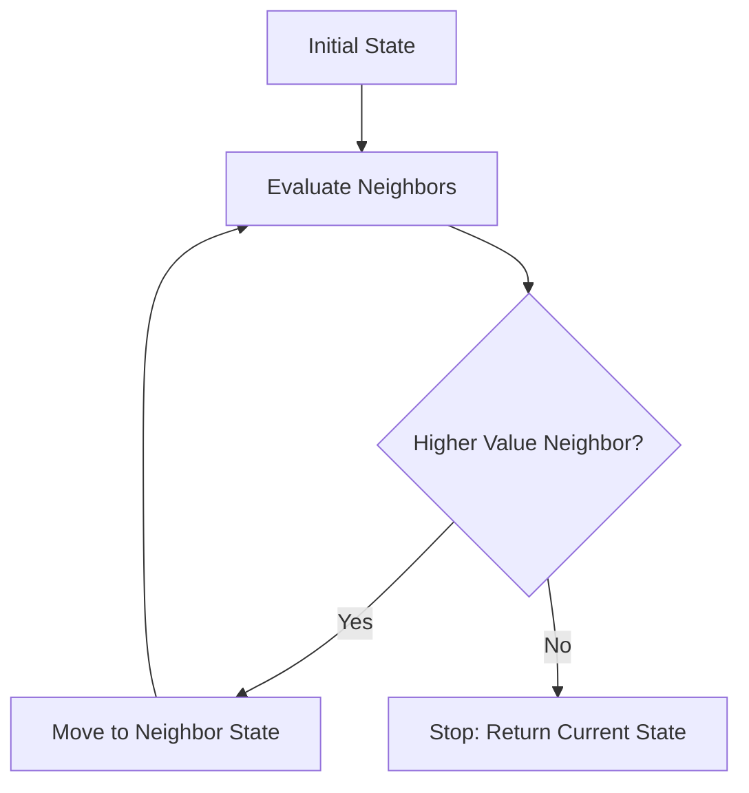

### 1. Variants of Hill Climbing:
- **Simple Hill Climbing:** Moves to the *first* neighbor that improves evaluation.
- **Steepest-Ascent Hill Climbing:** Evaluates *all* neighbors and picks the one with the *highest* improvement.
- **Stochastic Hill Climbing:** Chooses randomly among uphill neighbors based on steepness probability.

### 2. Three Major Limitations & Solutions:
- **Local Maxima:** Peak higher than neighbors but lower than global maximum. *Fix:* **Random-Restart Hill Climbing**.
- **Plateaus / Shoulders:** Flat region where neighbors have identical values. *Fix:* **Allow Sideways Moves**.
- **Ridges:** Sequence of local maxima with steep drops in non-cardinal directions. *Fix:* **Simulated Annealing** ($P = e^{-\Delta E / T}$).

---

## Q5. Illustrate the 8-Queens Problem using Local Search and Constraint Satisfaction formulation. (7 Marks)

**Answer:**

The **8-Queens Problem** requires placing 8 queens on an $8 \times 8$ chessboard such that no two queens attack each other (same row, column, or diagonal).

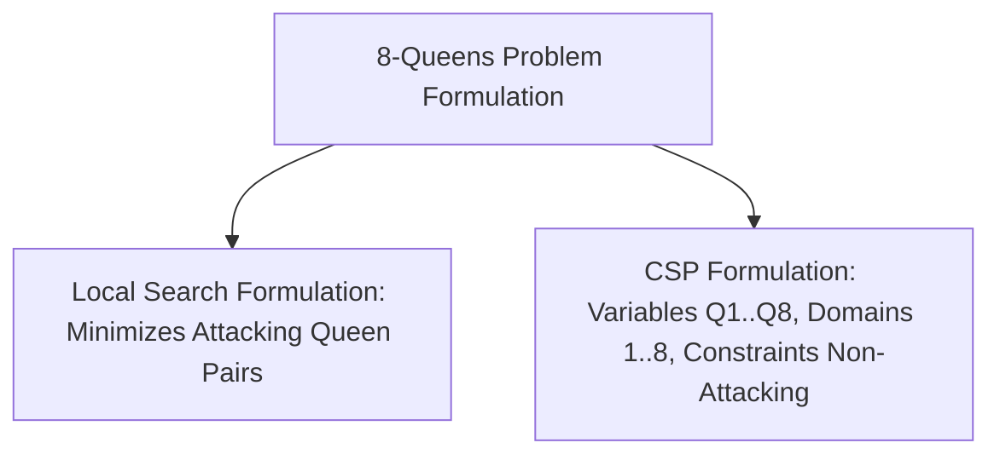

- **States:** All 8 queens on board, 1 per column. State space size = $8^8 = 16,777,216$.
- **Heuristic $h(n)$:** Number of pairs of queens attacking each other directly or indirectly.
- **Goal State:** $h(n) = 0$ (Zero attacking pairs).
- **Steepest-Ascent Performance:** Finds solution ~14% of time from random start; with 100 sideways moves limit, success jumps to 94%!

---

## Q6. What is a Constraint Satisfaction Problem (CSP)? Explain Backtracking Search, Heuristics (MRV, LCV, Degree), and AC-3 Algorithm. (7 Marks)

**Answer:**

A **Constraint Satisfaction Problem (CSP)** represents states as a set of variables $X = \{X_1, \dots, X_n\}$, domains $D = \{D_1, \dots, D_n\}$, and constraints $C = \{C_1, \dots, C_m\}$.

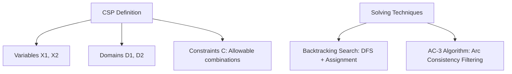

### 1. Backtracking Search & Heuristics:
- **MRV (Minimum Remaining Values):** Pick variable with fewest legal values left ("Fail-first").
- **Degree Heuristic:** Pick variable involved in most constraints on unassigned variables.
- **LCV (Least Constraining Value):** Pick value that rules out fewest choices for neighbors.

### 2. AC-3 (Arc Consistency Algorithm):
- Enforces arc consistency across variable pairs $X_i \to X_j$. Maintains a queue of arcs, removing values from $D_i$ that have no valid match in $D_j$ to prune search space.

---

## Q7. Explain Minimax Algorithm and Alpha-Beta Pruning with a step-by-step numerical tree trace. (7 Marks)

**Answer:**

The **Minimax Algorithm** is used in two-player zero-sum games (e.g., Chess, Tic-Tac-Toe).

- **MAX:** Chooses action maximizing utility.
- **MIN:** Chooses action minimizing utility.

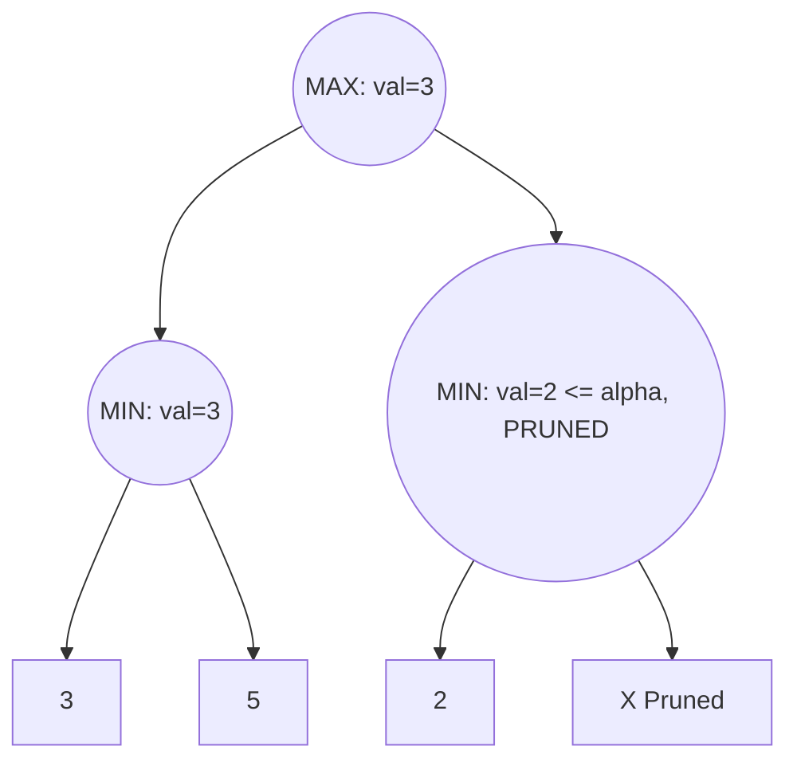

### Alpha-Beta Pruning Rules:
- $\alpha$ = Best (highest) value MAX can guarantee so far. (Initial: $-\infty$)
- $\beta$ = Best (lowest) value MIN can guarantee so far. (Initial: $+\infty$)
- **Prune Condition:** Cut off subtree whenever $\alpha \ge \beta$.

### Time Complexity:
- Minimax: $O(b^m)$
- Alpha-Beta (with optimal move ordering): $O(b^{m/2})$ (Doubles search depth achievable).

---

## Q8. Explain State Space Representation in AI with a Complete Worked Example of the 4-Litre and 3-Litre Water Jug Problem. Trace the Step-by-Step State Transitions to Measure 2 Litres of Water. (7 Marks)

**Answer:**

In Artificial Intelligence, **State Space Representation** models a problem as a set of discrete states connected by valid action transitions.

A state is a complete snapshot of the system at any given moment without requiring historical memory.

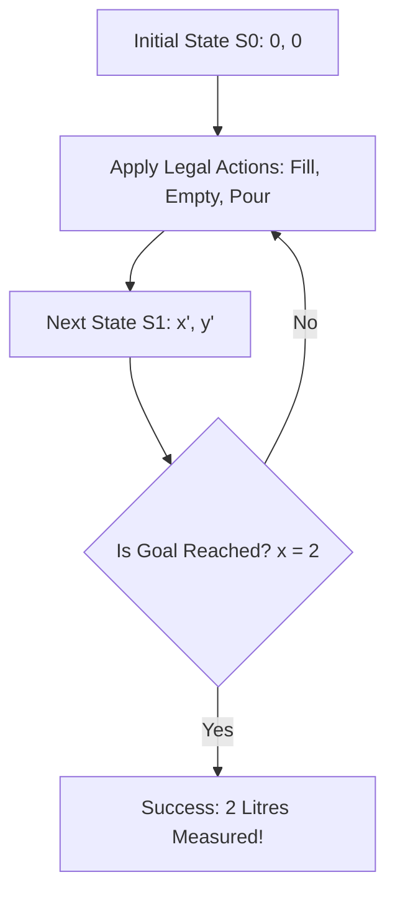

---

### 1. Problem Formulation of the Water Jug Problem:

- **State Representation:** A pair $(x, y)$, where:
  - $x$ = Volume of water in the 4-litre jug ($0 \le x \le 4$).
  - $y$ = Volume of water in the 3-litre jug ($0 \le y \le 3$).
- **Initial State:** $(0, 0)$ — Both jugs are empty.
- **Goal State:** $(2, y)$ — Exactly 2 litres of water in the 4-litre jug.
- **Path Cost:** $1$ per action.

---

### 2. Available Rules / Production Actions:

| Rule # | Action Name | Condition Premise | Resulting State | Description |
| :--- | :--- | :--- | :--- | :--- |
| **1** | Fill 4L | $x < 4$ | $(4, y)$ | Fill the 4L jug to capacity. |
| **2** | Fill 3L | $y < 3$ | $(x, 3)$ | Fill the 3L jug to capacity. |
| **3** | Empty 4L | $x > 0$ | $(0, y)$ | Empty all water from the 4L jug. |
| **4** | Empty 3L | $y > 0$ | $(x, 0)$ | Empty all water from the 3L jug. |
| **5** | Pour 4L $\to$ 3L | $x + y \ge 3 \land x > 0$ | $(x - (3 - y), 3)$ | Pour from 4L into 3L until 3L is full. |
| **6** | Pour 3L $\to$ 4L | $x + y \ge 4 \land y > 0$ | $(4, y - (4 - x))$ | Pour from 3L into 4L until 4L is full. |
| **7** | Pour 4L $\to$ 3L | $x + y \le 3 \land x > 0$ | $(0, x + y)$ | Pour all water from 4L into 3L. |
| **8** | Pour 3L $\to$ 4L | $x + y \le 4 \land y > 0$ | $(x + y, 0)$ | Pour all water from 3L into 4L. |

---

### 3. Step-by-Step Execution Trace to Reach Goal State $(2, y)$:

#### Detailed State Transition Table:

| Step # | Current State $(x, y)$ | Applied Action Rule | Physical Operation | New State $(x, y)$ | Cumulative Cost |
| :-: | :-: | :--- | :--- | :-: | :-: |
| **0** | $(0, 0)$ | — | Initial state; both jugs empty. | $(0, 0)$ | 0 |
| **1** | $(0, 0)$ | Rule 1 (Fill 4L) | Fill the 4-litre jug completely from tap. | $(4, 0)$ | 1 |
| **2** | $(4, 0)$ | Rule 5 (Pour 4L $\to$ 3L) | Pour from 4L to 3L until 3L jug is full (leaves 1L in 4L). | $(1, 3)$ | 2 |
| **3** | $(1, 3)$ | Rule 4 (Empty 3L) | Dump out all water from the 3L jug. | $(1, 0)$ | 3 |
| **4** | $(1, 0)$ | Rule 7 (Pour 4L $\to$ 3L) | Transfer the 1L from 4L jug into empty 3L jug. | $(0, 1)$ | 4 |
| **5** | $(0, 1)$ | Rule 1 (Fill 4L) | Fill the 4-litre jug completely again. | $(4, 1)$ | 5 |
| **6** | $(4, 1)$ | Rule 5 (Pour 4L $\to$ 3L) | Pour from 4L to 3L (needs 2L to fill 3L); leaves exactly **2L in 4L jug**. | **$(2, 3)$** | **6** |

- **Conclusion:** Goal state $(2, 3)$ is reached in **6 actions**, successfully measuring 2 litres of water.

---

## Q9. Compare Greedy Best-First Search vs $A^*$ Search Algorithm. Show a Step-by-Step Numerical Counter-Example Where Greedy Best-First Fails to Find the Optimal Path while $A^*$ Succeeds. (7 Marks)

**Answer:**

Both **Greedy Best-First Search** and **$A^*$ Search** are informed (heuristic) search techniques, but they differ fundamentally in how they evaluate candidate nodes.

---

### 1. Direct Comparison Matrix:

| Feature / Dimension | Greedy Best-First Search | $A^*$ Search Algorithm |
| :--- | :--- | :--- |
| **Evaluation Function** | $f(n) = h(n)$ | $f(n) = g(n) + h(n)$ |
| **Factors Considered** | **Only** estimated cost to goal $h(n)$. | **Both** actual cost paid $g(n)$ **AND** estimated cost $h(n)$. |
| **Strategy Philosophy** | "Greedy" (chases node that looks closest right now). | Balanced (balances progress so far with future estimate). |
| **Optimality Guarantee** | **Not Optimal** (ignores accumulated cost $g(n)$). | **Optimal** (if $h(n)$ is admissible: $0 \le h(n) \le h^*(n)$). |
| **Search Traversal** | Fast, but prone to misleading heuristic traps. | Systematic; prunes expensive paths safely. |
| **Sensitivity to $h(n)$** | Extremely high; easily tricked by low $h(n)$ values. | Robust; $g(n)$ acts as a check against misleading $h(n)$. |

---

### 2. Numerical Counter-Example Graph:

Consider finding the shortest path from Start ($S$) to Goal ($G$):

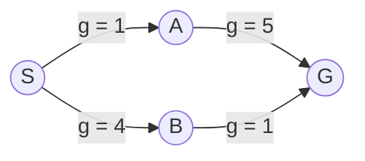

#### Node Heuristic Values $h(n)$ (Estimated remaining distance to $G$):
- $h(S) = 3$
- $h(A) = 0$ *(Misleadingly low heuristic; looks right next to goal)*
- $h(B) = 1$
- $h(G) = 0$

#### True Actual Route Costs:
- **Path 1 ($S \to A \to G$):** Actual cost = $1 + 5 = \mathbf{6}$
- **Path 2 ($S \to B \to G$):** Actual cost = $4 + 1 = \mathbf{5}$  *(True Optimal Path)*

---

### 3. Step-by-Step Execution Comparison Trace:

#### A. Greedy Best-First Search Trace ($f(n) = h(n)$):

| Step | Node Expanded | Current $h(n)$ | Priority Queue Frontier (Ordered by $h(n)$) | Action |
| :-: | :-: | :-: | :--- | :--- |
| **1** | $S$ | $h=3$ | $[ (h=3, S) ]$ | Pop $S$. Expand neighbors $A$ ($h=0$) and $B$ ($h=1$). |
| **2** | $A$ | $h=0$ | $[ (h=0, A), (h=1, B) ]$ | Pop $A$ (lowest $h$). Expand neighbor $G$ ($h=0$). |
| **3** | $G$ | $h=0$ | $[ (h=0, G), (h=1, B) ]$ | **Goal $G$ popped! Stop search.** |

- **Greedy Path Found:** $S \to A \to G$ with Actual Cost = $1 + 5 = \mathbf{6}$
- ❌ **FAILED OPTIMALITY:** Missed the cheaper path $S \to B \to G$ (Cost 5) because it was tricked by $h(A)=0$.

---

#### B. $A^*$ Search Trace ($f(n) = g(n) + h(n)$):

| Step | Node Expanded | $g(n)$ | $h(n)$ | $f(n) = g+h$ | Priority Queue Frontier (Ordered by $f(n)$) | Action |
| :-: | :-: | :-: | :-: | :-: | :--- | :--- |
| **1** | $S$ | 0 | 3 | 3 | $[ (f=3, S) ]$ | Pop $S$. |
| **2** | $S$ | 0 | 3 | 3 | $[ (f=1, A), (f=5, B) ]$ | $A: g=1, h=0 \implies f=1$. $B: g=4, h=1 \implies f=5$. |
| **3** | $A$ | 1 | 0 | 1 | $[ (f=5, B), (f=6, G_{\text{via } A}) ]$ | $G$ via $A: g=1+5=6, h=0 \implies f=6$. |
| **4** | $B$ | 4 | 1 | 5 | $[ (f=5, G_{\text{via } B}), (f=6, G_{\text{via } A}) ]$ | $G$ via $B: g=4+1=5, h=0 \implies f=5$. *(Lower $f$!)* |
| **5** | $G$ | 5 | 0 | 5 | $[ (f=5, G_{\text{via } B}) ]$ | **Goal $G$ popped with $f=5$! Stop search.** |

- **$A^*$ Path Found:** $S \to B \to G$ with Actual Cost = $\mathbf{5}$
- ✅ **SUCCESSFULLY OPTIMAL:** $A^*$ correctly evaluated $g(n)$, overriding the misleading heuristic and discovering the true minimal cost path.

---

## Q10. Explain Adversarial Search and Game Playing in AI. Walk through the Minimax Algorithm and Alpha-Beta Pruning with a Complete 8-Leaf Numerical Game Tree Trace Showing $\alpha, \beta$ Pruning Cuts. (7 Marks)

**Answer:**

**Adversarial Search** governs competitive environments where two agents with opposing goals interact in a zero-sum setting (e.g., Chess, Tic-Tac-Toe).

- **MAX (Player):** Tries to **maximize** the score.
- **MIN (Opponent):** Tries to **minimize** MAX's score.

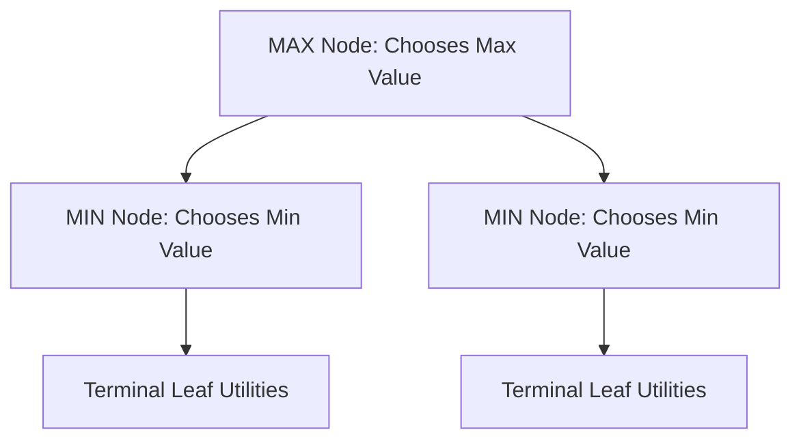

---

### 1. Alpha-Beta Pruning Rules:

Alpha-Beta pruning optimizes Minimax search by maintaining two bounds:
- $\alpha$: Highest (best) value MAX can guarantee so far. (Initial: $-\infty$)
- $\beta$: Lowest (best) value MIN can guarantee so far. (Initial: $+\infty$)
- **Cut-off Rule:** If $\alpha \ge \beta$ at any node, **prune (stop evaluating) all remaining children of that node**.

---

### 2. Complete 8-Leaf Numerical Game Tree Trace:

Consider an 8-leaf binary game tree evaluated left-to-right. Leaf terminal values from left to right: $[3, 5, 6, 9, 1, 2, 0, 4]$.

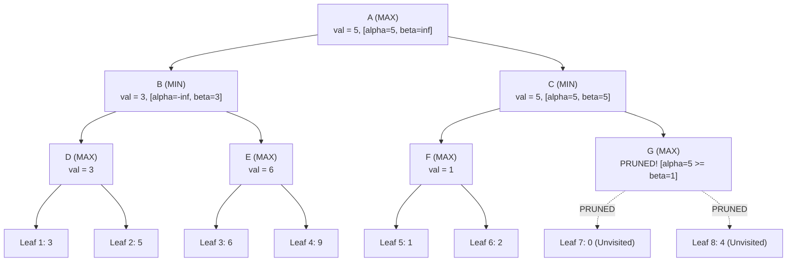

---

### 3. Step-by-Step Hand Trace & Pruning Proof:

1. **Evaluate Left Subtree under Node B (MIN):**
   - **Node D (MAX):** Evaluates Leaf 1 ($3$) and Leaf 2 ($5$). MAX takes $\max(3, 5) = \mathbf{3}$.
   - **Node E (MAX):** Evaluates Leaf 3 ($6$) and Leaf 4 ($9$). MAX takes $\max(6, 9) = \mathbf{6}$.
   - **Node B (MIN):** Receives values from D ($3$) and E ($6$). MIN takes $\min(3, 6) = \mathbf{3}$.
   - Updates at Root A: $\alpha = \max(-\infty, 3) = \mathbf{3}$.

2. **Evaluate Right Subtree under Node C (MIN):**
   - At Node C (MIN), initial bounds are $\alpha = 3, \beta = +\infty$.
   - **Node F (MAX):** Evaluates Leaf 5 ($1$) and Leaf 6 ($2$). MAX takes $\max(1, 2) = \mathbf{1}$.
   - Node F returns $1$ to Node C (MIN).
   - **Node C updates $\beta$:** $\beta = \min(+\infty, 1) = \mathbf{1}$.
   - **Check Prune Condition at Node C:**
     $$\alpha = 3, \quad \beta = 1 \implies \alpha \ge \beta \quad (3 \ge 1) \quad \mathbf{TRUE!}$$

3. **Pruning Decision:**
   - Since $\alpha (3) \ge \beta (1)$, Node C is guaranteed to yield a value $\le 1$, which is worse for MAX than the already guaranteed value of $3$ from Node B.
   - **Subtree under Node G (Leaves 7 & 8) is PRUNED immediately!** Leaves 7 ($0$) and 8 ($4$) are never visited.

4. **Final Result:**
   - Root Node A (MAX) picks $\max(\text{Node B}, \text{Node C}) = \max(3, 1) = \mathbf{3}$.
   - **Optimal Choice for MAX:** Move to Node B, guaranteeing a utility score of **3**.

