# Unit 3: Knowledge Representation & Reasoning - Term End Exam Notes (All 7 Marks Questions)

---

## Q1. What is Knowledge Representation (KR) in AI? Explain the 5 Stages / Schemes of Knowledge Representation with comparative examples. (7 Marks)

**Answer:**

**Knowledge Representation (KR)** is the field of Artificial Intelligence dedicated to translating human language, real-world facts, and domain rules into precise mathematical logic so that an AI inference engine can perform reasoning, make decisions, and generate results.

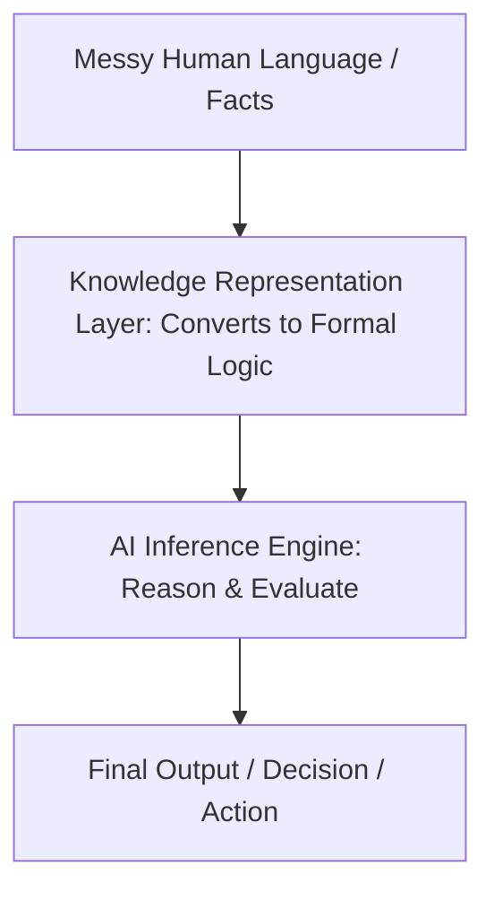

### The 5 Stages / Schemes of Knowledge Representation:

| Stage # | KR Scheme | Structural Format | Primary Characteristics & Real-World Examples |
| :--- | :--- | :--- | :--- |
| **1** | **Logic (PL & FOL)** | Mathematical / Semantic Logic | Uses Boolean propositions (Propositional Logic) or predicates and quantifiers (First-Order Logic). *Example:* Mathematical theorem provers. |
| **2** | **Rule-Based** | `IF-THEN` Production Rules | Connects condition premises to actions or derived facts. *Example:* Expert systems (MYCIN). |
| **3** | **Frames** | Structured Objects (Slots & Fillers) | Object-oriented structure storing attributes, default values, and inheritance. *Example:* Knowledge graphs, CAD object properties. |
| **4** | **Semantic Networks** | Graph (Nodes & Directed Edges) | Nodes represent entities/concepts; edges represent relationships (`is_a`, `has_a`). *Example:* Google Knowledge Graph, Navigation maps. |
| **5** | **Scripts** | Event Sequences / Scenarios | Represents stereotyped sequences of events in specific contexts. *Example:* Restaurant ordering process, Flight booking workflow. |

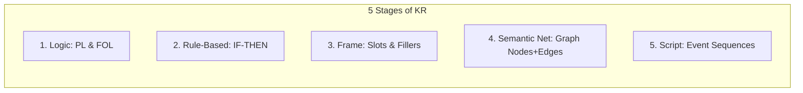

---

## Q2. What is Propositional Logic (PL)? Explain Atomic vs Complex Statements, the 5 Logical Connectives, and Worked English-to-Logic Translation Examples. (7 Marks)

**Answer:**

**Propositional Logic (PL)** is the foundational branch of Knowledge Representation dealing with declarative statements (propositions) that are strictly **either True or False** — never both, and never incomplete.

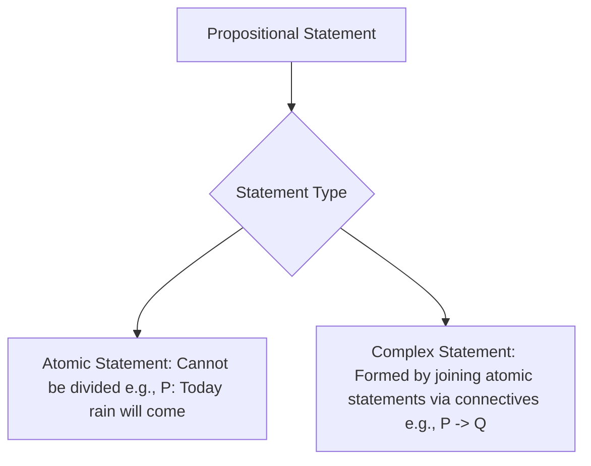

### The 5 Logical Connectives:

| # | Connective Name | Symbol | Logic Operator | Natural Language Equivalent | Truth Rule Summary |
| :--- | :--- | :---: | :---: | :--- | :--- |
| **1** | **Negation** | `¬` (or `~`) | NOT | "not" | Flips truth value ($\neg T = F, \neg F = T$) |
| **2** | **Conjunction** | `∧` | AND | "and" | True **ONLY if BOTH** operands are True |
| **3** | **Disjunction** | `∨` | OR | "or" | True if **AT LEAST ONE** operand is True |
| **4** | **Implication** | `→` | IF...THEN | "If...then..." | False **ONLY when** $T \to F$; True otherwise |
| **5** | **Biconditional** | `↔` | IF AND ONLY IF | "if and only if" | True **ONLY when BOTH** operands MATCH ($T \leftrightarrow T, F \leftrightarrow F$) |

---

### Worked Translation Examples (English $\to$ Mathematical Logic):

1. **Example 1:** *"You can access the campus internet if you are a CSE student or not a fresher."*
   - Let $P$: Access campus internet, $q$: CSE student, $r$: Fresher.
   - **Formal Logic:** $P \implies (q \lor \neg r)$

2. **Example 2:** *"If the Security Sensor detects motion and the System is armed, then the alarm will sound."*
   - Let $P$: Sensor detects motion, $q$: System armed, $r$: Alarm sounds.
   - **Formal Logic:** $(P \land q) \implies r$

3. **Example 3:** *"You will pass the exam if and only if you attend all lectures or submit the extra credit project."*
   - Let $P$: Pass exam, $q$: Attend lectures, $r$: Extra credit project.
   - **Formal Logic:** $P \iff (q \lor r)$

---

## Q3. Explain Truth Tables in Propositional Logic. Discuss Sizing Rules ($2^n$), Truth Rules for all connectives, and complete a full 8-Row Truth Table for $P \implies (q \lor \neg r)$. (7 Marks)

**Answer:**

A **Truth Table** is a tabular mathematical device used to evaluate the truth value of a complex logical sentence across **every possible combination** of truth values of its component proposition variables.

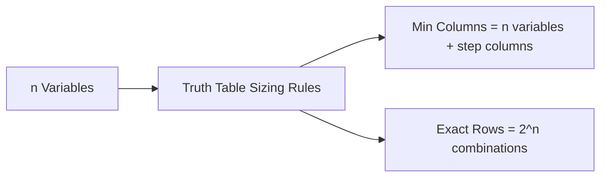

### 1. Truth Table Sizing Rules:
- **Minimum Columns:** Equal to the number of proposition variables plus intermediate connective steps.
- **Exact Rows:** Equal to $2^n$, where $n$ is the number of distinct proposition variables.
  - For $n=2$ variables $\implies 2^2 = 4$ rows.
  - For $n=3$ variables ($P, q, r$) $\implies 2^3 = 8$ rows.

---

### 2. Full 8-Row Truth Table Evaluation for $P \implies (q \lor \neg r)$:

| Row # | P | q | r | $\neg r$ | $q \lor \neg r$ | $P \implies (q \lor \neg r)$ | Evaluation Notes |
| :-: | :-: | :-: | :-: | :-: | :-: | :-: | :--- |
| **1** | T | T | T | F | T | **T** | True premise, True conclusion |
| **2** | T | T | F | T | T | **T** | True premise, True conclusion |
| **3** | T | F | T | F | F | **F** | **ONLY FALSE CASE** ($T \implies F$) |
| **4** | F | T | T | F | T | **T** | False premise $\implies$ Vacuously True |
| **5** | F | F | T | F | F | **T** | False premise $\implies$ Vacuously True |
| **6** | T | F | F | T | T | **T** | True premise, True conclusion |
| **7** | F | T | F | T | T | **T** | False premise $\implies$ Vacuously True |
| **8** | F | F | F | T | T | **T** | False premise $\implies$ Vacuously True |

- **Conclusion:** The logical expression is True in 7 out of 8 cases, and evaluates to False in exactly 1 case (Row 3, where $P=T, q=F, r=T$).

---

## Q4. Compare Propositional Logic (PL) vs First-Order Predicate Logic (FOL). Explain Quantifiers ($\forall, \exists$), Free/Bound Variables, and English to FOL Translations. (7 Marks)

**Answer:**

While Propositional Logic evaluates simple atomic facts, **First-Order Logic (FOL)** introduces objects, relations, functions, and quantifiers to represent complex world statements.

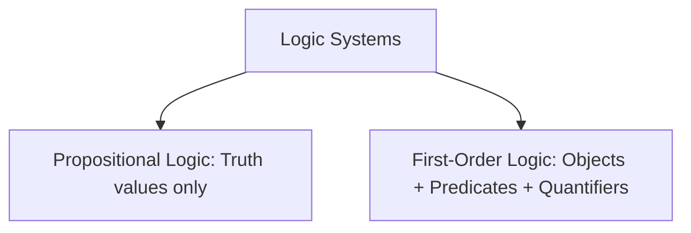

### 1. PL vs FOL Detailed Comparison Matrix:

| Feature | Propositional Logic (PL) | First-Order Predicate Logic (FOL) |
| :--- | :--- | :--- |
| **Ontological Commitment** | Facts (True / False) | Objects, Relations (Predicates), Functions |
| **Expressive Power** | Low (Requires verbose atomic symbols) | High (Concise generalizations over sets) |
| **Quantifiers ($\forall, \exists$)** | Not Supported | Fully Supported ($\forall$ Universal, $\exists$ Existential) |
| **Decidability** | Decidable (Truth table enumeration) | Semi-Decidable (Resolution refutation) |
| **Example Representation** | $P$: "Socrates is human", $Q$: "Socrates is mortal" | $\forall x \, (\text{Human}(x) \implies \text{Mortal}(x))$ |

---

### 2. Quantifiers in FOL:
- **Universal Quantifier ($\forall x$):** "For all $x$". Statement is true if predicate holds for *every* object in the domain. Usually paired with Implication ($\implies$).
- **Existential Quantifier ($\exists x$):** "There exists at least one $x$". Statement is true if predicate holds for *at least one* object. Usually paired with Conjunction ($\land$).

---

### 3. Worked English to FOL Translation Examples:
1. *"All humans are mortal."* $\implies \forall x \, (\text{Human}(x) \implies \text{Mortal}(x))$
2. *"Some dogs are white."* $\implies \exists x \, (\text{Dog}(x) \land \text{White}(x))$
3. *"Every student loves some subject."* $\implies \forall x \, (\text{Student}(x) \implies \exists y \, (\text{Subject}(y) \land \text{Loves}(x, y)))$

---

## Q5. Explain the Resolution Refutation Algorithm in First-Order Logic. Detail the 8 Steps of Converting Sentences to Conjunctive Normal Form (CNF) and Skolemization. (7 Marks)

**Answer:**

**Resolution Refutation** is a sound and complete inference technique that proves a goal $\alpha$ from a Knowledge Base ($KB$) using **Proof by Contradiction**:

$$KB \land \neg \alpha \implies \text{Empty Clause } (\square)$$

```mermaid
flowchart TD
    KBGoal[KB + Negated Goal NOT alpha] --> CNFConv[Convert all Sentences to CNF 8 Steps]
    CNFConv --> Unify[Apply Unification MGU on Complementary Literals]
    Unify --> ResRule[Apply Resolution Rule]
    ResRule --> CheckEmpty{Empty Clause [] Derived?}
    CheckEmpty -->|Yes| Proved[Goal alpha is PROVED!]
    CheckEmpty -->|No| Continue[Generate Resolvent Clauses] --> Unify
```

### The 8 Steps to Convert FOL Sentences to CNF:

1. **Eliminate Implications ($\implies$) and Biconditionals ($\iff$):**
   - Replace $A \implies B$ with $\neg A \lor B$.
   - Replace $A \iff B$ with $(\neg A \lor B) \land (\neg B \lor A)$.
2. **Move Negation ($\neg$) Inward (De Morgan's Laws):**
   - $\neg (A \land B) \equiv \neg A \lor \neg B$, $\neg (A \lor B) \equiv \neg A \land \neg B$.
   - $\neg \forall x \, P(x) \equiv \exists x \, \neg P(x)$, $\neg \exists x \, P(x) \equiv \forall x \, \neg P(x)$.
3. **Standardize Variables:** Rename variables so each quantifier uses a unique variable name.
4. **Skolemization (Eliminate Existential Quantifiers $\exists$):**
   - Replace $\exists x$ with a **Skolem Constant** $k$ if not in scope of $\forall$.
   - Replace $\exists x$ with a **Skolem Function** $f(y)$ if inside scope of $\forall y$.
5. **Drop Universal Quantifiers ($\forall$):** All remaining variables are implicitly universally quantified.
6. **Distribute Disjunction ($\lor$) over Conjunction ($\land$):** Convert to $(A \lor B) \land (C \lor D)$.
7. **Flatten Nested Conjunctions/Disjunctions:** Group into clauses.
8. **Separate Conjunctions into Independent Clauses:** Each clause becomes a separate disjunctive line.

---

## Q6. Explain Forward Chaining vs Backward Chaining Inference Algorithms with step-by-step execution traces. (7 Marks)

**Answer:**

An **Inference Engine** applies logical rules to derive new facts from existing knowledge.

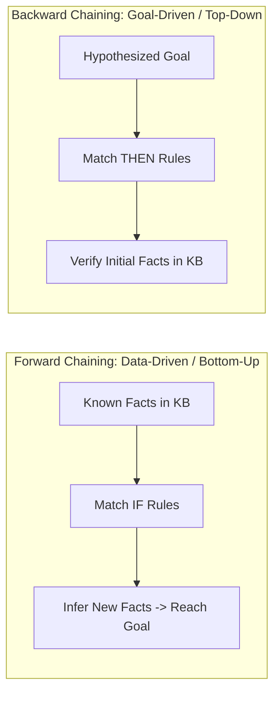

### Direct Comparison Matrix:

| Feature | Forward Chaining (Data-Driven) | Backward Chaining (Goal-Driven) |
| :--- | :--- | :--- |
| **Direction** | Bottom-up (Start with facts $\to$ infer goal) | Top-down (Start with goal $\to$ prove premises) |
| **Search Strategy** | Breadth-First Search (BFS) style | Depth-First Search (DFS) style |
| **Inference Mechanism** | Applies Modus Ponens to derive all possible consequences | Works backward matching goal with rule consequents |
| **Efficiency** | Can generate irrelevant facts if KB is large | Efficient; explores only paths relevant to goal |
| **Best Application** | Real-time monitoring, expert diagnosis, data analysis | Medical diagnosis, system troubleshooting |

---

## Q7. Explain the Architecture of an Expert System with a complete block diagram. Discuss the roles of MYCIN and DENDRAL. (7 Marks)

**Answer:**

An **Expert System** is an AI application that emulates the decision-making ability of a human expert in a specific domain.

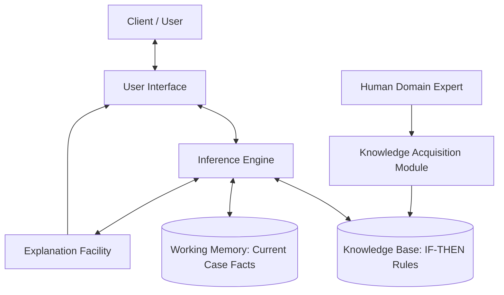

### 1. Key Components of an Expert System:
1. **Knowledge Base (KB):** Stores domain rules (`IF condition THEN action`) and static facts.
2. **Inference Engine:** Executes forward or backward chaining to derive solutions.
3. **Working Memory:** Stores dynamic facts and inputs for the current user session.
4. **User Interface (UI):** Portal for entering queries and viewing diagnosis.
5. **Explanation Facility:** Explains *how* and *why* a particular decision was reached.
6. **Knowledge Acquisition Module:** Tool for adding new expert rules into the KB.

### 2. Historical Pioneer Systems:
- **MYCIN:** Developed at Stanford for diagnosing blood-borne bacterial infections and recommending antibiotic dosages using certainty factors.
- **DENDRAL:** Developed at Stanford for analyzing mass spectrometry data to infer unknown chemical structures.

---

## Q8. What is a Semantic Network in Artificial Intelligence? Explain its Core Building Blocks, Node Classification, Predicate Logic Mapping, Full Worked Example, and Pros/Cons. (7 Marks)

**Answer:**

A **Semantic Network** (or Semantic Net) is a graphical representation scheme used in Artificial Intelligence to represent human knowledge as an interconnected mind-map or network graph. 

It models complex relationships between entities using **Nodes** (objects/concepts) and **Directed Labeled Arcs** (relationships).

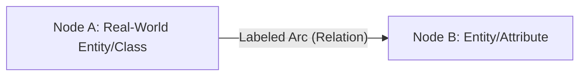

---

### 1. Core Building Blocks & Node Classification:

| Building Block / Concept | Meaning | Example in AI Domain |
| :--- | :--- | :--- |
| **Node** | Represents a real-world object, concept, category, or attribute. | `Animal`, `Mammal`, `Cat`, `Tom` |
| **Labeled Arc (Edge)** | Represents the directed relationship linking two nodes. | `is_a`, `has_a`, `like`, `sat_on`, `caught_a` |
| **Generic Node** | Represents a general category, class, or set of objects. | `Animal`, `Mammal`, `Cat`, `Bird` |
| **Individual Node** | Represents a specific single instance/object of a class. | `Tom` (a specific cat), `Oak` (a specific tree) |

---

### 2. Mapping Semantic Networks to Predicate Logic:

Every `is_a` link in a Semantic Network translates directly into an implication ($\implies$) in First-Order Predicate Logic (FOL):

- **Network Link:** `Cat` $\xrightarrow{\text{is\_a}}$ `Mammal`
- **Predicate Logic:** $\forall x \, (\text{Cat}(x) \implies \text{Mammal}(x))$ — *"For all x, if x is a cat, then x is a mammal."*
- **Network Link:** `Tom` $\xrightarrow{\text{is\_a}}$ `Cat`
- **Predicate Logic:** $\text{Cat}(\text{Tom})$ — *"Tom is an instance of Cat."*

---

### 3. Full Worked Hierarchy Example — "Tom the Cat" Knowledge Graph:

Consider the following knowledge facts:
1. Tom is a cat, ginger in color, owned by John, and sat on a mat.
2. Tom caught a bird.
3. Cats are mammals and like cream.
4. Birds are mammals.
5. Mammals are animals and have fur.

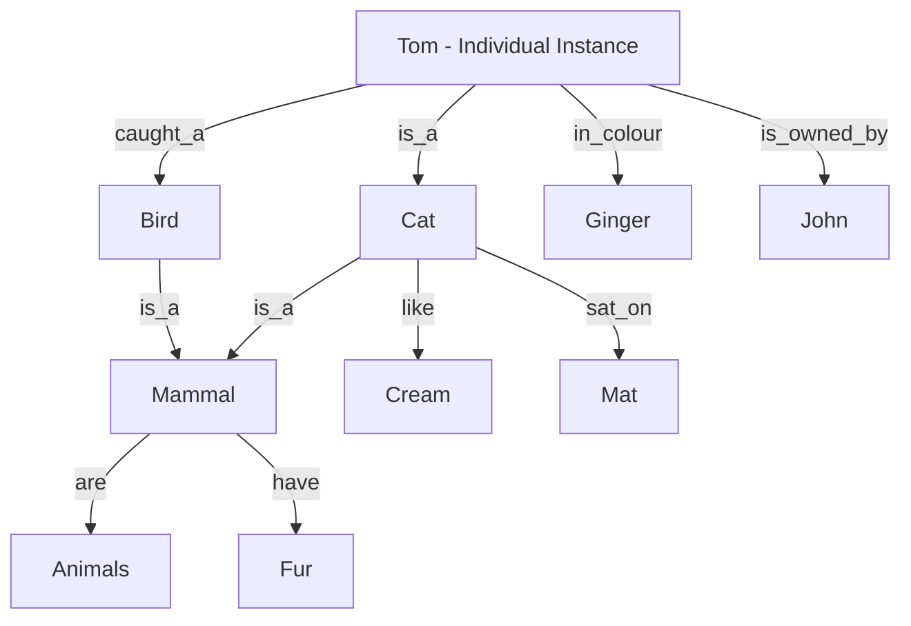

#### Node & Arc Summary Matrix:

| Source Node | Node Type | Outgoing Arc Label | Target Node | Fact Represented |
| :--- | :--- | :--- | :--- | :--- |
| `Tom` | Individual | `is_a`, `in_colour`, `is_owned_by`, `caught_a` | `Cat`, `Ginger`, `John`, `Bird` | Tom is a ginger cat owned by John who caught a bird. |
| `Cat` | Generic | `is_a`, `like`, `sat_on` | `Mammal`, `Cream`, `Mat` | Cats are mammals, like cream, and sit on mats. |
| `Bird` | Generic | `is_a` | `Mammal` | Birds are mammals. |
| `Mammal` | Generic | `are`, `have` | `Animals`, `Fur` | Mammals are animals and have fur. |

---

### 4. Pros & Cons of Semantic Networks:

| Advantages (Pros) | Disadvantages (Cons) |
| :--- | :--- |
| **Intuitive & Readable:** Visual graph structure mimics human brain mind-mapping. | **High Traversal Cost:** Inferring transitive facts requires searching/traversing the entire graph ($O(N)$ depth search). |
| **Clear Relation Mapping:** Explicitly labels exact relationships between concepts. | **Lack of Quantifier Scope:** Hard to represent negative facts ($\neg P$) or complex quantified scopes ($\forall x \exists y$). |
| **Inheritance Support:** Instance nodes automatically inherit properties from generic parent nodes up the `is_a` chain. | **No Native Execution Logic:** Arcs store static relations; cannot execute dynamic procedural scripts natively. |

- **Modern Applications:** Google Knowledge Graph, Semantic Web (RDF/OWL), GIS Map Routing.

---

## Q9. Explain Frame Representation and Slots in Artificial Intelligence. Discuss the 5 Types of Slots, Procedural Attachments (Daemons), and Frame Inheritance with a Connected Real-World Example. (7 Marks)

**Answer:**

A **Frame** is a structured, object-oriented Knowledge Representation scheme proposed by Marvin Minsky. It organizes information about an entity into a record-like structure composed of **Slots** (attributes/properties) and **Fillers/Values** (contents or pointers).

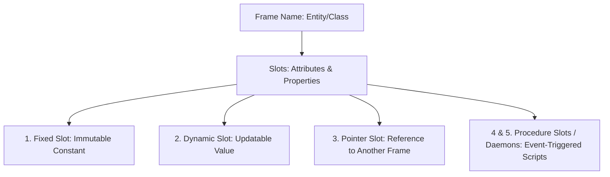

---

### 1. The 5 Types of Slots in Frame Systems:

| Slot Type | Behavior & Characteristic | Real-World Example |
| :--- | :--- | :--- |
| **1. Fixed-Slot** | Contains static values that **never change** after frame initialization. | In `Car` frame: `Number_of_Wheels = 4`. |
| **2. Dynamic-Slot** | Stores values that **frequently change** based on environmental state. | In `Phone` frame: `Battery_Percentage = 72%`. |
| **3. Pointer Slot** | Stores the **memory address / reference to another frame**, linking frames into a network graph. | In `Student` frame: `Enrolled_In` $\to$ points to `CLASSROOM-101` frame. |
| **4. Passive/Value Slot** | Standard data holder storing simple strings, integers, or defaults. | In `Person` frame: `Name = "John Doe"`. |
| **5. Procedure Slot (Daemon)** | Contains **active code scripts** that execute automatically when specific frame triggers occur. | Automatically computing student attendance percentage when queried. |

---

### 2. Procedural Attachments / Daemons (4 Event Triggers):

Unlike passive data structures, procedure slots turn frames into active object-oriented modules by executing scripts upon specific triggers (known as **Daemons**):

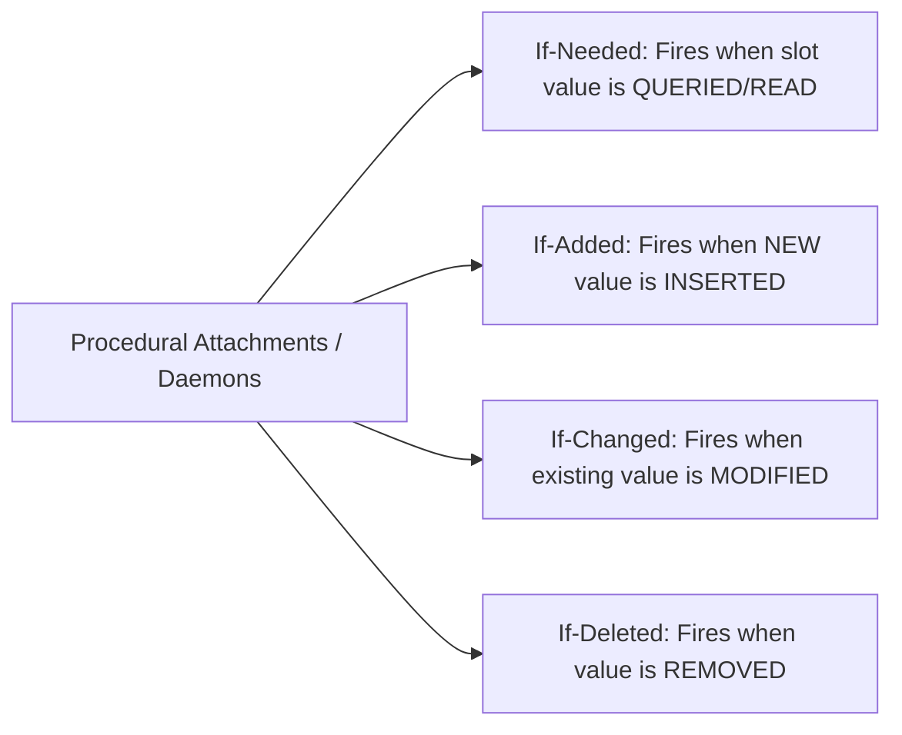

1. **`If-Needed` Daemon:** Executes a calculation script on-demand when a slot's value is requested but not pre-stored. *(e.g., `Current_Attendance = CalculateAttendance()`)*
2. **`If-Added` Daemon:** Fires automatically when a new filler is added into a slot. *(e.g., Updating classroom headcount when a new student enrolls)*
3. **`If-Changed` Daemon:** Fires when an existing slot value is altered. *(e.g., Alerting administration when `Class_Teacher` pointer is changed)*
4. **`If-Deleted` Daemon:** Fires when a slot value is removed. *(e.g., Freeing up a chair resource when a student drops out)*

---

### 3. Frame Inheritance (Generic Class Frame vs Instance Frame):

- **Generic Frame (Class Template):** Defines common slot names, data types, and **default values** for an entire entity class.
- **Instance Frame (Object Entity):** Inherits all slots from its Generic Frame via an implicit `is-a` pointer, filling specific values and overriding defaults where necessary.

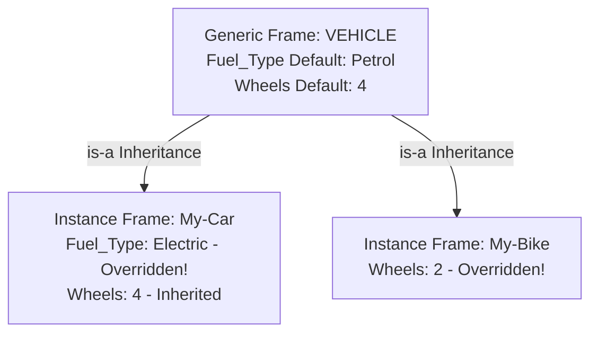

---

### 4. Comprehensive Connected Example — Classroom Knowledge Base:

#### A. Architecture Diagram of Interlinked Frames:

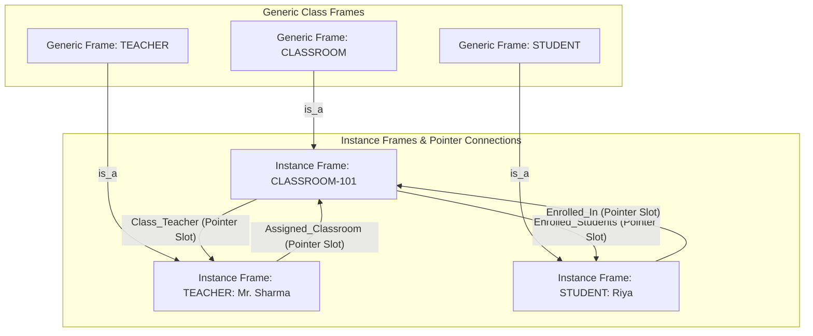

#### B. Detailed Specification of `CLASSROOM-101` Frame:

```
Frame Name: CLASSROOM-101 (is_a: CLASSROOM)
┌──────────────────────┬────────────────────────┬────────────────────────────────────────────────────────────┐
│ Slot Name            │ Slot Type              │ Value / Filler / Procedure Script                          │
├──────────────────────┼────────────────────────┼────────────────────────────────────────────────────────────┤
│ Frame_ID             │ Fixed-Slot             │ "CS-101"                                                   │
│ Capacity             │ Fixed-Slot (Inherited) │ 40 seats                                                   │
│ Class_Teacher        │ Pointer Slot           │ → Points to Frame("TEACHER: Mr. Sharma")                   │
│ Enrolled_Students    │ Pointer Slot (List)    │ → Points to [Frame("STUDENT: Riya"), Frame("STUDENT: Aman")]│
│ Current_Attendance   │ Procedure (If-Needed)  │ Script: Return Count(Present_Students) / Total_Capacity    │
│ Enrol_Student        │ Procedure (If-Added)   │ Script: RecalculateHeadcount() & TriggerDAEMON(UpdateLog) │
│ Change_Teacher       │ Procedure (If-Changed) │ Script: SendNotification(PrincipalOffice, "Teacher Changed")│
│ Remove_Student       │ Procedure (If-Deleted) │ Script: IncrementAvailableSeats(1)                         │
└──────────────────────┴────────────────────────┴────────────────────────────────────────────────────────────┘
```

#### C. Execution Walkthrough:
1. **Inheritance:** `CLASSROOM-101` inherits `Capacity = 40` directly from the generic `CLASSROOM` frame.
2. **Pointer Slot Linkage:** `Class_Teacher` slot points directly to `TEACHER: Mr. Sharma` instance frame. Conversely, `Mr. Sharma`'s `Assigned_Classroom` slot points back to `CLASSROOM-101`, establishing a bi-directional network.
3. **Procedural Execution:** When `Current_Attendance` is queried, the `If-Needed` daemon fires live to calculate present students, avoiding manual static data updates.

---

## Q10. Compare Semantic Networks vs Frame & Slot Systems in Knowledge Representation. Explain how Pointer Slots convert isolated Frames into a Semantic Knowledge Graph. (7 Marks)

**Answer:**

Both **Semantic Networks** and **Frame & Slot Systems** are structured Knowledge Representation schemes used to capture domain knowledge beyond basic formal logic. However, they differ significantly in structural granularity and dynamic behavior capability.

---

### 1. Direct Comparison Matrix (Semantic Networks vs Frame & Slots):

| Feature / Dimension | Semantic Networks | Frame & Slot Systems |
| :--- | :--- | :--- |
| **Primary Structure** | Graph of interconnected **Nodes** (objects) and **Arcs** (relationships). | Object-oriented record **Frame** containing **Slots** (attributes) and **Fillers** (values). |
| **Representation Granularity** | Fine-grained atomic node-arc triples. | Coarse-grained grouped object entities. |
| **Active Behavior / Daemons** | **No native support**; graph contains passive relations only. | **Full support** via **Procedure Slots** (`If-Needed`, `If-Added`, `If-Changed`, `If-Deleted`). |
| **Inter-Object Linking** | Linked via explicit **Labeled Directed Arcs** (`is_a`, `has_a`). | Linked via **Pointer Slots** storing memory addresses of other frames. |
| **Inheritance Mechanism** | Path traversal along `is_a` directed edges. | Attribute inheritance from Generic Frames with default overrides. |
| **Query Traversal Complexity** | High search overhead ($O(N)$ depth graph traversal). | Direct lookup within local frame + pointer jumping ($O(1)$ property access). |
| **Best Application Domain** | Knowledge graphs, taxonomy trees, natural language mind-maps. | Expert systems, complex domain models, CAD entity modeling. |

---

### 2. How Pointer Slots Convert Frames into a Semantic Network:

While a single Frame represents an isolated object (like an SQL record), **Pointer Slots** transform independent frames into a fully connected **Semantic Knowledge Network**.

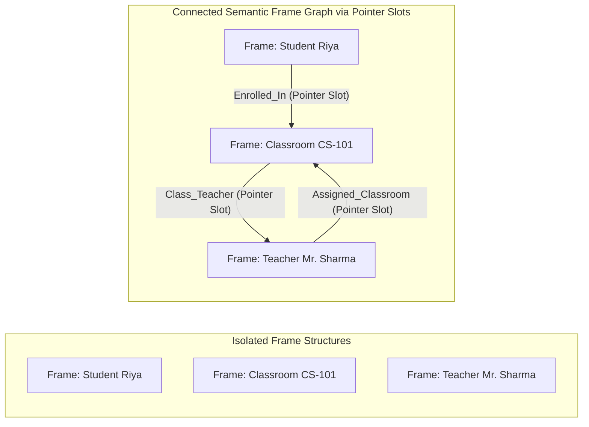

- **Equivalence Rule:** 
  $$\text{Pointer Slot in Frame } A \text{ pointing to Frame } B \equiv \text{Directed Labeled Arc from Node } A \to \text{Node } B \text{ in Semantic Network}$$
- **Conclusion:** A collection of Frames linked via Pointer Slots forms a **Semantic Network with active procedural capabilities (Daemons)**, combining the structural clarity of graphs with object-oriented dynamic programming.

---

## Q11. What is a Script in Artificial Intelligence Knowledge Representation? Explain its 5 Core Components, Conceptual Dependency Origin, Worked Examples, and Pros/Cons. (7 Marks)

**Answer:**

A **Script** is a structured Knowledge Representation scheme introduced by **Roger Schank and Robert Abelson (1977)**. It represents a **stereotyped, predictable sequence of events** that unfold over time in a familiar real-world scenario.

While a Frame represents an object's static properties, a Script uses **Slots to capture an event's chronological timeline**, enabling an AI engine to infer unstated real-world actions.

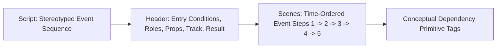

---

### 1. The 5 Core Components of a Script:

| # | Component | Meaning & Purpose | Real-World Restaurant Example |
| :--- | :--- | :--- | :--- |
| **1** | **Entry Condition** | Prerequisites that **must be True** before the script can execute. | Customer is hungry; Customer has money; Restaurant is open. |
| **2** | **Roles** | **Living actors/entities** involved in the scenario. | Customer, Waiter, Chef, Owner/Cashier. |
| **3** | **Props** | **Physical objects** manipulated during the event sequence. | Menu, Food, Table, Bill/Receipt, Money. |
| **4** | **Track** | Specific **variant or sub-type** of the general script. | Fast-Food Track vs Fine-Dining Track vs Cafeteria Track. |
| **5** | **Result** | Final state/outcome after all scenes complete. | Customer is not hungry & has less money; Owner has more money & less food. |

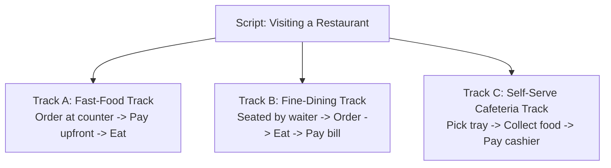

---

### 2. Full Worked Example — "Visiting a Restaurant" Script:

#### A. Script Header Specification:
- **Script Name:** `Visiting_a_Restaurant`
- **Track:** `Standard_Dine_In`
- **Roles:** Customer ($C$), Waiter ($W$), Cashier ($K$)
- **Props:** Menu ($M$), Food ($F$), Table ($T$), Money ($S$)
- **Entry Conditions:** $C$ is hungry $\land$ $C$ has money $\land$ Restaurant has food.
- **Result:** $C$ is pleased $\land$ $C$ has less money $\land$ Restaurant has more money.

#### B. Scene-by-Scene Breakdown with CD Tags:

| Scene # | Scene Title | Step-by-Step Actions | CD Primitive Tag |
| :--- | :--- | :--- | :--- |
| **Scene 1** | **Entering** | Customer enters restaurant $\to$ Customer walks to empty table $\to$ Customer sits down. | `PTRANS` (Move location) |
| **Scene 2** | **Ordering** | Customer calls Waiter $\to$ Waiter gives Menu $\to$ Customer reads Menu $\to$ Customer tells order to Waiter. | `SPEAK`, `MTRANS`, `ATTEND` |
| **Scene 3** | **Eating** | Waiter brings Food to Table $\to$ Customer eats Food. | `PTRANS`, `INGEST` |
| **Scene 4** | **Paying** | Waiter gives Bill $\to$ Customer hands Money to Cashier $\to$ Cashier gives change. | `MTRANS`, `ATRANS` (Transfer ownership) |
| **Scene 5** | **Exiting** | Customer leaves table $\to$ Customer exits restaurant. | `PTRANS` |

---

### 3. Second Worked Example — "Visiting a Doctor" Script:

- **Roles:** Patient, Doctor, Receptionist
- **Props:** Appointment Slip, Medical File, Stethoscope, Prescription Pad
- **Entry Condition:** Patient is unwell $\land$ Patient has appointment.
- **Result:** Patient gets prescription $\land$ Patient diagnosis recorded.

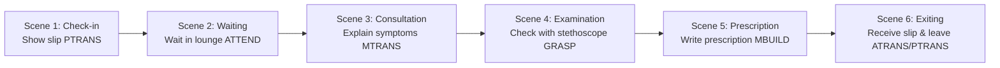

---

### 4. Advantages & Disadvantages of Scripts:

| Advantages (Pros) | Disadvantages (Cons) |
| :--- | :--- |
| **Infers Unstated Details:** Allows AI to infer implicit actions (e.g., inferring "John ate food" from "John paid restaurant bill"). | **Not Generalized:** A script built for a restaurant cannot handle a doctor visit or flight booking. |
| **Chronological Precision:** Explicitly prescribes event dependencies (what happens next). | **Rigid Flow:** Struggling to represent unexpected exceptions (e.g., kitchen fire during dinner). |
| **Rich Detail:** Captures roles, props, and environmental prerequisites in one structure. | **High Knowledge Engineering Cost:** Writing custom scripts for every human activity is non-scalable. |

---

## Q12. Discuss Conceptual Dependency (CD) Theory and the 12 CD Primitive Symbols in AI. Compare Scripts vs Frames vs Semantic Networks across all Knowledge Representation Dimensions. (7 Marks)

**Answer:**

**Conceptual Dependency (CD) Theory**, formulated by Roger Schank, is a natural language representation formalism based on the principle that **sentences with the same underlying meaning must have the exact same formal representation**, regardless of the natural language words used.

CD breaks down all human activities into **12 Primitive Action Symbols**.

---

### 1. The 12 CD Primitive Action Symbols:

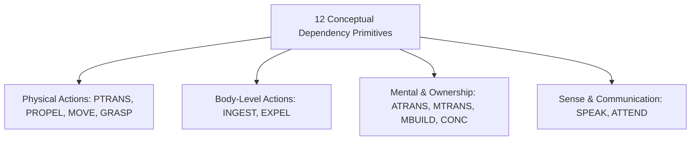

| Symbol | Category | Meaning / Definition | Natural Language Example Verbs |
| :--- | :--- | :--- | :--- |
| **`PTRANS`** | Physical | Transfer of physical location of an object. | *go, walk, fly, drive, move* |
| **`PROPEL`** | Physical | Application of physical force to an object. | *push, pull, throw, strike* |
| **`MOVE`** | Physical | Movement of a physical body part by its owner. | *kick, wave hand, step* |
| **`GRASP`** | Physical | Grasping/holding an object by an actor. | *grab, hold, clutch, pick up* |
| **`INGEST`** | Body | Taking an object inside the body of an animal. | *eat, drink, swallow, smoke* |
| **`EXPEL`** | Body | Expelling an object/substance from the body. | *spit, cry, sweat, vomit* |
| **`ATRANS`** | Mental/Abstract | Transfer of an abstract relationship (ownership/possession). | *give, buy, sell, pay, transfer* |
| **`MTRANS`** | Mental | Transfer of mental information between actors/memory. | *tell, inform, read, teach* |
| **`MBUILD`** | Mental | Constructing new mental information from old facts. | *decide, solve, conclude, figure out* |
| **`CONC`** | Mental | Thinking about or conceptualizing an idea. | *think, ponder, consider* |
| **`SPEAK`** | Communication | Producing physical sounds or speech. | *say, speak, shout, sing* |
| **`ATTEND`** | Communication | Focusing a physical sense organ on a stimulus. | *listen, look, watch, smell* |

---

### 2. Sentence-to-CD Primitive Translation Examples:

1. *"John gave Mary a book."* $\implies$ `John ATRANS Book to Mary`
2. *"Alice went to London."* $\implies$ `Alice PTRANS Alice to London`
3. *"Bob ate an apple."* $\implies$ `Bob INGEST Apple`
4. *"Teacher told students the answer."* $\implies$ `Teacher MTRANS Answer to Students`

---

### 3. Master Unit 3 Comparison Matrix — Semantic Networks vs Frames vs Scripts:

| Feature / Dimension | Semantic Networks (Q8) | Frame & Slot Systems (Q9) | Script Representation (Q11-Q12) |
| :--- | :--- | :--- | :--- |
| **Primary Target** | Inter-concept relationships & taxonomic hierarchies. | Single object's full attribute profile + behavior. | Chronological, stereotyped event sequences over time. |
| **Structural Format** | Graph (Nodes & Directed Labeled Arcs). | Object-oriented Record (Name, Slots, Fillers, Facets). | Header (5 Components) + Ordered Scene Sequence. |
| **Slot Mechanism** | No slots used. | Uses Slots for properties & pointers. | Uses Slots for roles, props, and scene actions. |
| **Time-Ordering** | Unordered static relations. | Unordered static attributes + dynamic daemons. | Strictly time-ordered sequential scenes ($t_1 \to t_2 \to t_3$). |
| **Active Code Support** | None (Passive graph). | Procedure Slots / Daemons (`If-Needed`, `If-Added`, etc.). | Conceptual Dependency (CD) Primitive action scripts. |
| **Core Advantage** | Intuitive visual mind-map representation. | Powerful object inheritance with default overriding. | Enables AI engine to infer unstated implied facts. |
| **Key Limitation** | Expensive search graph traversal ($O(N)$). | Complex inheritance hierarchies to manage. | Rigid; not generalized to non-stereotyped events. |

---

## Q13. Explain Forward Chaining vs Backward Chaining Techniques with Worked Execution Traces, Conflict Set Resolution, and Derivation Trees. (7 Marks)

**Answer:**

In Rule-Based AI Systems, **Inference Chaining** is the process of stringing together multiple `IF-THEN` rules to move between known facts and unknown goals. The inference engine operates in one of two directions: **Forward Chaining** (data-driven) or **Backward Chaining** (goal-driven).

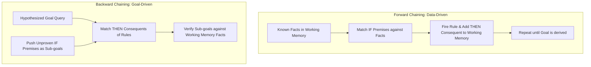

---

### 1. Architectural & Behavioral Comparison:

| Feature / Dimension | Forward Chaining (Data-Driven) | Backward Chaining (Goal-Driven) |
| :--- | :--- | :--- |
| **Starting Point** | Known initial facts stored in Working Memory. | A specific query hypothesis or goal to be proven. |
| **Reasoning Direction** | Antecedent to Consequent ($IF \to THEN$). | Consequent to Antecedent ($THEN \leftarrow IF$). |
| **Search Strategy** | Breadth-First Search (BFS) / Data Expansion. | Depth-First Search (DFS) / Goal Reduction. |
| **Working Memory** | Expands dynamically as new facts are derived. | Maintains a Stack of unresolved sub-goals. |
| **Best Suited For** | Real-time monitoring, data synthesis, planning. | Diagnosis, troubleshooting, system verification. |
| **Primary Risk** | May infer many facts irrelevant to the target goal. | Can get stuck exploring useless sub-goal branches. |

---

### 2. Full Worked Execution Trace & Derivation Tree:

#### Knowledge Base ($KB$):
- **Rule R1:** $IF \, A \land B \, THEN \, C$
- **Rule R2:** $IF \, C \land D \, THEN \, E$
- **Rule R3:** $IF \, E \land F \, THEN \, G \text{ (Goal)}$
- **Rule R4:** $IF \, H \land I \, THEN \, F$

#### Initial Working Memory ($WM$):
$$\text{Facts: } \{A, B, D, H, I\}$$
$$\text{Goal Query: } G$$

---

#### A. Forward Chaining Trace (Step-by-Step):

```mermaid
flowchart LR
    A[Fact: A] & B[Fact: B] -->|R1 Fires| C[Derived: C]
    C & D[Fact: D] -->|R2 Fires| E[Derived: E]
    H[Fact: H] & I[Fact: I] -->|R4 Fires| F[Derived: F]
    E & F -->|R3 Fires| G[GOAL G DERIVED!]
```

1. **Cycle 1:**
   - **Match:** Check $KB$ against $WM=\{A, B, D, H, I\}$.
   - $R1$ matches ($A, B$ present). $R4$ matches ($H, I$ present).
   - **Conflict Set:** $\{R1, R4\}$.
   - **Resolve & Act:** Fire $R1 \implies$ Add $C$ to $WM$. $WM = \{A, B, D, H, I, C\}$.
2. **Cycle 2:**
   - **Match:** $R2$ now matches ($C, D$ present). $R4$ still matches.
   - **Conflict Set:** $\{R2, R4\}$.
   - **Resolve & Act:** Fire $R2 \implies$ Add $E$ to $WM$. $WM = \{A, B, D, H, I, C, E\}$.
3. **Cycle 3:**
   - **Match:** $R4$ matches ($H, I$ present).
   - **Resolve & Act:** Fire $R4 \implies$ Add $F$ to $WM$. $WM = \{A, B, D, H, I, C, E, F\}$.
4. **Cycle 4:**
   - **Match:** $R3$ now matches ($E, F$ present).
   - **Resolve & Act:** Fire $R3 \implies$ Add $G$ to $WM$.
5. **Termination:** Goal $G$ is present in $WM$. **PROVED SUCCESSFUL.**

---

#### B. Backward Chaining Trace (Sub-Goal Stack):

```mermaid
flowchart TD
    GoalG[Sub-Goal: Prove G] -->|Requires R3| NeedEF[Needs E and F]
    NeedEF -->|Requires R2 for E| NeedCD[Needs C and D]
    NeedCD -->|Requires R1 for C| NeedAB[Needs A and B]
    NeedAB -->|A, B in WM| ProveC[C Proved!]
    ProveC & DWM[D in WM] --> ProveE[E Proved!]
    NeedEF -->|Requires R4 for F| NeedHI[Needs H and I]
    NeedHI -->|H, I in WM| ProveF[F Proved!]
    ProveE & ProveF --> ProveG[Goal G PROVED!]
```

1. **Goal:** Prove $G$. Search $KB$ for rules with $THEN \, G \implies R3$.
2. **Sub-goals created:** Prove $E$ and Prove $F$.
3. **Branch 1 (Prove $E$):** Search $KB$ for $THEN \, E \implies R2$. Needs $C$ and $D$.
   - $D$ is in $WM$ ($\checkmark$).
   - Needs $C \implies$ Search $KB$ for $THEN \, C \implies R1$. Needs $A$ and $B$.
   - $A$ and $B$ are in $WM$ ($\checkmark$). $C$ is proved! $E$ is proved!
4. **Branch 2 (Prove $F$):** Search $KB$ for $THEN \, F \implies R4$. Needs $H$ and $I$.
   - $H$ and $I$ are in $WM$ ($\checkmark$). $F$ is proved!
5. **Final Step:** Both $E$ and $F$ are proved $\implies R3$ fires $\implies$ Goal $G$ is **PROVED SUCCESSFUL.**

---

## Q14. Explain Rule-Based Expert Systems: Architecture, the 3 Components, Match-Resolve-Act Cycle, Conflict Resolution Strategies, and a Worked Troubleshooting Example. (7 Marks)

**Answer:**

A **Rule-Based Expert System** is a domain-specific AI program that emulates human expert decision-making by applying `IF-THEN` rules to real-world user facts.

```mermaid
flowchart TD
    User[User / Client] <--> UI[User Interface]
    UI <--> IE[Inference Engine]
    IE <--> KB[(Knowledge Base: Permanent IF-THEN Rules)]
    IE <--> WM[(Working Memory: Dynamic Session Facts)]
    IE <--> EF[Explanation Facility] --> UI
```

---

### 1. The 3 Core Components:

| Component | Lifespan | Scope | Description |
| :--- | :--- | :--- | :--- |
| **Knowledge Base (KB)** | Permanent | Static Domain Rules | Stores expert domain knowledge as `IF <condition> THEN <action/conclusion>` production rules. |
| **Working Memory (WM)** | Temporary | Session-Specific | Stores facts provided by the user for the current session along with facts derived during inference. |
| **Inference Engine** | Continuous | Reasoning Brain | Executes the **Match-Resolve-Act** cycle, linking $KB$ rules to $WM$ facts to reach conclusions. |

---

### 2. The Match-Resolve-Act Inference Cycle:

```mermaid
flowchart LR
    Match[1. MATCH: Find all rules whose IF conditions match WM -> Form Conflict Set] --> Resolve[2. RESOLVE: Select 1 rule from Conflict Set using Conflict Resolution Strategy]
    Resolve --> Act[3. ACT: Fire selected rule & append THEN conclusion to WM]
    Act --> Match
```

1. **Match Phase:** Scans $KB$ and compares rule conditions against current $WM$. All matching rules are placed into the **Conflict Set**.
2. **Resolve Phase:** If the Conflict Set contains multiple rules, a **Conflict Resolution Strategy** selects exactly one rule to fire.
3. **Act Phase:** Executes the selected rule's action/consequent, writing newly derived facts into $WM$, and restarts the cycle.

---

### 3. Conflict Resolution Strategies:

When multiple rules match $WM$ simultaneously, the system uses one of the following strategies:

| Strategy | Rule Selection Logic |
| :--- | :--- |
| **1. Rule Priority** | Assigns static numerical priorities to rules; fires the rule with the highest priority score. |
| **2. Specificity (Most Specific)** | Fires the rule with the largest number of `IF` conditions (most detailed rule). |
| **3. Recency** | Fires the rule matching the most recently added fact in Working Memory. |
| **4. First Match** | Fires the first rule encountered in the Knowledge Base file order. |

---

### 4. Fully Worked Example — "Automotive Diagnostic System":

#### Knowledge Base ($KB$):
- **R1:** $IF \, \text{Lights\_On} = \text{Yes} \land \text{Engine\_Cranks} = \text{No} \, THEN \, \text{Starter\_Problem} = \text{Likely}$
- **R2:** $IF \, \text{Lights\_On} = \text{No} \, THEN \, \text{Battery\_Dead} = \text{Likely}$
- **R3:** $IF \, \text{Starter\_Problem} = \text{Likely} \land \text{Battery\_Voltage} = \text{Normal} \, THEN \, \text{Action} = \text{"Replace Starter Solenoid"}$

#### Working Memory ($WM$) Initial State:
$$\{\text{Lights\_On} = \text{Yes}, \text{Engine\_Cranks} = \text{No}, \text{Battery\_Voltage} = \text{Normal}\}$$

#### Execution Trace:
- **Cycle 1:**
  - Match: R1 conditions satisfied ($\text{Lights\_On}=\text{Yes}, \text{Engine\_Cranks}=\text{No}$). R2 and R3 do not match.
  - Conflict Set: $\{R1\}$.
  - Act: Fire R1 $\implies$ Add $\text{Starter\_Problem} = \text{Likely}$ to $WM$.
- **Cycle 2:**
  - Match: R3 conditions now satisfied ($\text{Starter\_Problem}=\text{Likely}, \text{Battery\_Voltage}=\text{Normal}$).
  - Conflict Set: $\{R3\}$.
  - Act: Fire R3 $\implies$ Add $\text{Action} = \text{"Replace Starter Solenoid"}$ to $WM$.
- **Cycle 3:**
  - Match: Conflict Set is Empty ($\emptyset$). Cycle Halts.
- **Final Output:** `"Replace Starter Solenoid"` returned to user.

---

## Q15. Explain Reasoning Under Uncertainty & Probabilistic AI: Sources of Uncertainty, Bayes' Theorem, and Bayesian Belief Networks with Worked Calculations. (7 Marks)

**Answer:**

Classical logic requires facts to be strictly True or False. However, real-world AI applications (medical diagnosis, autonomous driving, weather forecasting) must operate under **uncertainty** due to noisy sensors, incomplete information, and non-deterministic domain rules.

```mermaid
flowchart TD
    Uncertainty[Sources of Uncertainty in AI] --> Noise[1. Sensor Noise & Measurement Error]
    Uncertainty --> Incomplete[2. Incomplete / Missing Data]
    Uncertainty --> Ambiguity[3. Natural Language Ambiguity]
    Uncertainty --> NonDet[4. Non-Deterministic World Rules]
```

---

### 1. Classical Logic vs Probabilistic Reasoning:

| Dimension | Classical / Crisp Logic | Probabilistic Reasoning |
| :--- | :--- | :--- |
| **Fact Value** | Binary $\{0, 1\}$ (True or False). | Continuous probability $P(X) \in [0, 1]$. |
| **Rule Firing** | Rigid: Conditions must match 100%. | Weighted: Evidence shifts belief degrees dynamically. |
| **Handling Missing Data** | Fails or halts execution. | Calculates marginal probability over unobserved variables. |
| **Mathematical Basis** | Boolean Algebra & Predicate Logic. | Probability Theory & Bayes' Theorem. |

---

### 2. Bayes' Theorem Formulation:

Bayes' Theorem provides the mathematical framework to update the probability of a hypothesis $H$ given observed evidence $E$:

$$P(H | E) = \frac{P(E | H) \cdot P(H)}{P(E)}$$

- **$P(H)$ (Prior Probability):** Initial belief in hypothesis $H$ before seeing evidence $E$.
- **$P(E | H)$ (Likelihood):** Probability of observing evidence $E$ given hypothesis $H$ is true.
- **$P(E)$ (Marginal Probability):** Total probability of observing evidence $E$ across all cases:
  $$P(E) = P(E | H) \cdot P(H) + P(E | \neg H) \cdot P(\neg H)$$
- **$P(H | E)$ (Posterior Probability):** Updated confidence in hypothesis $H$ after observing evidence $E$.

---

### 3. Worked Bayesian Calculation Example (Radar Obstacle Detections):

Suppose an autonomous vehicle radar detects an obstacle ahead ($E = \text{Detected}$). We know:
- Prior obstacle presence: $P(\text{Obstacle}) = 0.05 \implies P(\neg \text{Obstacle}) = 0.95$.
- Detection accuracy: $P(\text{Detected} | \text{Obstacle}) = 0.95$.
- False alarm rate: $P(\text{Detected} | \neg \text{Obstacle}) = 0.10$.

#### Calculation:
1. **Marginal Evidence $P(\text{Detected})$:**
   $$P(\text{Detected}) = (0.95 \times 0.05) + (0.10 \times 0.95) = 0.0475 + 0.095 = 0.1425$$
2. **Posterior Probability $P(\text{Obstacle} | \text{Detected})$:**
   $$P(\text{Obstacle} | \text{Detected}) = \frac{P(\text{Detected} | \text{Obstacle}) \cdot P(\text{Obstacle})}{P(\text{Detected})} = \frac{0.0475}{0.1425} \approx 0.333 \quad (33.3\%)$$

- **Insight:** Even with a radar detection alert, there is only a **33.3%** true obstacle probability because obstacles are rare. Crisp logic would have slammed the brakes immediately; probabilistic AI waits for secondary sensor confirmation.

---

### 4. Bayesian Belief Networks (BBN):

A **Bayesian Network** is a **Directed Acyclic Graph (DAG)** representing probabilistic relationships across multiple variables.

```mermaid
flowchart TD
    Cloudy[Cloudy P(C)] --> Sprinkler[Sprinkler P(S|C)]
    Cloudy --> Rain[Rain P(R|C)]
    Sprinkler --> WetGrass[WetGrass P(W|S,R)]
    Rain --> WetGrass
```

#### Key Components of BBN:
1. **Nodes:** Represent random variables.
2. **Directed Edges:** Represent direct causal dependencies.
3. **Conditional Probability Tables (CPTs):** Quantify parent-child influence.
4. **Chain Rule for BBN:** Joint distribution is calculated as:
   $$P(X_1, X_2, \dots, X_n) = \prod_{i=1}^{n} P(X_i | \text{Parents}(X_i))$$

---

## Q16. Explain Fuzzy Logic Systems: Crisp vs Fuzzy Sets, Membership Functions, 4-Stage FIS Architecture, and a Complete Worked Appliance Example. (7 Marks)

**Answer:**

Introduced by **Lotfi Zadeh (1965)**, **Fuzzy Logic** is a mathematical methodology designed to reason with **degrees of truth** in continuous ranges $[0, 1]$, rather than binary True/False logic.

```mermaid
flowchart LR
    CrispIn[Crisp Input e.g., Temp=35°C] --> Fuzz[1. Fuzzification]
    Fuzz --> FIS[2 & 3. Rule Base & Inference Engine]
    FIS --> Defuzz[4. Defuzzification]
    Defuzz --> CrispOut[Crisp Output e.g., Fan Speed=80%]
```

---

### 1. Crisp Sets vs Fuzzy Sets:

| Feature | Classical / Crisp Set | Fuzzy Set |
| :--- | :--- | :--- |
| **Membership Range** | Binary $\mu_A(x) \in \{0, 1\}$ (Member or Non-member). | Continuous degree $\mu_A(x) \in [0, 1]$. |
| **Boundary** | Sharp, rigid cutoff (e.g., $Temp \ge 30^\circ C$ is Hot). | Smooth, overlapping gradual transitions. |
| **Set Characteristic** | $x \in A$ or $x \notin A$. | $x$ belongs to $A$ with partial confidence degree $\mu$. |
| **Mathematical Notation** | Indicator Function $I_A(x)$. | Membership Function $\mu_A(x)$. |

```mermaid
flowchart LR
    subgraph Crisp_Set [Crisp Cutoff: Hard Threshold at 30°C]
        C1[Temp < 30°C: Cold μ=0] | C2[Temp >= 30°C: Hot μ=1]
    end
    subgraph Fuzzy_Set [Fuzzy Set: Overlapping Membership Curves]
        F1[Cold μ=0.2] --- F2[Warm μ=0.6] --- F3[Hot μ=0.3]
    end
```

---

### 2. Common Shapes of Membership Functions:
- **Triangular Membership Function:** Defined by 3 points $(a, b, c)$; peaks at $b$.
- **Trapezoidal Membership Function:** Defined by 4 points $(a, b, c, d)$; flat top region between $b$ and $c$.
- **Gaussian Membership Function:** Smooth bell curve defined by mean $\mu$ and standard deviation $\sigma$.

---

### 3. The 4-Stage Fuzzy Inference System (FIS):

1. **Fuzzification:** Converts crisp numerical inputs into fuzzy membership degrees ($\mu$) across predefined input sets.
2. **Knowledge Base (Rule Base):** Stores expert fuzzy `IF-THEN` rules using linguistic variables (*"IF Load is Heavy THEN Wash Time is Long"*).
3. **Inference Engine:** Applies fuzzy operators ($\text{AND} = \min$, $\text{OR} = \max$) to evaluate rule firing strengths.
4. **Defuzzification:** Converts fuzzy output curves back into a single crisp control value (using methods like Centroid or Weighted Average).

---

### 4. Fully Worked Example — "Smart Washing Machine Controller":

#### Problem Setup:
- **Input:** Clothes Weight $= 4.5 \text{ kg}$.
- **Output:** Wash Time (in minutes).

#### Step 1: Fuzzification
Evaluating Weight $= 4.5 \text{ kg}$ on input membership curves yields:
- $\mu_{\text{Light}}(4.5) = 0.1$
- $\mu_{\text{Medium}}(4.5) = 0.6$
- $\mu_{\text{Heavy}}(4.5) = 0.0$

#### Step 2 & 3: Rule Evaluation & Inference
- **Rule 1:** $IF \, \text{Weight is Light} \, THEN \, \text{Wash Time is Short (Peak } = 10 \text{ min)}$
  - Firing Strength $w_1 = 0.1$
- **Rule 2:** $IF \, \text{Weight is Medium} \, THEN \, \text{Wash Time is Medium (Peak } = 28 \text{ min)}$
  - Firing Strength $w_2 = 0.6$
- **Rule 3:** $IF \, \text{Weight is Heavy} \, THEN \, \text{Wash Time is Long (Peak } = 50 \text{ min)}$
  - Firing Strength $w_3 = 0.0$ (Does not fire)

#### Step 4: Defuzzification (Weighted Average Method)

$$\text{Crisp Wash Time} = \frac{\sum (w_i \cdot \text{Peak}_i)}{\sum w_i} = \frac{(w_1 \cdot 10) + (w_2 \cdot 28)}{w_1 + w_2}$$

$$\text{Crisp Wash Time} = \frac{(0.1 \times 10) + (0.6 \times 28)}{0.1 + 0.6} = \frac{1.0 + 16.8}{0.7} = \frac{17.8}{0.7} \approx 25.43 \text{ minutes}$$

- **Conclusion:** The FIS converts imprecise sensor weight ($4.5\text{ kg}$) into an exact operational duration of **$\approx 25.43$ minutes** (rounded to 26 minutes on the appliance display).


