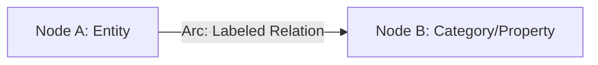
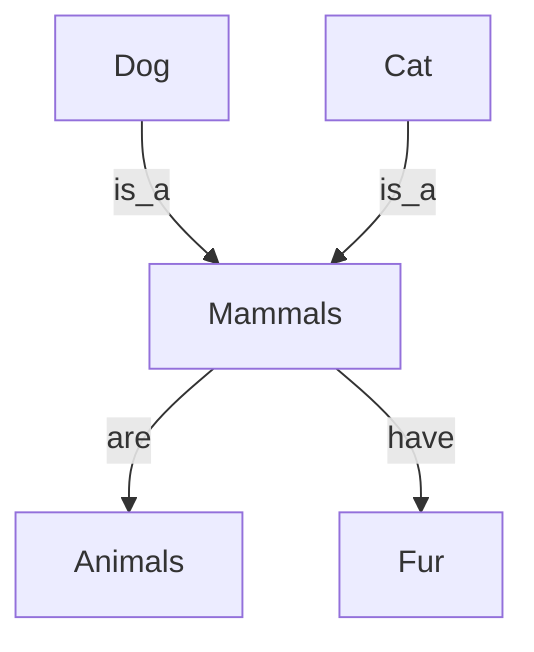
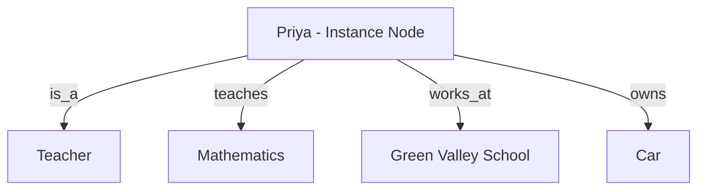
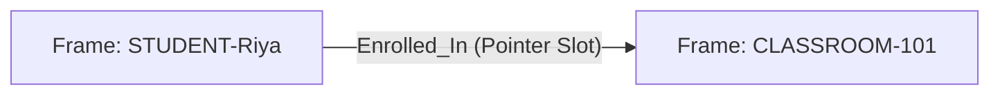
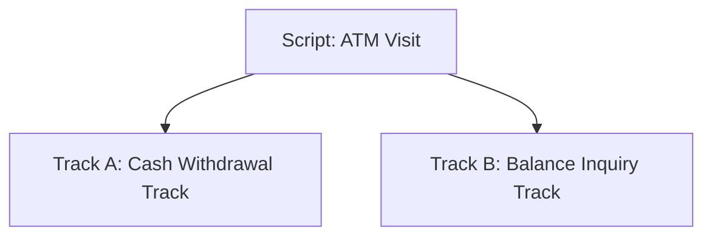
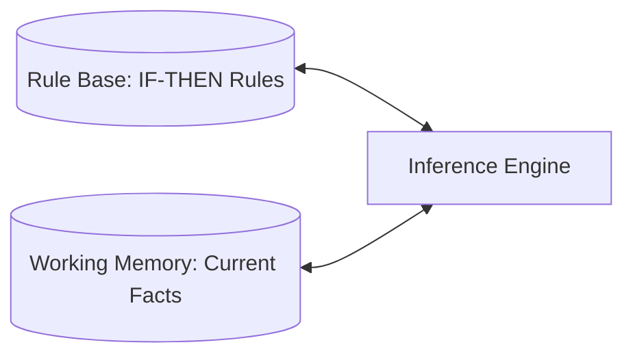

# Unit 3: Knowledge Representation and Reasoning — Assignment Solutions

**Subject:** Artificial Intelligence (5th Semester)  
**Unit:** Unit 3 — Knowledge Representation & Reasoning  
**Document Purpose:** Complete, step-by-step, simple, and 100% accurate solutions for all questions in `Assignment_Unit3_Knowledge_Representation_and_Reasoning.txt`.

---

# SECTION A: PROPOSITIONAL LOGIC

## Q1. Define "Proposition" and "Logic" separately, and explain how together they form Propositional Logic.

**Answer:**

1. **Definition of Proposition:**  
   A **Proposition** is a declarative statement in natural language that is strictly **either True ($T$) or False ($F$)**, but never both. It cannot be ambiguous, a question, or a command.  
   - *Example:* "New Delhi is the capital of India" $\to$ **True**.

2. **Definition of Logic:**  
   **Logic** is the study of valid reasoning, truth evaluation, and rules used to derive correct conclusions from given facts.

3. **How they form Propositional Logic:**  
   **Propositional Logic (PL)** combines propositions and logic. It represents real-world facts using simple symbols (like $P, Q, R$) and connects them using logical operators ($\neg, \land, \lor, \implies, \iff$) to test whether complex statements are True or False.

---

## Q2. Differentiate between an Atomic statement and a Complex/Compound statement, with one example of each.

**Answer:**

| Feature | Atomic Statement | Complex / Compound Statement |
| :--- | :--- | :--- |
| **Meaning** | A single, basic statement that **cannot be broken down** any further. | A statement formed by **joining two or more atomic statements** using logical connectives. |
| **Connectives Used** | None. | Uses operators like AND ($\land$), OR ($\lor$), NOT ($\neg$), IF...THEN ($\implies$). |
| **Example** | $P$: *"It is raining."* | $P \implies Q$: *"If it is raining, then I will carry an umbrella."* |

---

## Q3. List all 5 logical connectives used in Propositional Logic along with their symbols and the operator name they represent.

**Answer:**

| # | Connective Name | Symbol | Operator Name | Natural Language Meaning | Truth Rule Summary |
| :-: | :--- | :---: | :---: | :--- | :--- |
| **1** | **Negation** | $\neg$ (or $\sim$) | NOT | "not" | Flips the truth value ($\neg T = F, \neg F = T$). |
| **2** | **Conjunction** | $\land$ | AND | "and" | True **ONLY if BOTH** inputs are True. |
| **3** | **Disjunction** | $\lor$ | OR | "or" | True if **AT LEAST ONE** input is True. |
| **4** | **Implication** | $\implies$ (or $\to$) | IF...THEN | "If...then..." | False **ONLY when** True $\implies$ False. |
| **5** | **Biconditional** | $\iff$ (or $\leftrightarrow$) | IF AND ONLY IF | "if and only if" | True **ONLY when BOTH** inputs match ($T \iff T$ or $F \iff F$). |

---

## Q4. Translate the following statement into mathematical logic: "You can enter the library if you have a valid ID card and it is not a public holiday."

**Answer:**

1. **Assign Proposition Variables:**
   - Let $P$: *"You can enter the library."*
   - Let $Q$: *"You have a valid ID card."*
   - Let $R$: *"It is a public holiday."*

2. **Identify Premises and Conclusion:**
   - Condition (Premise): *"You have a valid ID card and it is not a public holiday"* $\implies (Q \land \neg R)$
   - Result (Conclusion): *"You can enter the library"* $\implies P$

3. **Final Logic Expression:**
   $$(Q \land \neg R) \implies P$$

---

## Q5. Translate the following statement into mathematical logic: "The alarm will ring if and only if the door is opened or a window is broken."

**Answer:**

1. **Assign Proposition Variables:**
   - Let $P$: *"The alarm will ring."*
   - Let $Q$: *"The door is opened."*
   - Let $R$: *"A window is broken."*

2. **Identify Parts:**
   - *"the door is opened or a window is broken"* $\implies (Q \lor R)$
   - *"if and only if"* $\implies \iff$

3. **Final Logic Expression:**
   $$P \iff (Q \lor R)$$

---

## Q6. Construct the complete truth table for the expression: $P \to (q \land \sim r)$

**Answer:**

### 1. Structure & Sizing Breakdown:
- **Given Expression:** $P \to (q \land \sim r)$  *(also written as $P \implies (q \land \neg r)$)*
- **Variables ($n$):** 3 variables ($P, q, r$).
- **Number of Rows ($2^n$):** $2^3 = \mathbf{8\text{ rows}}$.
- **Sub-Expressions (Columns):**
  1. $P$: First proposition variable
  2. $q$: Second proposition variable
  3. $r$: Third proposition variable
  4. $\sim r$: Negation of $r$ (NOT $r$)
  5. $(q \land \sim r)$: Conjunction of $q$ and $\sim r$ ($q$ AND NOT $r$)
  6. $P \to (q \land \sim r)$: Final Implication ($P$ IF...THEN $(q \land \sim r)$)

---

### 2. Logical Truth Rules Applied:
1. **Negation ($\sim r$):** Inverts the truth value of $r$ ($\sim T = F$, $\sim F = T$).
2. **Conjunction ($q \land \sim r$):** Evaluates to **True ONLY when BOTH** $q = T$ and $\sim r = T$.
3. **Implication ($P \to \dots$):** Evaluates to **False ONLY when** the premise $P = T$ and the conclusion $(q \land \sim r) = F$. If $P = F$, the expression is automatically **True** (vacuously true).

---

### 3. Complete Truth Table:

| Row # | $P$ | $q$ | $r$ | $\sim r$ | $(q \land \sim r)$ | $P \to (q \land \sim r)$ | Truth Result | Step-by-Step Reason |
| :-: | :-: | :-: | :-: | :-: | :-: | :-: | :-: | :--- |
| **1** | **T** | **T** | **T** | F | F | **F** | **FALSE** | Premise $P=T$, Conclusion $F \implies T \to F$ is **False**. |
| **2** | **T** | **T** | **F** | T | T | **T** | **TRUE** | Premise $P=T$, Conclusion $T \implies T \to T$ is **True**. |
| **3** | **T** | **F** | **T** | F | F | **F** | **FALSE** | Premise $P=T$, Conclusion $F \implies T \to F$ is **False**. |
| **4** | **T** | **F** | **F** | T | F | **F** | **FALSE** | Premise $P=T$, Conclusion $F \implies T \to F$ is **False**. |
| **5** | **F** | **T** | **T** | F | F | **T** | **TRUE** | Premise $P=F \implies$ Vacuously **True** regardless of conclusion. |
| **6** | **F** | **T** | **F** | T | T | **T** | **TRUE** | Premise $P=F \implies$ Vacuously **True** regardless of conclusion. |
| **7** | **F** | **F** | **T** | F | F | **T** | **TRUE** | Premise $P=F \implies$ Vacuously **True** regardless of conclusion. |
| **8** | **F** | **F** | **F** | T | F | **T** | **TRUE** | Premise $P=F \implies$ Vacuously **True** regardless of conclusion. |

---

### 4. Row-by-Row Complete Derivation Walkthrough:

- **Row 1 ($T, T, T$):** $\sim r = F$. Thus $(q \land \sim r) = (T \land F) = F$. Implication $T \to F$ is **False**.
- **Row 2 ($T, T, F$):** $\sim r = T$. Thus $(q \land \sim r) = (T \land T) = T$. Implication $T \to T$ is **True**.
- **Row 3 ($T, F, T$):** $\sim r = F$. Thus $(q \land \sim r) = (F \land F) = F$. Implication $T \to F$ is **False**.
- **Row 4 ($T, F, F$):** $\sim r = T$. Thus $(q \land \sim r) = (F \land T) = F$. Implication $T \to F$ is **False**.
- **Row 5 ($F, T, T$):** $\sim r = F$. Thus $(q \land \sim r) = (T \land F) = F$. Implication $F \to F$ is **True**.
- **Row 6 ($F, T, F$):** $\sim r = T$. Thus $(q \land \sim r) = (T \land T) = T$. Implication $F \to T$ is **True**.
- **Row 7 ($F, F, T$):** $\sim r = F$. Thus $(q \land \sim r) = (F \land F) = F$. Implication $F \to F$ is **True**.
- **Row 8 ($F, F, F$):** $\sim r = T$. Thus $(q \land \sim r) = (F \land T) = F$. Implication $F \to F$ is **True**.

---

### 5. Final Logical Analysis & Summary:
1. **Satisfiability:** The expression is **Satisfiable** because it evaluates to True in 5 out of 8 cases (Rows 2, 5, 6, 7, 8).
2. **Falsifiability:** The expression is **Falsifiable** because it evaluates to False in 3 out of 8 cases (Rows 1, 3, 4).
3. **Classification:** Since the truth column contains a mix of both True ($T$) and False ($F$) values, $P \to (q \land \sim r)$ is classified as a **Contingency** (neither a Tautology nor a Contradiction).

---

## Q7. State the rule for calculating the minimum number of columns and the exact number of rows in a truth table. Apply this rule for a statement containing 4 variables.

**Answer:**

1. **Rule for Number of Rows:**
   $$\text{Total Rows} = 2^n$$
   where $n$ is the number of atomic proposition variables.

2. **Rule for Minimum Number of Columns:**
   $$\text{Minimum Columns} = n + k$$
   where $n$ is the number of variables, and $k$ is the number of logical connectives/sub-expressions.

3. **Application for 4 Variables ($n = 4$):**
   - **Exact Rows:** $2^4 = \mathbf{16\text{ rows}}$.
   - **Minimum Columns:** At least 4 input columns ($P, Q, R, S$) plus columns for each connective operator ($4 + k$).

---

## Q8. Explain, with a truth table, why an Implication ($P \implies Q$) is considered False in only ONE specific case.

**Answer:**

An **Implication ($P \implies Q$)** means: *"If premise $P$ is True, then conclusion $Q$ MUST be True."*

### Truth Table for $P \implies Q$:

| Row # | Premise ($P$) | Conclusion ($Q$) | $P \implies Q$ | Reason |
| :-: | :-: | :-: | :-: | :--- |
| **1** | T | T | **T** | Rule kept: $P$ happened, and $Q$ happened. |
| **2** | **T** | **F** | **F** | **ONLY FALSE CASE:** $P$ happened ($T$), but $Q$ failed ($F$). |
| **3** | F | T | **T** | Vacuously True: Premise $P$ didn't happen, so rule wasn't broken. |
| **4** | F | F | **T** | Vacuously True: Premise $P$ didn't happen, so rule wasn't broken. |

**Conclusion:** The statement $P \implies Q$ is False **ONLY when $P$ is True and $Q$ is False**. If $P$ is False, the rule never gets triggered, so it is automatically considered True.

---

## Q9. Given $P = \text{"It is raining"}$ and $Q = \text{"I will carry an umbrella"}$, write the mathematical logic for: "It is not the case that it is raining and I am not carrying an umbrella."

**Answer:**

1. **Step-by-step conversion:**
   - *"it is raining"* $\implies P$
   - *"I am not carrying an umbrella"* $\implies \neg Q$
   - *"it is raining AND I am not carrying an umbrella"* $\implies (P \land \neg Q)$
   - *"It is not the case that..."* $\implies \neg (\dots)$

2. **Final Logic Expression:**
   $$\neg (P \land \neg Q)$$

*(Note: $\neg (P \land \neg Q)$ is logically equivalent to $P \implies Q$).*

---

## Q10. Explain the difference between Conjunction and Disjunction with a truth table for each.

**Answer:**

### 1. Conjunction ($P \land Q$ — AND):
- **Rule:** True **ONLY when BOTH** $P$ and $Q$ are True.

| $P$ | $Q$ | $P \land Q$ |
| :-: | :-: | :-: |
| T | T | **T** |
| T | F | **F** |
| F | T | **F** |
| F | F | **F** |

---

### 2. Disjunction ($P \lor Q$ — OR):
- **Rule:** True if **AT LEAST ONE** of $P$ or $Q$ is True.

| $P$ | $Q$ | $P \lor Q$ |
| :-: | :-: | :-: |
| T | T | **T** |
| T | F | **T** |
| F | T | **T** |
| F | F | **F** |

---
---

# SECTION B: PREDICATE LOGIC

## Q1. Define Predicate Logic and explain why it is called an "extension" of Propositional Logic.

**Answer:**

1. **Definition of Predicate Logic (First-Order Logic):**  
   **Predicate Logic** is a formal system that represents knowledge using **Objects**, **Predicates (Properties/Relations)**, and **Quantifiers ($\forall, \exists$)**.

2. **Why it is an "Extension":**  
   Propositional Logic treats whole sentences as single symbols ($P$), so it cannot look inside a sentence. Predicate Logic **extends** it by breaking sentences into objects ($x$) and properties ($\text{Human}(x)$), allowing us to express general rules like *"All humans are mortal"* using $\forall x (\text{Human}(x) \implies \text{Mortal}(x))$.

---

## Q2. Define the terms: Predicate, Variable, Domain, and Quantifier, with one example each.

**Answer:**

| Term | Definition | Simple Example |
| :--- | :--- | :--- |
| **Predicate** | A statement/function that describes a property or relation of an object. | $\text{IsEven}(x)$ or $\text{Loves}(x, y)$ |
| **Variable** | A symbol representing an arbitrary object in a set. | $x$ in $\text{Student}(x)$ |
| **Domain** | The set of all allowed objects for a variable. | $\text{Domain} = \{1, 2, 3, 4, 5\}$ |
| **Quantifier** | A symbol telling how many objects satisfy a predicate. | $\forall$ (All) or $\exists$ (Some) |

---

## Q3. Differentiate between the Universal Quantifier and the Existential Quantifier, including which connective ($\implies$ or $\land$) is conventionally used with each and why.

**Answer:**

| Feature | Universal Quantifier ($\forall$) | Existential Quantifier ($\exists$) |
| :--- | :--- | :--- |
| **Meaning** | "For all", "For every". | "There exists at least one", "For some". |
| **Requirement** | Must be True for **EVERY** object in the domain. | Must be True for **AT LEAST ONE** object in the domain. |
| **Connective Used** | **Implication ($\implies$)** | **Conjunction ($\land$)** |
| **Why?** | Using $\land$ with $\forall$ (e.g. $\forall x (\text{Dog}(x) \land \text{Barks}(x))$) means *everything in the universe is a dog that barks*. $\implies$ correctly says *"If $x$ is a dog, then $x$ barks."* | Using $\implies$ with $\exists$ (e.g. $\exists x (\text{Dog}(x) \implies \text{White}(x))$) becomes True if any non-dog exists. $\land$ correctly says *"There exists an object that IS a dog AND is white."* |

---

## Q4. Translate into predicate logic: "All engineering students must submit their project before the deadline."

**Answer:**

1. **Define Predicates:**
   - Let $\text{EngStudent}(x)$: "$x$ is an engineering student."
   - Let $\text{SubmitProject}(x)$: "$x$ submits project before deadline."

2. **Logic Expression:**
   $$\forall x \, (\text{EngStudent}(x) \implies \text{SubmitProject}(x))$$

---

## Q5. Translate into predicate logic: "Some employees work from home or take a leave on Fridays."

**Answer:**

1. **Define Predicates:**
   - Let $\text{Employee}(x)$: "$x$ is an employee."
   - Let $\text{WorkFromHome}(x)$: "$x$ works from home on Fridays."
   - Let $\text{TakeLeave}(x)$: "$x$ takes a leave on Fridays."

2. **Logic Expression:**
   $$\exists x \, (\text{Employee}(x) \land (\text{WorkFromHome}(x) \lor \text{TakeLeave}(x)))$$

---

## Q6. Translate into predicate logic: "No reptiles are warm-blooded." (Hint: use negation with a universal quantifier)

**Answer:**

1. **Define Predicates:**
   - Let $\text{Reptile}(x)$: "$x$ is a reptile."
   - Let $\text{WarmBlooded}(x)$: "$x$ is warm-blooded."

2. **Logic Expression:**
   $$\forall x \, (\text{Reptile}(x) \implies \neg \text{WarmBlooded}(x))$$

---

## Q7. Given the domain $x = \{1, 2, 3, 4, 5, 6\}$, evaluate whether the statement "for all $x$, $x$ is less than 10" is True or False, and justify using the AND-across-domain rule for Universal Quantifiers.

**Answer:**

1. **Statement:** $\forall x \, (x < 10)$ over domain $D = \{1, 2, 3, 4, 5, 6\}$.
2. **AND-across-domain Expansion:**
   $$(1 < 10) \land (2 < 10) \land (3 < 10) \land (4 < 10) \land (5 < 10) \land (6 < 10)$$
3. **Evaluate each term:**
   $$T \land T \land T \land T \land T \land T = \mathbf{True}$$
4. **Result:** The statement is **True**.

---

## Q8. Given the domain $x = \{2, 4, 5, 8\}$, evaluate whether the statement "there exists an $x$ such that $x$ is odd" is True or False, and justify using the OR-across-domain rule for Existential Quantifiers.

**Answer:**

1. **Statement:** $\exists x \, \text{IsOdd}(x)$ over domain $D = \{2, 4, 5, 8\}$.
2. **OR-across-domain Expansion:**
   $$\text{IsOdd}(2) \lor \text{IsOdd}(4) \lor \text{IsOdd}(5) \lor \text{IsOdd}(8)$$
3. **Evaluate each term:**
   $$F \lor F \lor T \lor F = \mathbf{True}$$
4. **Result:** The statement is **True** because $x = 5$ is odd.

---

## Q9. Convert the following predicate logic statement back into a plain English sentence: $\forall x \, (\text{Student}(x) \implies \text{Passed}(x))$

**Answer:**

- **Plain English:** *"All students passed."* (or *"Every student passed the exam."*)

---

## Q10. Explain, with an example, how propositional connectives ($\land, \lor, \neg$) can be nested inside a quantified predicate logic statement.

**Answer:**

Connectives can be placed inside quantifiers to join multiple conditions for an object.

### Example:
*"Every candidate who has a Bachelor's degree AND 2 years of experience, OR holds a Master's degree, is eligible."*

$$\forall x \, \Big( \text{Candidate}(x) \implies \Big( \big( (\text{Bachelors}(x) \land \text{Experience}(x)) \lor \text{Masters}(x) \big) \implies \text{Eligible}(x) \Big) \Big)$$

---
---

# SECTION C: SEMANTIC NETWORK

## Q1. Define Semantic Network and explain its two core building blocks (Node and Arc).

**Answer:**

1. **Definition:** A **Semantic Network** is a visual graph used in AI to represent knowledge as nodes (objects) connected by arcs (relationships).

2. **Two Building Blocks:**
   - **Node:** Represents an object, concept, or attribute (drawn as circles/rectangles).
   - **Arc (Edge):** A directed arrow connecting two nodes with a label showing their relation.



---

## Q2. Differentiate between a Generic Node and an Individual (Instance) Node, with one example each.

**Answer:**

| Node Type | Meaning | Example |
| :--- | :--- | :--- |
| **Generic Node** | Represents a **general class or category** of things. | `Mammal`, `Dog`, `School` |
| **Individual Node** | Represents **one specific real-world object/instance**. | `Tom` (a cat), `Priya` (a teacher) |

---

## Q3. Draw a Semantic Network diagram to represent the following statements: "A dog is a mammal", "A cat is a mammal", "All mammals are animals", "Mammals have fur."

**Answer:**



---

## Q4. Draw a Semantic Network diagram for the following facts about a person named Priya: "Priya is a teacher", "Priya teaches Mathematics", "Priya works at Green Valley School", "Priya owns a car."

**Answer:**



---

## Q5. Explain, with an example, how an "is-a" arc in a Semantic Network can be translated into Predicate Logic.

**Answer:**

An `is-a` arc connecting a subclass to a superclass translates into a universal implication ($\implies$).

- **Semantic Network:** `Cat` $\xrightarrow{\text{is\_a}}$ `Mammal`
- **Predicate Logic:** $\forall x \, (\text{Cat}(x) \implies \text{Mammal}(x))$

---

## Q6. What is a "label arc" in a Semantic Network? Explain with an example.

**Answer:**

A **label arc** is an arrow in a graph with a relation name written on it, so reading from source to target forms a sentence.

- **Example:** `[Tom]` $\xrightarrow{\text{is\_owned\_by}}$ `[John]` $\implies$ *"Tom is owned by John."*

---

## Q7. List the advantages and disadvantages of representing knowledge using a Semantic Network.

**Answer:**

| Advantages | Disadvantages |
| :--- | :--- |
| **Easy to understand:** Simple visual mind-map style. | **High search cost:** Must traverse the whole graph to find answers. |
| **Clear relations:** Labels explicitly state connections. | **No quantifier scope:** Hard to express negative or complex logic. |

---

## Q8. Explain why traversing the entire graph is required to reach a conclusion in a Semantic Network, and why this is considered a drawback.

**Answer:**

To find inherited properties (e.g. *"Does Tom have fur?"*), the system must search upward link-by-link (`Tom` $\to$ `Cat` $\to$ `Mammal` $\to$ `has fur`). In large graphs, this step-by-step traversal becomes very slow ($O(N)$ overhead).

---

## Q9. Convert the Semantic Network diagram from Question 3 into a set of plain English sentences (reverse translation).

**Answer:**

1. *"A dog is a mammal."*
2. *"A cat is a mammal."*
3. *"All mammals are animals."*
4. *"Mammals have fur."*

---

## Q10. Compare Semantic Network with Predicate Logic in terms of how each one represents relationships between objects.

**Answer:**

| Feature | Semantic Network | Predicate Logic |
| :--- | :--- | :--- |
| **Format** | Visual graph (Nodes & Arcs). | Mathematical formulas ($\text{Rel}(x,y)$). |
| **Inheritance** | Follows `is-a` paths visually. | Expressed via implication rules ($\implies$). |

---
---

# SECTION D: FRAME & SLOTS

## Q1. Define "Frame" and explain the concept of a "Slot" within it.

**Answer:**

1. **Frame:** A record-like data structure used to represent an object or concept.
2. **Slot:** A named field/attribute inside a frame that holds a value (called a **Filler**), default value, pointer, or script.

---

## Q2. List and explain all types of slots used in a Frame (Fixed, Dynamic, Pointer, and Procedure slots), with one small example for each.

**Answer:**

| Slot Type | Meaning | Example |
| :--- | :--- | :--- |
| **Fixed-Slot** | Value **never changes**. | In `Car` frame: `Wheels = 4`. |
| **Dynamic-Slot** | Value **changes over time**. | In `Phone` frame: `Battery = 72%`. |
| **Pointer Slot** | Points to another frame. | `Enrolled_In` $\to$ points to `CLASSROOM-101`. |
| **Procedure Slot** | Runs a script when triggered. | Computing total salary or attendance. |

---

## Q3. Explain the four triggers of a Procedure Slot: If-Needed, If-Added, If-Changed, and If-Deleted, with a real-world example for each.

**Answer:**

1. **`If-Needed`:** Fires when a slot value is **read/requested**. *(e.g. Computing live total grade)*.
2. **`If-Added`:** Fires when a **new value is inserted**. *(e.g. Incrementing class count when a student enrolls)*.
3. **`If-Changed`:** Fires when a value is **modified**. *(e.g. Sending an alert when teacher changes)*.
4. **`If-Deleted`:** Fires when a value is **removed**. *(e.g. Freeing a seat when student drops out)*.

---

## Q4. What is Frame Inheritance? Explain with an example how a child frame can both inherit and override an attribute from its parent frame.

**Answer:**

A child frame inherits default slots from its parent frame, but can override specific values.

- **Parent (`VEHICLE`):** Default `Wheels = 4`, Default `Fuel = Petrol`.
- **Child (`My-Electric-Car`):**
  - **Inherits:** `Wheels = 4`.
  - **Overrides:** `Fuel = Electric`.

---

## Q5. Design a Generic Frame named "Employee" with at least 5 meaningful slots (mention the slot type for each).

**Answer:**

### Generic Frame: `EMPLOYEE`

| Slot Name | Slot Type | Default / Description |
| :--- | :--- | :--- |
| `Emp_ID` | Fixed-Slot | String template (`EMP-XXX`). |
| `Department` | Dynamic-Slot | `"Engineering"`. |
| `Reports_To` | Pointer Slot | Points to a `MANAGER` frame. |
| `Monthly_Salary` | Dynamic-Slot | Float monetary value. |
| `Calculate_Tax` | Procedure (If-Needed) | Script: `Return Monthly_Salary * 0.20`. |

---

## Q6. Design an Instance Frame named "Employee-John" that inherits from the "Employee" Generic Frame in Question 5, and fill in actual values for each slot.

**Answer:**

### Instance Frame: `Employee-John` (`is-a`: `EMPLOYEE`)

| Slot Name | Slot Type | Actual Value |
| :--- | :--- | :--- |
| `Emp_ID` | Fixed-Slot | `"EMP-1042"` |
| `Department` | Dynamic-Slot | `"Software Development"` |
| `Reports_To` | Pointer Slot | $\to$ Points to `Manager-Alice` |
| `Monthly_Salary` | Dynamic-Slot | `\$8,500.00` |
| `Calculate_Tax` | Procedure (If-Needed) | Returns `\$1,700.00` |

---

## Q7. Explain how a Pointer Slot is used to connect two different frames together. Illustrate using a "Student" frame and a "Classroom" frame.

**Answer:**

A **Pointer Slot** stores the memory reference of another frame instead of duplicating data.



- **Student Frame:** `Enrolled_In` $\to$ points to `CLASSROOM-101`.
- **Classroom Frame:** `Enrolled_Students` $\to$ points to `[STUDENT-Riya, STUDENT-Aman]`.

---

## Q8. Write the complete text-format representation of a frame named "Smartphone-X1" with at least 4 slots, including at least one Fixed-Slot, one Dynamic-Slot, and one Procedure (If-Needed) slot with its script.

**Answer:**

```
Frame Name: Smartphone-X1 (is-a: SMARTPHONE)

1. Slot: Model-ID                             → Fixed-Slot
     Value: "SP-X1-2026"

2. Slot: Battery-Percentage                   → Dynamic-Slot
     Value: 84%

3. Slot: Connected-Wifi                       → Pointer Slot
     Points-To: Frame("Wifi-Network-Campus5G")

4. Slot: Remaining-Usage-Time                 → Procedure (If-Needed)
     Script: CalculateRemainingTime()
       currentBattery = Self.Battery-Percentage
       drainRate = GetAverageDrainRate()
       return (currentBattery / drainRate) + " Hours"
```

---

## Q9. Compare Frame & Slots with Semantic Network — in what way are they similar, and in what way are they different?

**Answer:**

| Aspect | Semantic Network | Frame & Slots |
| :--- | :--- | :--- |
| **Similarity** | Both use `is-a` links to support attribute inheritance. |
| **Difference** | Focuses on **fine-grained node-arc relations**. | Bundles all attributes of **one object into a frame**. |
| **Code Support** | Passive (No scripts). | Active (Procedure slots / Daemons). |

---

## Q10. Explain why Frames are considered a "structured and object-oriented" way of representing knowledge.

**Answer:**

Frames use Object-Oriented principles:
1. **Encapsulation:** Combines data slots and active procedure scripts.
2. **Inheritance:** Instance frames inherit slots from parent frames.
3. **Overriding:** Instance frames can override default parent values.

---
---

# SECTION E: SCRIPT

## Q1. Define "Script" and explain why it is described as "similar to Frame."

**Answer:**

1. **Script:** A Knowledge Representation scheme that captures a **predictable, step-by-step sequence of events** for a familiar situation.
2. **Similar to Frame:** Because it **uses slots** to hold details (roles, props, scenes), but applies them to an event timeline rather than a static object.

---

## Q2. List and explain the 5 components used to classify a Script (Entry Condition, Roles, Props, Track, Result), with a small example for each.

**Answer:**

| Component | Meaning | ATM Example |
| :--- | :--- | :--- |
| **(i) Entry Condition** | What must be True before script starts. | User has ATM card and PIN. |
| **(ii) Roles** | Living actors involved. | Customer, Security Guard. |
| **(iii) Props** | Physical objects used. | ATM Card, Cash, Receipt. |
| **(iv) Track** | Specific variant of the script. | Cash Withdrawal vs Balance Check. |
| **(v) Result** | Outcome state after script ends. | User has cash; account updated. |

---

## Q3. Explain the concept of "Track" in a Script with an example showing at least 2 different tracks of the same overall script.

**Answer:**

A **Track** is a specific variation of a main script.



---

## Q4. Design a complete Script (with all 5 components and at least 4 scenes) for the situation: "Withdrawing money from a bank ATM."

**Answer:**

### Script Specification: `ATM_Cash_Withdrawal`
- **Track:** `Debit_Card_Withdrawal`
- **Roles:** Customer ($C$)
- **Props:** ATM Card ($K$), ATM Machine ($M$), Cash ($S$)
- **Entry Condition:** $C$ has Card and knows PIN.
- **Result:** $C$ has cash, bank balance updated.

### Scenes:
- **Scene 1 (Insert Card):** Customer inserts Card into Machine (`PTRANS`).
- **Scene 2 (Enter PIN):** Customer enters PIN (`MTRANS`).
- **Scene 3 (Select Amount):** Customer selects Withdrawal amount (`MBUILD`).
- **Scene 4 (Collect Cash):** Machine dispenses cash $\to$ Customer takes cash & card (`ATRANS`, `PTRANS`).

---

## Q5. Design a complete Script (with all 5 components and at least 4 scenes) for the situation: "Boarding a flight at an airport."

**Answer:**

### Script Specification: `Flight_Boarding`
- **Track:** `Domestic_Flight`
- **Roles:** Passenger ($P$), Agent ($A$), Security ($S$)
- **Props:** Boarding Pass, ID, Luggage
- **Entry Condition:** Passenger has ticket and arrives on time.
- **Result:** Passenger seated in plane; luggage loaded.

### Scenes:
- **Scene 1 (Check-in):** Show ID $\to$ Print Boarding Pass $\to$ Drop luggage (`PTRANS`, `ATRANS`).
- **Scene 2 (Security):** Pass security screening (`ATTEND`).
- **Scene 3 (Gate Boarding):** Scan Boarding Pass at gate (`ATTEND`, `PTRANS`).
- **Scene 4 (Seating):** Walk into aircraft and sit in assigned seat (`PTRANS`).

---

## Q6. List and explain any 6 Conceptual Dependency (CD) primitive symbols used in Scripts, along with their meaning and one example action for each.

**Answer:**

| Symbol | Meaning | Example Action |
| :--- | :--- | :--- |
| **`PTRANS`** | Move location of object. | Walking into a room. |
| **`ATRANS`** | Transfer ownership/possession. | Paying money / giving a tip. |
| **`INGEST`** | Take substance into body. | Eating food / drinking water. |
| **`MTRANS`** | Transfer mental information. | Telling a secret / reading PIN. |
| **`MBUILD`** | Build new mental info. | Deciding what to order. |
| **`ATTEND`** | Focus sense organ. | Looking at a screen / listening. |

---

## Q7. Translate the sentence "The passenger checks in their luggage at the counter" into symbolic (CD) form using an appropriate CD primitive.

**Answer:**

- **CD Form:**
  $$\text{Passenger } \mathbf{ATRANS} \text{ Luggage to CounterAttendant}$$
  *(and $\text{Passenger } \mathbf{PTRANS} \text{ Luggage to Counter}$)*

---

## Q8. State the advantages and disadvantages of using Scripts to represent knowledge.

**Answer:**

| Advantages | Disadvantages |
| :--- | :--- |
| **Infers Unstated Details:** Fills in missing story steps automatically. | **Not Generalized:** ATM script cannot solve grocery shopping. |
| **Time-Ordered:** Clearly shows event sequence ($t_1 \to t_2 \to t_3$). | **Rigid:** Struggles with unexpected events. |

---

## Q9. Explain, with an example, how a Script allows a system to "infer" an unstated event that is not explicitly mentioned in a sentence.

**Answer:**

1. **Sentence:** *"John went to a restaurant and left a \$10 tip."*
2. **Script Inference:** The `Restaurant` script knows that tip happens after eating and paying. Thus, the system infers **John ordered food, ate, and paid the bill**, even though the sentence never said so!

---

## Q10. Compare Script with Frame & Slots in terms of how each represents time/sequence of events.

**Answer:**

| Dimension | Frame & Slots | Script |
| :--- | :--- | :--- |
| **Time Representation** | **Static Snapshot:** Represents object attributes at one time. | **Dynamic Sequence:** Represents events unfolding over time. |

---
---

# SECTION F: FORWARD CHAINING & BACKWARD CHAINING

## Q1. Define Forward Chaining and Backward Chaining, and state the basic direction of reasoning followed by each (data-driven vs. goal-driven).

**Answer:**

1. **Forward Chaining (Data-Driven):** Starts with **known facts** and applies rules (`IF premises THEN conclusion`) to reach a goal.  
   - **Direction:** Bottom-Up (Facts $\implies$ Goal).

2. **Backward Chaining (Goal-Driven):** Starts with a **goal hypothesis** and works backward to see if known facts support it.  
   - **Direction:** Top-Down (Goal $\impliedby$ Facts).

---

## Q2. Differentiate between Forward Chaining and Backward Chaining using a comparison table covering at least 5 aspects (starting point, approach, use case, speed, breadth/depth).

**Answer:**

| Aspect | Forward Chaining | Backward Chaining |
| :--- | :--- | :--- |
| **Starting Point** | Known Facts. | Goal Hypothesis. |
| **Approach** | Bottom-up (Data-driven). | Top-down (Goal-driven). |
| **Search Strategy** | Breadth-First Search (BFS). | Depth-First Search (DFS). |
| **Use Case** | Real-time monitoring & synthesis. | Diagnostic troubleshooting (MYCIN, Prolog). |
| **Efficiency** | May derive unused extra facts. | Highly targeted; checks only goal paths. |

---

## Q3. Given the following rules and facts, apply Forward Chaining to derive all possible conclusions, showing each step:

**Rules:**
- $R_1$: `IF A AND B THEN C`
- $R_2$: `IF C THEN D`
- $R_3$: `IF D AND E THEN F`

**Known Facts:** $A, B, E$ are True.

### Step-by-Step Trace:
1. **Initial Facts:** $\{A, B, E\}$
2. **Step 1:** Check $R_1$ (`A AND B`). Both $A$ and $B$ are True $\implies$ Derive **$C$**.  
   - Current Facts: $\{A, B, E, C\}$
3. **Step 2:** Check $R_2$ (`IF C THEN D`). $C$ is True $\implies$ Derive **$D$**.  
   - Current Facts: $\{A, B, E, C, D\}$
4. **Step 3:** Check $R_3$ (`D AND E`). Both $D$ and $E$ are True $\implies$ Derive **$F$**.  
   - Current Facts: $\{A, B, E, C, D, F\}$
5. **Conclusions Derived:** **$C, D, F$** are True.

---

## Q4. Given the same rules as Question 3, apply Backward Chaining to prove the goal "F" is True, showing each step and sub-goal.

**Rules:** $R_1: A \land B \implies C$, $R_2: C \implies D$, $R_3: D \land E \implies F$  
**Known Facts:** $\{A, B, E\}$  
**Goal:** Prove $F$.

### Step-by-Step Trace:
1. **Goal 1: Prove $F$**  
   - Rule $R_3$ produces $F$ if **$D$** and **$E$** are True.
2. **Check $E$:** $E$ is a known fact (**Proved**).
3. **Goal 2: Prove $D$**  
   - Rule $R_2$ produces $D$ if **$C$** is True.
4. **Goal 3: Prove $C$**  
   - Rule $R_1$ produces $C$ if **$A$** and **$B$** are True.
5. **Check $A$ and $B$:** Both $A$ and $B$ are known facts (**Proved**).
6. **Unwind Proof:**  
   - $A \land B \implies C$ is True.
   - $C \implies D$ is True.
   - $D \land E \implies F$ is True.
7. **Result:** Goal **$F$ is PROVED True**.

---

## Q5. Explain why Forward Chaining is also called a "data-driven" reasoning technique, with a real-world example (such as a medical diagnosis system or fault detection system).

**Answer:**

1. **Why Data-Driven:** It starts directly from raw data/facts and drives forward to discover whatever conclusions follow, without needing a pre-set goal.
2. **Real-World Example (Sensor Alarm System):**
   - Sensors detect: `Temperature > 100°C` and `Pressure > 50 PSI`.
   - Rule 1 fires: `Temp > 100` $\implies$ `Overheating`.
   - Rule 2 fires: `Overheating AND High Pressure` $\implies$ `Trigger Emergency Shutdown`.

---

## Q6. Explain why Backward Chaining is also called a "goal-driven" reasoning technique, with a real-world example (such as a Prolog-style query system).

**Answer:**

1. **Why Goal-Driven:** It starts with a specific target question (Goal) and selectively checks only the rules and facts needed to answer that specific question.
2. **Real-World Example (Medical Query):**
   - Query: *"Does John have the Flu?"*
   - System checks rule: `Flu :- Fever AND Cough`.
   - System asks user *only*: *"Does John have fever and cough?"* (Ignoring unrelated data like eye color).

---

## Q7. List at least 3 advantages and 3 disadvantages of Forward Chaining.

**Answer:**

| Advantages | Disadvantages |
| :--- | :--- |
| **1. Open-ended:** Finds all consequences when goal is unknown. | **1. Wasted work:** May derive facts not needed by user. |
| **2. Sensor friendly:** Works great with continuous live data. | **2. Memory growth:** Fact list can grow very large. |
| **3. Automatic updates:** Keeps fact base fresh. | **3. Unfocused:** Lacks direction in big rule bases. |

---

## Q8. List at least 3 advantages and 3 disadvantages of Backward Chaining.

**Answer:**

| Advantages | Disadvantages |
| :--- | :--- |
| **1. Focused:** Checks only goal-relevant rules. | **1. Needs a goal:** Cannot run without a starting question. |
| **2. Asks less:** Requests only necessary user inputs. | **2. Repeated work:** May re-verify same sub-goals. |
| **3. Low memory:** Explores one goal path at a time. | **3. Poor for streams:** Not suited for raw live sensor feeds. |

---

## Q9. Explain the role of a "Rule Base" and a "Working Memory" (or "Knowledge Base") in a rule-based inference system that uses Forward/Backward Chaining.

**Answer:**



1. **Rule Base:** Holds static domain rules (`IF condition THEN action`).
2. **Working Memory:** Holds dynamic facts of the current problem session.
3. **Interaction:** The Inference Engine matches Working Memory facts against Rule Base conditions to make deductions.

---

## Q10. For the following knowledge base, determine which chaining method (Forward or Backward) would be more efficient to answer the specific query "Is X a mammal?", and justify your answer:

**Rules:**  
- $R_1$: `IF has-fur(X) THEN mammal(X)`  
- $R_2$: `IF mammal(X) AND eats-meat(X) THEN carnivore(X)`  
**Facts:** `has-fur(Tom)`, `eats-meat(Tom)`  
**Query:** `Is Tom a mammal?` (`mammal(Tom)`)

### Decision & Justification:

1. **Best Method:** **Backward Chaining**.
2. **Justification:**
   - Goal is specific: `mammal(Tom)`.
   - Backward Chaining checks $R_1$: `IF has-fur(Tom) THEN mammal(Tom)`.
   - Checks fact `has-fur(Tom)` $\implies$ **True! Goal proved in 1 step.**
   - Rule $R_2$ (`carnivore`) is completely skipped.
   - Forward Chaining would waste effort firing $R_2$ to prove `carnivore(Tom)` which was never asked.
