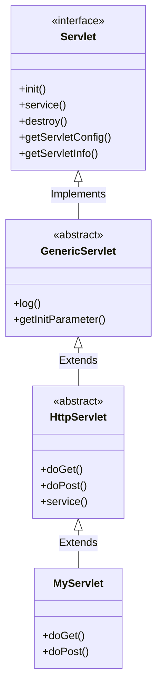
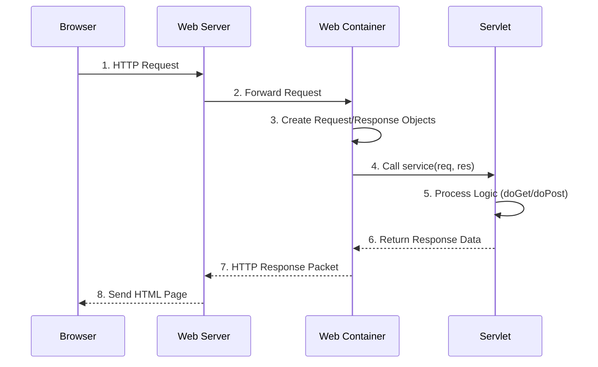
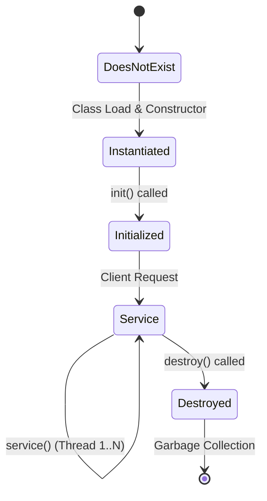

# Unit 2: Java Servlets & Web Basics - Deep Solved Question Bank

> **Target:** Exams requiring detailed 7-Mark answers.
> **Coverage:** All 45 Questions from Question Bank.
> **Features:** In-depth Explanations, Tables, Diagrams, and Full Programs.

---

## Part 1: Servlet Fundamentals (Theory)

### Q1. What is a Servlet? How is it different from an Applet and CGI?

**1. Definition:**
A **Servlet** is a Java program that runs on a web server (like Tomcat). It acts as a middle layer between a request coming from a Web Browser (HTTP) and the Database or Applications on the HTTP server.
*   **Key Job:** Read user input, process it (business logic), and generate dynamic content (HTML).

**2. Difference between Applet, Servlet, and CGI:**

| Feature | Servlet | Applet | CGI (Common Gateway Interface) |
| :--- | :--- | :--- | :--- |
| **Running Location** | **Server-side** (Inside Web Container) | **Client-side** (Inside Browser) | **Server-side** |
| **Language** | Java | Java | Perl, C, Shell Script |
| **Performance** | **High** (Multithreaded: Single instance handles multiple requests) | Slow (Needs to download) | **Low** (Process-based: New process for every request) |
| **Security** | Secure (Managed by Server) | Sandbox security | Less secure |
| **State** | Can maintain state (Session) | Difficult to maintain server state | Stateless |
| **Current Status** | Standard for Enterprise Web | **Deprecated/Obsolete** | Outdated |

> **Analogy:**
> *   **CGI:** A receptionist who hires a *new* temp worker for *every* single phone call. (Slow, Expensive).
> *   **Servlet:** A super-fast receptionist who answers *all* calls on multiple lines simultaneously. (Fast, Efficient).

---

### Q2. Explain the Servlet API. Draw the hierarchy showing `Servlet`, `GenericServlet`, and `HttpServlet`.

**1. The Servlet Hierarchy:**
The Servlet API is built on inheritance.

*   `javax.servlet.Servlet` (Interface)
    *   `javax.servlet.GenericServlet` (Abstract Class)
        *   `javax.servlet.http.HttpServlet` (Abstract Class)
            *   `YourUserDefinedServlet` (Class)

**2. Diagram (Mermaid):**



**3. Details:**
*   **Servlet (Interface):** The boss. Defines the roadmap (Life Cycle methods).
*   **GenericServlet:** The generalist. Implements the interface but doesn't care about the protocol (could be HTTP, FTP, SMTP). It leaves `service()` abstract.
*   **HttpServlet:** The specialist. Extends GenericServlet specifically for **HTTP Protocol**. It implements `service()` to route requests to `doGet()`, `doPost()`, etc.

---

### Q3. Describe the HTTP Request-Response model in Servlets with a diagram.

**The Workflow:**
1.  **Request:** User clicks a link. Browser sends HTTP Request (Headers + Data) to Web Server.
2.  **Container:** Web Server hands specific request to **Servlet Container** (e.g., Tomcat).
3.  **Objects:** Container creates two objects:
    *   `HttpServletRequest` (Data regarding the request).
    *   `HttpServletResponse` (Empty shell for the answer).
4.  **Process:** Container calls `service()` method of the specific Servlet (found via `web.xml` or `@WebServlet`).
5.  **Logic:** Servlet processes data (talks to DB) and fills the `Response` object.
6.  **Response:** Container converts Response object to HTTP Response and sends to Browser.
7.  **Death:** The Request and Response objects are destroyed (Garbage Collected).



---

### Q4. Explain the Servlet Lifecycle in detail with a diagram.

The lifecycle is managed entirely by the **Web Container**. The programmer does not call these methods.

**1. Loading & Instantiation:**
*   Server starts or first request arrives.
*   Container loads the class `MyServlet.class`.
*   Container creates an instance: `Servlet s = new MyServlet()`.

**2. Initialization (`init()`):**
*   **Called:** Exactly **Once**.
*   **Purpose:** To initialize expensive resources (DB connection, read config).
*   **Signature:** `public void init(ServletConfig config)`

**3. Service (`service()`):**
*   **Called:** Multiple times (Once per request).
*   **Purpose:** The main worker. Checks HTTP method (GET/POST) and calls `doGet()` or `doPost()`.
*   **Multithreading:** Container creates a new thread for every service call.

**4. Destruction (`destroy()`):**
*   **Called:** Exactly **Once** (Server shutdown or memory cleanup).
*   **Purpose:** To close connections, save state (cleanup).



---

### Q6. Differentiate between `GenericServlet` and `HttpServlet`.

| Aspect | GenericServlet | HttpServlet |
| :--- | :--- | :--- |
| **Package** | `javax.servlet` | `javax.servlet.http` |
| **Parent** | Implements `Servlet` interface | Extends `GenericServlet` class |
| **Protocol** | Protocol Independent (HTTP, FTP, etc.) | **HTTP Protocol Specific** |
| **Service Method** | Abstract `service()` (Must override) | Implemented `service()` (Routes to doGet/doPost) |
| **Usage** | Rarely used in web apps | Used in **99%** of web apps |

---

### Q7. Initialization Parameters: Global vs Local.

**1. Servlet Config (Local - Specific to ONE servlet):**
*   **Defined:** Inside `<servlet>` tag in `web.xml`.
*   **Accessed:** `getServletConfig().getInitParameter("name")`.
*   **Use Case:** A specific email address for the "Contact Us" servlet only.

**2. Context Param (Global - For ALL servlets):**
*   **Defined:** Directly under `<web-app>` tag.
*   **Accessed:** `getServletContext().getInitParameter("name")`.
*   **Use Case:** Database URL, Global Theme Color.

**web.xml Example:**
```xml
<web-app>
    <!-- GLOBAL -->
    <context-param>
        <param-name>dbUrl</param-name>
        <param-value>jdbc:mysql://localhost/db</param-value>
    </context-param>

    <servlet>
        <servlet-name>MyServlet</servlet-name>
        <!-- LOCAL -->
        <init-param>
            <param-name>adminEmail</param-name>
            <param-value>admin@test.com</param-value>
        </init-param>
    </servlet>
</web-app>
```

---

### Q9. Differentiate between `ServletConfig` and `ServletContext`.

| Feature | ServletConfig | ServletContext |
| :--- | :--- | :--- |
| **Object Type** | One object **per Servlet**. | One object **per Web Application**. |
| **Visibility** | Local (Private to that servlet). | Global (Shared by all servlets/JSPs). |
| **Methods** | `getInitParameter()` | `getInitParameter()`, `setAttribute()`, `getResource()` |
| **Creation** | During `init()` method. | At Application deployment/startup. |
| **Role** | Configuration of a single component. | Communication hub for the whole app. |

---

### Q12 & Q13. Handling Form Data: GET vs POST.

**GET Method:**
*   **How:** Default method or `method="get"`.
*   **Visibilty:** Data appended to URL (`login?user=abc`).
*   **Security:** **Low**. Never use for passwords.
*   **Limit:** ~2KB data length.
*   **Usage:** Fetching data (Search, Filtering).
*   **Java Handler:** `doGet(req, res)`

**POST Method:**
*   **How:** Explicitly `method="post"`.
*   **Visibilty:** Data sent in Request Body (Hidden from address bar).
*   **Security:** **Higher**.
*   **Limit:** No limit (can upload files).
*   **Usage:** Submitting data (Login, Register, Upload).
*   **Java Handler:** `doPost(req, res)`

---

### Q14 & Q15. Forward vs SendRedirect vs Include.

**1. RequestDispatcher.forward(req, res):**
*   **Internal Transfer:** Happens entirely on the server.
*   **One Request:** Uses the *same* request object.
*   **URL:** Does **NOT** change in browser.
*   **Analogy:** You call Receptionist A. She realizes she can't help, so she silently hands the phone to Receptionist B. *You are still on the same call.*

**2. response.sendRedirect(url):**
*   **External Transfer:** Server tells Browser "Go look over there".
*   **Two Requests:** Browser makes a *new* request to the new URL.
*   **URL:** **Changes** in browser.
*   **Analogy:** You call Receptionist A. She says "Please call this other number: 555-0199". You hang up and dial the new number.

**Difference Table:**
| Feature | forward() | sendRedirect() |
| :--- | :--- | :--- |
| **Processing** | Server-side | Client-side (Browser) |
| **Requests** | 1 | 2 (New request created) |
| **Data** | Preserved (req attributes stay) | Lost (unless passed in URL) |
| **Speed** | Faster | Slower (Network round-trip) |
| **URL** | Unchanged | Updates to new URL |

---

## Part 2: Session Management (Theory)

### Q16. What is Session Management? Why is it needed?
**The Problem:** HTTP is a **Stateless Protocol**.
*   When you request Page A, the server sends it and forgets you.
*   When you request Page B immediately after, the server treats you as a completely stranger.
*   *Difficulty:* How do we maintain a "Shopping Cart" or "Login State"?

**The Solution:** Session Management.
*   Comparison of Techniques:

| Technique | Where Stored? | Data Type | Security | Expiry |
| :--- | :--- | :--- | :--- | :--- |
| **Cookies** | Client (Browser) | String only | Low (Editable) | Configurable |
| **Hidden Fields** | Client (HTML form) | String only | Low | On Form Submit |
| **URL Rewriting** | Client (URL) | String only | Very Low | On Tab Close |
| **HttpSession** | **Server Memory** | **Objects (Any)** | **High** | Timeout / Logout |

### Q19. HttpSession Methods Details.
1.  `request.getSession()`: Returns current session. If none exists, creates a **new** one.
2.  `setAttribute(String name, Object value)`: Saves data (e.g., User object) in server memory.
3.  `getAttribute(String name)`: Retrieves data.
4.  `invalidate()`: Destroys session (Logout).
5.  `getId()`: Returns the unique JSESSIONID specific to that user.

---

## Part 3: Filters (Theory)

### Q22. What are Servlet Filters?
Filters are "Gatekeepers". They are Java classes that intercept the Request **before** it reaches the Servlet, or intercept the Response **after** the Servlet but before it goes to the client.

**Real-world Use Cases:**
1.  **Authentication:** "Is this user logged in?" If yes -> Pass. If no -> Redirect to Login.
2.  **Logging:** "Log that IP 192.168.1.5 requested /admin at 10:00 AM".
3.  **Data Compression:** Zip request/response to save bandwidth.
4.  **Input Sanitation:** Remove bad characters from input to prevent hacking.

### Q23. Filter Lifecycle.
1.  **Init:** `init(FilterConfig filterConfig)`
    *   Called once. Read parameters.
2.  **Filter:** `doFilter(ServletRequest request, ServletResponse response, FilterChain chain)`
    *   **Crucial Step:** You MUST write `chain.doFilter(request, response)` inside this.
    *   *Before chain:* Pre-processing (Auth check).
    *   *After chain:* Post-processing (Logging time taken).
3.  **Destroy:** `destroy()`
    *   Cleanup.

---

## Part 4: Programs (Practical Solutions)

### Q31. Basic "Welcome" Servlet (Hello World).
*Simple servlet configuration using Annotation.*
```java
import java.io.*;
import javax.servlet.*;
import javax.servlet.annotation.WebServlet;
import javax.servlet.http.*;

@WebServlet("/welcome")
public class WelcomeServlet extends HttpServlet {
    public void doGet(HttpServletRequest req, HttpServletResponse res) throws IOException {
        // 1. Set Content Type (MIME type)
        res.setContentType("text/html");
        
        // 2. Get Object to write text to browser
        PrintWriter out = res.getWriter();
        
        // 3. Write HTML
        out.println("<html><body>");
        out.println("<h1>Welcome to Rai University</h1>");
        out.println("<p>This is my first dynamic servlet!</p>");
        out.println("</body></html>");
    }
}
```

---

### Q32. Login Servlet (Read Input).
*Reads parameters 'user' and 'pass' from request.*
```java
@WebServlet("/login")
public class LoginServlet extends HttpServlet {
    protected void doPost(HttpServletRequest req, HttpServletResponse res) throws IOException {
        res.setContentType("text/html");
        PrintWriter out = res.getWriter();
        
        // 1. Read Form Data
        String u = req.getParameter("username");
        String p = req.getParameter("password");
        
        // 2. Validate
        if(u.equals("admin") && p.equals("secret")) {
            out.println("<h2 style='color:green'>Login Successful!</h2>");
            out.println("Welcome, " + u);
        } else {
            out.println("<h2 style='color:red'>Login Failed!</h2>");
            out.println("Invalid username or password.");
            // Example of 'include' - show login form again
            // RequestDispatcher rd = req.getRequestDispatcher("login.html");
            // rd.include(req, res);
        }
    }
}
```

---

### Q35. RequestDispatcher Forward Example.
*FirstServlet forwards to SecondServlet.*
```java
// FirstServlet.java
@WebServlet("/start")
public class FirstServlet extends HttpServlet {
    public void doGet(HttpServletRequest req, HttpServletResponse res) throws ServletException, IOException {
        // 1. Set an attribute to pass to next servlet
        req.setAttribute("message", "Hello from Servlet 1");
        
        // 2. Get Dispatcher for next resource
        RequestDispatcher rd = req.getRequestDispatcher("final");
        
        // 3. Forward (Control transferred completely)
        rd.forward(req, res);
    }
}

// SecondServlet.java
@WebServlet("/final")
public class SecondServlet extends HttpServlet {
    public void doGet(HttpServletRequest req, HttpServletResponse res) throws IOException {
        PrintWriter out = res.getWriter();
        
        // 4. Retrieve data from request
        String msg = (String) req.getAttribute("message");
        
        out.println("<h1>Destination Reached</h1>");
        out.println("Received: " + msg);
    }
}
```

---

### Q36 & Q37. Cookies (Create & Read).
```java
// CreateCookieServlet.java
@WebServlet("/createcookie")
public class CreateCookie extends HttpServlet {
    public void doGet(HttpServletRequest req, HttpServletResponse res) {
        // Create
        Cookie c = new Cookie("username", "RaiStudent");
        
        // Configure (Expires in 24 hours)
        c.setMaxAge(24 * 60 * 60); 
        
        // Send to client
        res.addCookie(c);
    }
}

// ReadCookieServlet.java
@WebServlet("/readcookie")
public class ReadCookie extends HttpServlet {
    public void doGet(HttpServletRequest req, HttpServletResponse res) throws IOException {
        PrintWriter out = res.getWriter();
        
        // Get all cookies
        Cookie[] cookies = req.getCookies();
        
        if(cookies != null) {
            for(Cookie c : cookies) {
                out.println("Name: " + c.getName() + ", Value: " + c.getValue());
            }
        } else {
            out.println("No cookies found");
        }
    }
}
```

---

### Q38. Session Counter (Visits per session).
```java
@WebServlet("/counter")
public class SessionCounter extends HttpServlet {
    public void doGet(HttpServletRequest req, HttpServletResponse res) throws IOException {
        res.setContentType("text/html");
        PrintWriter out = res.getWriter();
        
        // 1. Get Session (Create if not exists)
        HttpSession session = req.getSession(true);
        
        // 2. Check if "visits" attribute exists
        Integer count = (Integer) session.getAttribute("visits");
        
        if(count == null) {
            count = 1; // First visit
            out.println("Welcome! This is your first visit.");
        } else {
            count++; // Increment visit
            out.println("Welcome back! You visited " + count + " times.");
        }
        
        // 3. Save updated count back to session
        session.setAttribute("visits", count);
    }
}
```

---

### Q39. Complete Login App using HttpSession.

**1. LoginServlet**
```java
String u = req.getParameter("user");
// ... check password ...
HttpSession session = req.getSession();
session.setAttribute("currentUser", u); // Login user
res.sendRedirect("welcome"); // Go to dashboard
```

**2. WelcomeServlet (Protected Page)**
```java
HttpSession session = req.getSession(false); // Don't create new if not exists
if(session != null && session.getAttribute("currentUser") != null) {
    String name = (String) session.getAttribute("currentUser");
    out.println("Hello " + name + "! <a href='logout'>Logout</a>");
} else {
    res.sendRedirect("login.html"); // Force Login
}
```

**3. LogoutServlet**
```java
HttpSession session = req.getSession(false);
if(session != null) {
    session.invalidate(); // Destroy session
}
out.println("You are logged out.");
```

---

### Q41. Authentication Filter Code.
*Intercepts traffic to /admin/ pages.*
```java
@WebFilter("/admin/*")
public class AuthFilter implements Filter {
    
    public void init(FilterConfig arg0) {}

    public void doFilter(ServletRequest req, ServletResponse res, FilterChain chain) 
            throws IOException, ServletException {
        
        HttpServletRequest request = (HttpServletRequest) req;
        HttpServletResponse response = (HttpServletResponse) res;
        
        // Check session
        HttpSession session = request.getSession(false);
        boolean isLoggedIn = (session != null && session.getAttribute("currentUser") != null);
        
        if (isLoggedIn) {
            // User is safe, let them pass
            chain.doFilter(req, res);
        } else {
            // Stranger danger, redirect to login
            response.sendRedirect(request.getContextPath() + "/login.html");
        }
    }

    public void destroy() {}
}
```

---

### Q43. JDBC Registration Servlet.
*Connects Servlet to Database.*
```java
@WebServlet("/register")
public class RegisterServlet extends HttpServlet {
    protected void doPost(HttpServletRequest req, HttpServletResponse res) throws IOException {
        res.setContentType("text/html");
        PrintWriter out = res.getWriter();
        
        // 1. Get Input
        String name = req.getParameter("name");
        String email = req.getParameter("email");
        String pass = req.getParameter("pass");
        
        try {
            // 2. Load Driver
            Class.forName("com.mysql.cj.jdbc.Driver");
            
            // 3. Connect
            Connection con = DriverManager.getConnection(
                "jdbc:mysql://localhost:3306/mydb", "root", "password");
            
            // 4. Query
            PreparedStatement ps = con.prepareStatement(
                "INSERT INTO users(name, email, password) VALUES(?,?,?)");
            
            ps.setString(1, name);
            ps.setString(2, email);
            ps.setString(3, pass);
            
            // 5. Execute
            int i = ps.executeUpdate();
            
            if(i > 0) {
                out.println("<h3>Registration Successful!</h3>");
            }
            con.close();
            
        } catch(Exception e) {
            out.println("Error: " + e);
        }
    }
}
```
