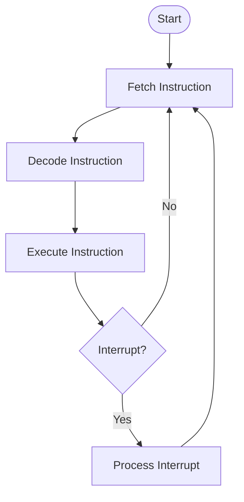

# Unit 2: Basic Computer Organization & CPU - Complete Theory Notes

> **Scope:** Full Syllabus Coverage for Unit 2.
> **Topics:** Registers, Instructions, Timing, Stack, Formats, Addressing.

---

## Part 1: Basic Computer Organization

### 1. Computer Registers
A computer needs various registers to manipulate data and store addresses during program execution.

| Symbol | Name | Size | Function |
| :--- | :--- | :--- | :--- |
| **DR** | Data Register | 16-bit | Holds memory operand (Data read from memory). |
| **AR** | Address Register | 12-bit | Holds address for memory. |
| **AC** | Accumulator | 16-bit | Processor register (General purpose, Math results). |
| **IR** | Instruction Register | 16-bit | Holds instruction code being executed. |
| **PC** | Program Counter | 12-bit | Holds address of the **next** instruction. |
| **TR** | Temporary Register | 16-bit | Holds temporary data. |
| **INPR** | Input Register | 8-bit | Holds input character. |
| **OUTR** | Output Register | 8-bit | Holds output character. |

---

### 2. Instruction Codes
*   **Stored Program Organization:** Instructions and Data are both stored in memory.
*   **Instruction Format (Basic):**
    *   **I (1 bit):** Mode (0 = Direct, 1 = Indirect).
    *   **Opcode (3 bits):** Operation (Add, Load, Store).
    *   **Address (12 bits):** Memory Address.

> **Direct Address (I=0):** Address part points to the operand.
> **Indirect Address (I=1):** Address part points to an address which points to the operand.

---

### 3. The Instruction Cycle
The CPU processes instructions in 3 phases:

1.  **Fetch:**
    *   Read instruction from memory address pointed by PC.
    *   Transfer instruction to IR.
    *   Increment PC.
    *   `T0: AR <- PC`
    *   `T1: IR <- M[AR], PC <- PC + 1`

2.  **Decode:**
    *   Decode opcode (Bits 12-14).
    *   Decide addressing mode (Bit 15).
    *   `T2: D0...D7 <- Decode Opcode`

3.  **Execute:**
    *   Perform the operation based on decoded Opcode.
    *   `T3...T6`: Actual execution.

---

### 4. Memory Reference Instructions
These instructions refer to a memory address.

| Symbol | Description | Operation |
| :--- | :--- | :--- |
| **AND** | AND to AC | AC <- AC ^ M[AR] |
| **ADD** | Add to AC | AC <- AC + M[AR] |
| **LDA** | Load to AC | AC <- M[AR] |
| **STA** | Store AC | M[AR] <- AC |
| **BUN** | Branch Unconditionally | PC <- AR (Jump) |
| **BSA** | Branch and Save Return | Save PC used for Subroutines |
| **ISZ** | Increment and Skip if Zero | M[AR]++, if 0 skip next instruction |

---

### 5. Input-Output and Interrupt
*   **Programmed I/O:** CPU monitors the flag bit continuously (Polling). CPU stays busy looping. (Inefficient).
*   **Interrupt Driven I/O:** CPU does other work. When device is ready, it sends an **Interrupt Signal**. CPU stops, handles I/O, and resumes. (Efficient).

---

## Part 2: Central Processing Unit (CPU)

### 6. Stack Organization
A **Stack** is a storage mechanism that stores information in a **LIFO** (Last-In First-Out) manner.

#### A. Register Stack
*   A collection of finite number of registers.
*   **Stack Pointer (SP):** Holds the address of the top item.
*   **PUSH:**
    1.  `SP <- SP + 1`
    2.  `M[SP] <- DR` (Write)
    3.  If SP = Max, Stack Overflow.
*   **POP:**
    1.  `DR <- M[SP]` (Read)
    2.  `SP <- SP - 1`
    3.  If SP = 0, Stack Underflow.

#### B. Memory Stack
*   A portion of RAM is assigned as stack.
*   CPU uses `SP` register to point to memory address.
*   Often grows **downwards** (High address to Low address).

---

### 7. Instruction Formats
The layout of bits in an instruction.

1.  **Three-Address Instruction:**
    *   `Opcode + Dest + Src1 + Src2`
    *   Ex: `ADD R1, A, B`  (R1 <- M[A] + M[B])
    *   *Usage:* General Register Organization.

2.  **Two-Address Instruction:**
    *   `Opcode + Dest + Src`
    *   Ex: `ADD R1, B` (R1 <- R1 + M[B])
    *   *Usage:* Most common commercial computers.

3.  **One-Address Instruction:**
    *   `Opcode + Operand`
    *   Ex: `ADD B` (AC <- AC + M[B])
    *   *Usage:* Accumulator Organization.

4.  **Zero-Address Instruction:**
    *   `Opcode` (No operands)
    *   Ex: `ADD` (Pops top two from stack, adds, pushes result)
    *   *Usage:* Stack Organization.

---

### 8. Addressing Modes (Detailed)
How the operand is chosen.

1.  **Implied Mode:** Operand is specified implicitly in definition. (Ex: `CLA` - Clear Accumulator).
2.  **Immediate Mode:** Operand is specified in the instruction. (Ex: `MOV R1, #5`).
3.  **Register Mode:** Operand is in a register. (Ex: `MOV R1, R2`).
4.  **Register Indirect:** Register holds address of operand. (Ex: `MOV R1, @R2`).
5.  **Direct Mode (Absolute):** Address field contains effective address. (Ex: `LDA 1000`).
6.  **Indirect Mode:** Address field points to address of operand. (Ex: `LDA @1000`).
7.  **Relative Mode:** Address = PC + Offset. Used for branching.
8.  **Indexed Mode:** Address = Index Register (XR) + Constant. Used for arrays.
9.  **Auto-Increment/Decrement:** Register incremented/decremented after/before access. Used for loops.

---

### 9. Data Transfer and Manipulation
1.  **Data Transfer:** MOV, LOAD, STORE, EXCHANGE, PUSH, POP.
2.  **Arithmetic:** ADD, SUB, MUL, DIV, INC, DEC.
3.  **Logical:** AND, OR, XOR, COM (Complement), CLR (Clear).
4.  **Shift:** SHR (Shift Right), SHL (Shift Left), ROR (Rotate Right), ROL (Rotate Left).

---

### 10. RISC vs CISC
| Feature | RISC (Reduced Instruction Set) | CISC (Complex Instruction Set) |
| :--- | :--- | :--- |
| **Instructions** | Few, Simple, Fixed Length | Many, Complex, Variable Length |
| **Execution** | Execute in 1 cycle | Multiple cycles per instruction |
| **Addressing** | Few modes | Many complex modes |
| **Registers** | Many registers | Few registers |
| **Complexity** | In Compiler (Software) | In Microcode (Hardware) |
| **Application** | Smartphones (ARM) | Desktops (x86) |
