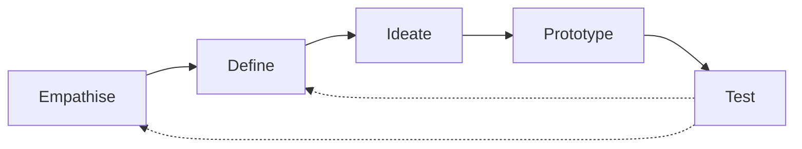

# Unit 1: Introduction to Design Thinking - Deep Notes

> **Target:** 5-6 Mark Questions
> **Coverage:** 100% Syllabus (Definitions, Framework, Models, Business Context)

---

## 1. Introduction to Design Thinking & Importance
### What is Design Thinking?
Design Thinking is a **human-centered approach to innovation** that draws from the designer's toolkit to integrate the needs of people, the possibilities of technology, and the requirements for business success.
*   **Non-linear & Iterative:** It is not a straight line. You loop back frequently.
*   **Focus:** It focuses on the **Users** rather than the **product**.

### Importance Construction of Design Thinking
1.  **Reduces Risk:** By testing prototypes early, businesses avoid building products nobody wants.
2.  **Fosters Innovation:** Encourages "thinking outside the box" (divergent thinking).
3.  **Customer Satisfaction:** Solutions are tailored to actual human needs, leading to higher adoption.
4.  **Collaboration:** Breaks down silos; requires cross-functional teams (marketers, engineers, designers) to work together.

---

## 2. The Design Thinking Framework (The 5 Defined Stages)
*(Crucial for Exam - Draw the loop diagram if possible)*

### Stage 1: Empathise (Understand the User)
> **Mnemonic:** **E-D-I-P-T** (Empathise, Define, Ideate, Prototype, Test)

*   **Goal:** Gain an empathic understanding of the problem being solved.
*   **Activities:** Observe users, engage with them (interviews), immerse yourself in their environment.
*   **Why?** To set aside assumptions and understand the *real* need.

### Stage 2: Define (State the Problem)
*   **Goal:** Re-frame the problem in a human-centric way.
*   **Activities:** Analyze observations and synthesize them into a **Problem Statement** or **Point of View (POV)**.
*   **Example:** Instead of "We need to increase market share by 5%", say "Teenage girls need a healthier snack option because..."

### Stage 3: Ideate (Generate Ideas)
*   **Goal:** Generate a wide range of ideas.
*   **Activities:** Brainstorming, Worst Possible Idea, SCAMPER.
*   **Rule:** Quantity > Quality. No judgment allowed.

### Stage 4: Prototype (Build to Think)
*   **Goal:** Produce a number of inexpensive, scaled-down versions of the solution.
*   **Activities:** Paper models, Storyboards, Wireframes.
*   **Why?** To investigate problem solutions and fail cheap/fast.

### Stage 5: Test (Validation)
*   **Goal:** Rigorously test the complete product using the best solutions.
*   **Activities:** Users use the prototype; designers observe and capture feedback.
*   **Result:** Feedback loop -> Return to Define or Ideate.

---

## 3. Comparison of Methodologies

### Waterfall Model vs V-Model vs Design Thinking

| Feature | Waterfall Model | V-Model | Design Thinking |
| :--- | :--- | :--- | :--- |
| **Structure** | Linear (Step-by-step) | Linear (V-Shape) | Non-Linear (Looping) |
| **Focus** | Requirements | Verification & Validation | User Empathy |
| **Flexibility** | Rigid | Rigid | Very Flexible |
| **Feedback** | Late (at the end) | During Testing phase | Continuous |
### V-Model (Verification & Validation)
*   **Concept:** An extension of Waterfall where for every development phase, there is a corresponding testing phase.
*   **Shape:** forming a 'V'. Left side = Development (Verification). Right side = Testing (Validation).
*   **Phases:**
    *   Requirements <--> Acceptance Testing
    *   System Design <--> System Testing
    *   Unit Design <--> Unit Testing
*   **Best For:** Projects where requirements are clearly defined and fixed (e.g., Medical software).

---

## 4. Design Thinking in Context

### Innovation Management
Innovation is not just "new tech". It is the intersection of:
1.  **Desirability (Human):** Do people want this?
2.  **Feasibility (Technical):** Can we build this with current tech?
3.  **Viability (Business):** Will this make money/be sustainable?
**Design Thinking** ensures all 3 are met, managing the "Chaos" of innovation.

### Changing Management Paradigms
*   **Old Paradigm:** "We know what is best." Managers decide, workers execute. Top-down.
*   **New Paradigm (Design Thinking):** "The User knows best." Teams are self-organizing. Bottom-up innovation. Failure is seen as learning.

### Design Thinking: Science vs Art
*   **Science:** It uses a systematic, analytical approach (Observation -> Hypothesis -> Test). It relies on data and logic.
*   **Art:** It uses creativity, intuition, and emotional intelligence (Empathy). It focuses on aesthetics and human feeling.
*   **Conclusion:** Design Thinking is the **bridge** between Science (Engineering) and Art (Design).

### Linking Solutions to Business Challenges
Businesses often solve the *wrong* problem.
*   *Example:* A bank thinks they need a "Faster App" (Business Challenge).
*   *Design Thinking Application:* After empathizing, they realize users don't care about speed, they care about *trust*.
*   *Solution:* Add security features, not speed features. This saves money and solves the real business challenge.
