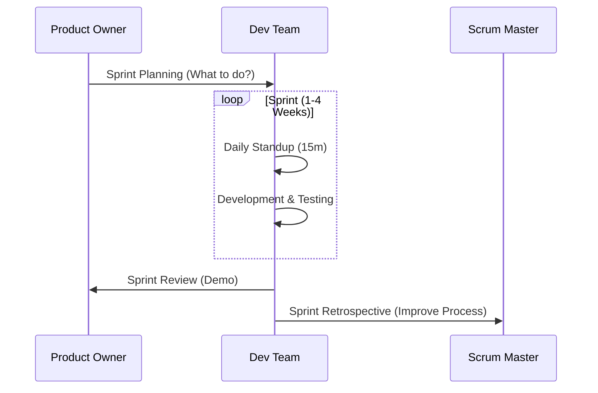

# Unit 2: Agile Software Development - Deep Notes

> **Target:** 5-6 Mark Questions
> **Coverage:** 100% Syllabus (Agile, Scrum, XP, TDD, FDD, RUP, Agile vs DevOps)

---

## 1. Agile Principles & Methodology
### The Agile Manifesto (4 Values)
1.  **Individuals and interactions** over processes and tools.
2.  **Working software** over comprehensive documentation.
3.  **Customer collaboration** over contract negotiation.
4.  **Responding to change** over following a plan.

> **Exam Tip:** Remember **"I-W-C-R"** (Individuals, Working sw, Customer, Responding).

### Agile vs Waterfall (Crucial Comparison)
*   **Waterfall:** Sequential. Requirements -> Design -> Code -> Test. Creating a "Heavy" product. Good for predictable projects.
*   **Agile:** Iterative. Plan -> Do -> Check -> Act (Repeat). Creating a "Lightweight" product. Good for changing requirements.

---

## 2. Agile Frameworks (Beyond Scrum)

### A. Extreme Programming (XP)
*   **Focus:** Technical excellence and customer satisfaction.
*   **Key Practices:**
    *   **Pair Programming:** Two devs, one machine.
    *   **Continuous Integration (CI):** Merge code daily.
    *   **Test-Driven Development (TDD):** Write test first, then code.
    *   **Small Releases:** Frequent updates.

### Kanban (Detailed)
*   **Focus:** Visualizing work, limiting work in progress (WIP), and maximizing flow.
*   **4 Core Principles:**
    1.  **Visualize Work:** Use a board (ToDo, Doing, Done).
    2.  **Limit Work in Progress (WIP):** Don't start too many things at once.
    3.  **Focus on Flow:** Monitor how fast items move.
    4.  **Continuous Improvement:** Always look for bottlenecks.
*   **Key Difference from Scrum:** No fixed Sprints. Continuous delivery.

### B. Rational Unified Process (RUP)
*   An iterative framework by IBM.
*   **4 Phases:** Inception, Elaboration, Construction, Transition.
*   More structured and heavy documentation compared to Scrum.

### C. Feature Driven Development (FDD)
*   **Focus:** Delivering tangible, working software repeatedly in a timely manner.
*   **Process:** Develop an overall model -> Build a feature list -> Plan by feature -> Design by feature -> Build by feature.

### D. Test Driven Development (TDD)
*   **Concept:** You write the **Test Case** *before* you write the code.
*   **Cycle:** Red (Test Fails) -> Green (Write Code to Pass) -> Refactor (Clean up).

---

## 3. The Scrum Framework (Detailed)

### Roles
1.  **Product Owner:** The "Voice of the Customer". Manage Product Backlog. ROI focused.
2.  **Scrum Master:** The "Facilitator". Removes blockers. Process focused.
3.  **Development Team:** Self-organizing. Cross-functional. 3-9 members.

### Sprints
*   A time-boxed period (1-4 weeks) to create a "Done", useable, and potentially releasable product increment.
*   **No changes** are made that endanger the Sprint Goal during the Sprint.

### Scrum Events
1.  **Sprint Planning:** What can be done? How will the chosen work get done?
2.  **Daily Scrum:** 15-minute standup.
3.  **Sprint Review:** Inspect the Increment and adapt the Product Backlog.
4.  **Sprint Retrospective:** Inspect the *Team* and *Process* to improve.

### Scrum Metrics
1.  **Burndown Chart:** Shows work remaining vs time. (Should trend down).
2.  **Velocity:** The amount of work (Story Points) a team completes in a Sprint. Used for future planning.

---

## 4. Agile vs DevOps (Syllabus Topic)
*This is often a question: "How does Agile relate to DevOps?"*

| Feature | Agile | DevOps |
| :--- | :--- | :--- |
| **Focus** | Software Development (Dev) | End-to-End Delivery (Dev + Ops) |
| **Gap Bridged** | Customer & Developer | Developer & Operations (IT) |
| **Goal** | Speed of Coding/Adapting to Change | Speed of Deployment/Stability |
| **Key Metric** | Velocity / Working Software | Deployment Frequency / Failure Rate |
| **Feedback** | From Customer | From Monitoring/Production |

> **Conclusion:** DevOps is often considered the logical continuation of Agile. Agile fixes the coding process; DevOps fixes the delivery and operations process.

---

## 5. Case Studies (Brief)
*   **Spotify Model:** Uses "Squads" (Teams), "Tribes" (Groups of Squads), "Chapters" (Specialists), and "Guilds" (Interest groups) to scale Agile across a large company.
*   **Amazon:** Deploys code every few seconds using extreme automation (DevOps) and small "Two-Pizza Teams" (Agile).
