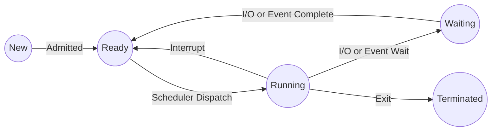

# Operating Systems - Deep Exam Notes (Unit 1 & 2)

> **Target:** 7-Mark Theoretical Questions & MCQs.
> **Focus:** Diagrams, Key Definitions, Algorithms, Comparisons.

---

# Unit 1: Introduction to Operating Systems

## Q1: Explain the functional units/services of an Operating System. (7 Marks)

An Operating System provides an environment for the execution of programs and services to users and programs.

**1. User Interface:**
*   **CLI (Command Line Interface):** Text-based.
*   **GUI (Graphical User Interface):** Windows, Icons, Menus.

**2. Program Execution:**
*   The OS loads a program into memory and runs it via the CPU.
*   Handles program termination (normal or error).

**3. I/O Operations:**
*   Programs cannot control I/O devices directly (security).
*   OS provides a uniform interface for drivers.

**4. File-System Manipulation:**
*   Create, delete, read, write files and directories.
*   Manage permissions and access control.

**5. Communications:**
*   **Inter-Process Communication (IPC):** Shared Memory or Message Passing.
*   **Network Communication:** Between different systems.

**6. Error Detection:**
*   Detects errors in CPU, Memory, I/O devices, or user programs (overflow, illegal access).

**7. Resource Allocation:**
*   Allocation of CPU cycles, main memory, and file storage for multiple concurrent users/jobs.

**8. Accounting:**
*   Keeps track of which users use how much and what kinds of computer resources.

**9. Protection and Security:**
*   **Protection:** Controlling access to resources.
*   **Security:** Authenticating users (passwords).

---

## Q2: Evolution/Types of Operating Systems. (7 Marks)

**1. Batch Processing Systems:**
*   Jobs with similar needs are batched together.
*   **Pros:** Improved CPU utilization over manual op.
*   **Cons:** No interaction between user and job. CPU often idle during I/O.
*   *Example:* Payroll systems, Bank statements.

**2. Time-Sharing Systems (Multitasking):**
*   CPU switches jobs so frequently that users can interact with each job while it is running.
*   **Key:** Response time is critical.
*   *Example:* Unix, Windows.

**3. Real-Time Systems (RTOS):**
*   Rigid time requirements. Processing must be done within defined constraints.
*   **Hard Real-Time:** Critical failure if deadline missed (e.g., Pacemaker, Flight control).
*   **Soft Real-Time:** Quality degrades if deadline missed (e.g., Video streaming).

**4. Distributed Systems:**
*   Computation distributed among several physical processors.
*   Loosely coupled systems.

---

## Q3: Monolithic vs Microkernel Architecture. (7 Marks)

| Feature | Monolithic Kernel | Microkernel |
| :--- | :--- | :--- |
| **Size** | Large. Entire OS in kernel space. | Small. Minimal required functions in kernel. |
| **Speed** | Fast (System calls are direct function calls). | Slower (Message passing overhead). |
| **Stability** | Crash in a driver crashes the whole OS. | Crash in a service doesn't crash the kernel. |
| **Services** | File system, IPC, Drivers all in kernel. | File system, Drivers in User Space. |
| **Example** | Linux, Unix, MS-DOS. | Minix, QNX, L4. |

---

# Unit 1: MCQ Corner

1.  **The specific environment/program that acts as an intermediary between user and hardware is:**
    *   a) Compiler
    *   b) **Operating System**
    *   c) Assembler
    *   d) Loader

2.  **In which OS is the "Response Time" strictly crucial?**
    *   a) Batch
    *   b) **Real-Time**
    *   c) Time-Sharing
    *   d) Distributed

3.  **The mode bit '0' represents:**
    *   a) User Mode
    *   b) **Kernel/Monitor Mode**
    *   c) Privilege Mode
    *   d) Safe Mode

---
---

# Unit 2: Process Management

## Q1: Explain Process States with a Diagram. (7 Marks)

A process is a program in execution. As it executes, it changes state.

**The 5-State Life Cycle Model:**

1.  **New:** The process is being created.
2.  **Ready:** The process is waiting to be assigned to a processor. (Stored in Ready Queue).
3.  **Running:** Instructions are being executed.
4.  **Waiting (Blocked):** The process is waiting for some event (I/O completion or reception of a signal).
5.  **Terminated:** The process has finished execution.



*Note: For 7 marks, also mention **Suspended Ready** and **Suspended Wait** states (swapped out processes).*

---

## Q2: Process Control Block (PCB). (5 Marks)

Each process is represented in the OS by a PCB (Task Control Block). It contains:

1.  **Process State:** (New, Ready, Running, etc.)
2.  **Program Counter (PC):** Address of the next instruction to execute.
3.  **CPU Registers:** Accumulators, Index registers, Stack pointers.
4.  **CPU Scheduling Information:** Priority, pointers to scheduling queues.
5.  **Memory-Management Information:** Base/Limit registers, Page tables.
6.  **Accounting Information:** Time limits, Process numbers.
7.  **I/O Status Information:** List of I/O devices allocated, open files.

> **Visual:** Imagine a block with these fields stacked. It is the specific data structure for a process.

---

## Q3: User Level Threads (ULT) vs Kernel Level Threads (KLT). (7 Marks)

| Feature | User Level Threads (ULT) | Kernel Level Threads (KLT) |
| :--- | :--- | :--- |
| **Management** | By user-level thread library. | By the Operating System. |
| **Speed** | Faster (creation/switching needs no kernel intervention). | Slower (requires system calls). |
| **Blocking** | If one thread blocks, the entire process blocks. | If one thread blocks, kernel can schedule another. |
| **OS Awareness** | Kernel sees one process, unaware of threads. | Kernel is fully aware of all threads. |
| **Example** | Java Green Threads, POSIX Pthreads (User space). | Windows, Linux (Native threads). |

---

## Q4: Scheduling Algorithms (Criteria & Types). (7 Marks)

**Scheduling Criteria:**
*   **CPU Utilization:** Keep CPU as busy as possible (Max).
*   **Throughput:** # of processes completed per time unit (Max).
*   **Turnaround Time:** Time from submission to completion (Min).
*   **Waiting Time:** Time spending waiting in the ready queue (Min).
*   **Response Time:** Time from submission to first response (Min).

**Algorithms:**
1.  **FCFS (First-Come, First-Served):** Non-preemptive. Simple but suffers from **Convoy Effect**.
2.  **SJF (Shortest Job First):** Provably optimal min waiting time. Hard to predict burst time.
3.  **Priority Scheduling:** CPU to highest priority. Problem: **Starvation** (Solution: **Aging**).
4.  **Round Robin (RR):** Preemptive. Each process gets a time quantum (q). Good for Time-Sharing.

---

## Q5: The Critical Section Problem & Semaphores. (7 Marks)

**Critical Section (CS):** Segment of code where shared resources are accessed.

**3 Requirements for Solution:**
1.  **Mutual Exclusion:** If process Pi is in CS, no other process can be in CS.
2.  **Progress:** If no one is in CS, selection for next entrant cannot be postponed indefinitely.
3.  **Bounded Waiting:** A bound must exist on the number of times other processes are allowed to enter CS after a request is made.

**Semaphores (Dijkstra):**
A synchronization tool. An integer variable accessed only via two standard atomic operations: `wait()` (P) and `signal()` (V).

*   **Binary Semaphore (Mutex):** Value 0 or 1.
*   **Counting Semaphore:** Unrestricted domain.

```c
// Structure of Wait (P)
wait(S) {
    while (S <= 0); // Busy wait
    S--;
}

// Structure of Signal (V)
signal(S) {
    S++;
}
```

---

## Q6: Classical Problems of Synchronization. (7 Marks)

**1. Producer-Consumer Problem:**
*   **Buffer:** Size N.
*   **Producer:** Checks if buffer is full; if not, produces item.
*   **Consumer:** Checks if buffer is empty; if not, consumes item.
*   **Semaphores used:** `mutex` (1), `empty` (N), `full` (0).

**2. Dining Philosophers Problem:**
*   5 Philosophers, 5 Chopsticks. Needs 2 chopsticks to eat.
*   **Problem:** Deadlock if all pick up left chopstick simultaneously.
*   **Solution:** Pick up both only if available (Monitor), or asymmetric solution (odd/even).

---

# Unit 2: MCQ Corner

1.  **Which scheduler controls the degree of multiprogramming?**
    *   a) Short-term Scheduler
    *   b) **Long-term Scheduler**
    *   c) Medium-term Scheduler
    *   d) Dispatcher

2.  **In Round Robin, if the time quantum is very large, it behaves like:**
    *   a) SJF
    *   b) **FCFS**
    *   c) Priority
    *   d) Multilevel Queue

3.  **A situation where processes are waiting indefinitely for an event that can only be triggered by another waiting process is:**
    *   a) Starvation
    *   b) Aging
    *   c) **Deadlock**
    *   d) Race Condition

4.  **The only state transition that is NOT possible is:**
    *   a) Ready -> Running
    *   b) Running -> Ready
    *   c) **Waiting -> Running** (Must go to Ready first)
    *   d) Running -> Terminated
