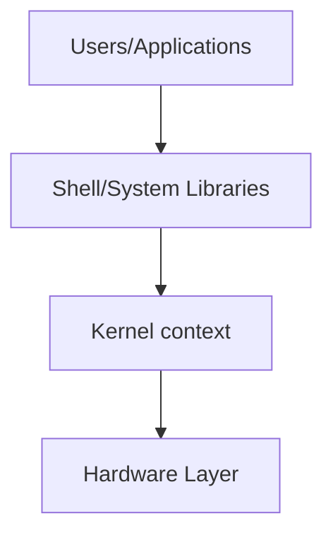

# Operating Systems - Unit 1: Introduction Deep Notes

> **Target:** 7-Mark Theoretical Questions & MCQs.
> **Focus:** Diagrams, Key Definitions, Algorithms, Comparisons.

---

## Q1: Explain the functional units/services of an Operating System. (7 Marks)

An Operating System provides an environment for the execution of programs and services to users and programs.

**1. User Interface:**
*   **CLI (Command Line Interface):** Text-based interaction (Shell).
*   **GUI (Graphical User Interface):** Windows, Icons, Menus, Pointer.

**2. Program Execution:**
*   OS loads programs into RAM and executes them.
*   Handles process synchronization and deadlock handling.

**3. I/O Operations:**
*   Programs cannot directly control I/O devices (security).
*   OS provides a uniform interface to hide specific hardware details.

**4. File-System Manipulation:**
*   Create, delete, read, write files and directories.
*   Permission management (Read/Write/Execute).

**5. Communications:**
*   **Local (IPC):** Shared Memory or Message Passing.
*   **Remote:** Sockets for network communication.

**6. Error Detection:**
*   Constant monitoring for CPU, Memory, or I/O errors (e.g., Disk failure, Divide by zero).

**7. Resource Allocation:**
*   Managing CPU cycles, Main Memory, and Storage for concurrent processes.

**8. Protection and Security:**
*   **Protection:** Control access to system resources.
*   **Security:** Authentication (User IDs, passwords) and defense against attacks.

---

## Q2: Evolution/Types of Operating Systems. (7 Marks)

**1. Batch Processing Systems:**
*   Jobs grouped in "batches" with similar needs.
*   **Pros:** Better CPU utilization than manual loading.
*   **Cons:** Non-interactive, difficult debugging, long turnaround time.
*   *Example:* Payroll/Bank systems (IBM 1401).

**2. Time-Sharing Systems (Multitasking):**
*   CPU switches rapidly between users/jobs (Time Quantum).
*   **Key:** Fast **Response Time** (interactive).
*   *Example:* UNIX, Windows, Linux.

**3. Real-Time Systems (RTOS):**
*   **Hard RTOS:** Guarantee critical deadlines (e.g., Pacemaker, Flight Control). Missing deadline = Failure.
*   **Soft RTOS:** Priority to critical tasks, but deadlines can slip slightly (e.g., Video Streaming).

**4. Distributed Systems:**
*   Physically separate systems connected via network acting as one.
*   Loosely coupled; high reliability and scalability.

**5. Handheld/Embedded Systems:**
*   **Handheld:** Touch/Gesture based, limited power (Android/iOS).
*   **Embedded:** Dedicated function, often no UI, highly efficient (Washing Machine, Car ECU).

---

## Q3: User View vs System View of OS. (7 Marks)

The OS can be viewed from two perspectives:

### 1. User View (The Interface)
Focuses on the user experience based on the device.
*   **Single User (PC):** Focus on **Ease of Use** and performance for one person. Resource utilization is secondary.
*   **Multi-User (Mainframes/Servers):** Focus on **Resource Sharing** (Fairness). No single user should hog the CPU/Memory.
*   **Handheld:** Focus on **Battery Life** and **UI (Touch)**.
*   **Embedded:** Minimal or **No User View**. Runs automatically.

### 2. System View (The Hardware Manager)
Focuses on efficient operation.
*   **Resource Allocator:** OS acts as the manager of CPU, Memory, I/O, deciding who gets what and for how long.
*   **Control Program:** OS controls execution of user programs to prevent errors and improper use of the computer.


> **Diagram:**
>
> ```mermaid
> graph TD
>     OS[Operating System]
>     
>     subgraph User_View [User View]
>     PC[PC: Ease of Use]
>     Mainframe[Mainframe: Resource Sharing]
>     Handheld[Handheld: UI/Battery]
>     end
>     
>     subgraph System_View [System View]
>     ResAllocator[Resource Allocator]
>     ControlProg[Control Program]
>     end
>     
>     OS --- User_View
>     OS --- System_View
> ```


---

## Q4: UNIX vs Linux & Architecture. (7 Marks)

### UNIX vs Linux
| Feature | UNIX | Linux |
| :--- | :--- | :--- |
| **Source** | Proprietary (Closed) | Open Source (Free) |
| **Origin** | Bell Labs (1970s), Ken Thompson & Dennis Ritchie | Linus Torvalds (1991) |
| **Cost** | Expensive (Licensing) | Free (mostly) |
| **Example** | Solaris, AIX, HP-UX | Ubuntu, Fedora, Debian |

### Architecture Diagram
The structure consists of layers:

1.  **Hardware:** CPU, RAM, Disk.
2.  **Kernel:** Core of OS. Manages Process, Memory, I/O.
3.  **Shell:** Command Interpreter (Interface between User & Kernel).
4.  **Applications:** User programs (Firefox, gcc, ls).



---

## Q5: I/O Management Techniques. (7 Marks)

How the OS/CPU handles Input/Output operations:

**1. Programmed I/O (Polling):**
*   CPU continuously checks status register of I/O device ("Are you ready?").
*   **Pros:** Simple implementation.
*   **Cons:** **Busy Waiting** wastes massive CPU cycles.

**2. Interrupt-Driven I/O:**
*   CPU issues command and goes to do other work.
*   Device sends an **ReQuest (IRQ)** when ready/done.
*   CPU pauses current task, handles I/O, then resumes.
*   **Pros:** CPU is efficient.

**3. Direct Memory Access (DMA):**
*   Used for large data transfer (Disk to RAM).
*   A **DMA Controller** takes over the bus. transfer block of data directly to memory *without* CPU intervention.
*   CPU is only interrupted at the start and end.
*   **Pros:** Highest efficiency for bulk data.

---

# Unit 1: MCQ Corner

1.  **The mode bit '0' represents:**
    *   a) User Mode
    *   b) **Kernel/Monitor Mode**
    *   c) Privilege Mode
    *   d) Safe Mode

2.  **Which OS type strictly requires meeting deadline constraints?**
    *   a) Time-Sharing
    *   b) **Real-Time (RTOS)**
    *   c) Distributed
    *   d) Batch

3.  **In which I/O technique does the CPU busy-wait?**
    *   a) DMA
    *   b) Interrupt-driven
    *   c) **Programmed I/O**
    *   d) Spooling

4.  **The core component of UNIX/Linux that interacts with hardware is:**
    *   a) Shell
    *   b) **Kernel**
    *   c) Compiler
    *   d) Utility

5.  **Spooling (Simultaneous Peripheral Operations On-Line) is most commonly used for:**
    *   a) Keyboards
    *   b) **Printers**
    *   c) Mouse
    *   d) Scanners
