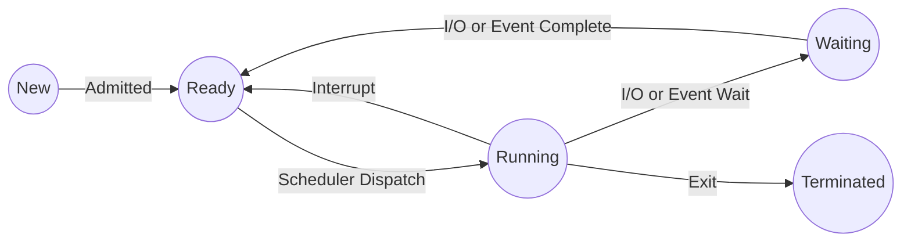
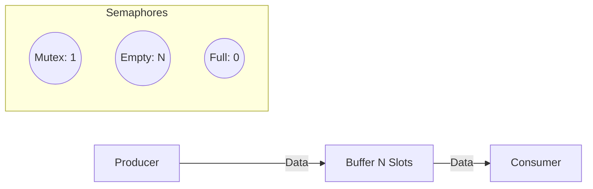
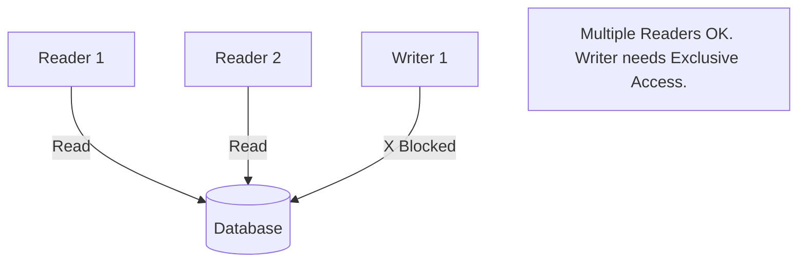
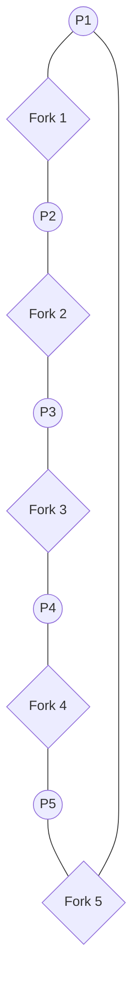

# Operating Systems - Unit 2: Process Management Deep Notes

> **Target:** 7-Mark Theoretical Questions & MCQs.
> **Focus:** Diagrams, Key Definitions, Algorithms, Comparisons.

---

## Q1: Process State Diagram & PCB. (7 Marks)

**Definition:** A process is a program in execution (Active Entity).

**5-State Model:**
1.  **New:** Creation of process.
2.  **Ready:** Loaded in RAM, waiting for CPU (Ready Queue).
3.  **Running:** Executing instructions on CPU.
4.  **Waiting/Blocked:** Waiting for I/O or event completion.
5.  **Terminated:** Execution finished, resources freed.

**Process Control Block (PCB):**
Also called Task Control Block. It is the data structure for a process containing:
*   **PID:** Unique ID.
*   **State:** Current state (Ready, Running...).
*   **Program Counter (PC):** Address of next instruction.
*   **Registers:** Accumulators, stack pointers.
*   **Scheduling Info:** Priority, pointers.
*   **Memory Info:** Base/Limit registers.

---

## Q2: Threads & Multithreading Models. (7 Marks)

**Thread:** Lightweight unit of execution within a process. They share Code, Data, and Heap but have their own **Stack** and **Registers**.

**User Level Threads (ULT) vs Kernel Level Threads (KLT):**
*   **ULT:** Managed by library in user space. Fast. Blocking one blocks all. (Example: Java Green Threads).
*   **KLT:** Managed by OS. Slower. Blocking one doesn't halt process. True parallelism. (Example: Windows/Linux Threads).

**Multithreading Models:**
1.  **Many-to-One:** Many user threads -> 1 Kernel thread. (Efficient but no parallelism).
2.  **One-to-One:** 1 User thread -> 1 Kernel thread. (True concurrency, high overhead).
3.  **Many-to-Many:** M User threads -> N Kernel threads. (Best of both worlds).

---

## Q3: CPU Scheduling Algorithms. (7 Marks)

**Goal:** Maximize CPU Utilization and Throughput. Minimize Waiting/Turnaround Time.

**Algorithms:**
1.  **FCFS (First-Come First-Serve):** Simple FIFO. Problem: **Convoy Effect** (short jobs wait behind long ones).
2.  **SJF (Shortest Job First):** Optimal for average wait time. Problem: Hard to predict next burst, Starvation.
3.  **Priority Scheduling:** Run highest importance job. Problem: **Starvation**. Solution: **Aging** (increase priority over time).
4.  **Round Robin (RR):** Time quantum (q). Best for time-sharing.
    *   *Large q* => FCFS.
    *   *Small q* => High context switch overhead.

---

## Q4: Synchronization & Hardware Solutions. (7 Marks)

**Critical Section (CS):** Code segment accessing shared resources.
**Requirements:** Mutual Exclusion, Progress, Bounded Waiting.

**Hardware Solutions:**
1.  **Test-and-Set Lock (TSL):**
    *   Atomic instruction.
    *   Reads value and sets it to 1 in one bus cycle.
    *   `while(TestAndSet(&lock));` // Spinlock
2.  **Compare-and-Swap (CAS):**
    *   Atomic. Swap only if current value matches expected.

**Software Solution (Peterson's):**
*   Uses `turn` variable and `flag` array.
*   Guarantees all 3 requirements for 2 processes.

---

## Q5: Semaphores & Classical Problems. (7 Marks)

**Semaphore:** Integer variable accessed via atomic `wait()` (P) and `signal()` (V).
*   **Binary Semaphore (Mutex):** 0 or 1.
*   **Counting Semaphore:** Any integer (for resource pools).

**1. Producer-Consumer Problem:**
*   Shared Buffer [N].
*   Producer waits on `Empty` slots. Consumer waits on `Full` slots.
*   Mutex protects buffer access.

**2. Readers-Writers Problem:**
*   Multiple Readers allowed simultaneously.
*   Writer needs **exclusive** access.
*   First Reader locks database; Last Reader unlocks it.

**3. Dining Philosophers:**
*   5 Philosophers, 5 Forks. Need 2 forks to eat.
*   **Deadlock:** All take left fork same time.
*   **Solution:** Pick both only if available (Monitor) or asymmetry.

---

## Q6: Monitors & Message Passing. (7 Marks)

**Monitors:**
*   High-level synchronization construct (e.g., in Java).
*   **Automatic Mutual Exclusion:** Only one process inside monitor at a time.
*   **Condition Variables:** `wait()` (suspend) and `signal()` (wake).
*   Prevents programming errors typical with Semaphores.

**Message Passing (IPC):**
*   Processes communicate by sending data packets (no shared memory).
*   **Operations:** `send(dest, msg)` and `receive(src, msg)`.
*   **Synchronization:**
    *   **Blocking:** Sender waits until received (Rendezvous).
    *   **Non-Blocking:** Sender continues (Asynchronous).
*   Essential for **Distributed Systems**.

---

# Unit 2: MCQ Corner

1.  **Which scheduler controls the degree of multiprogramming?**
    *   a) Short-term
    *   b) **Long-term Scheduler**
    *   c) Medium-term
    *   d) Dispatcher

2.  **Which instruction is atomic and used for hardware synchronization?**
    *   a) Load
    *   b) Store
    *   c) **Test-and-Set**
    *   d) Move

3.  **A situation where variable access order determines the output is called:**
    *   a) Deadlock
    *   b) **Race Condition**
    *   c) Starvation
    *   d) Aging

4.  **In a Monitor, if a process calls wait(), it:**
    *   a) Exits the system
    *   b) **Releases the monitor lock and blocks**
    *   c) Keeps the lock and blocks
    *   d) Terminates

5.  **Which multithreading model offers true concurrency on multi-core?**
    *   a) Many-to-One
    *   b) **One-to-One**
    *   c) User Threads
    *   d) Green Threads
