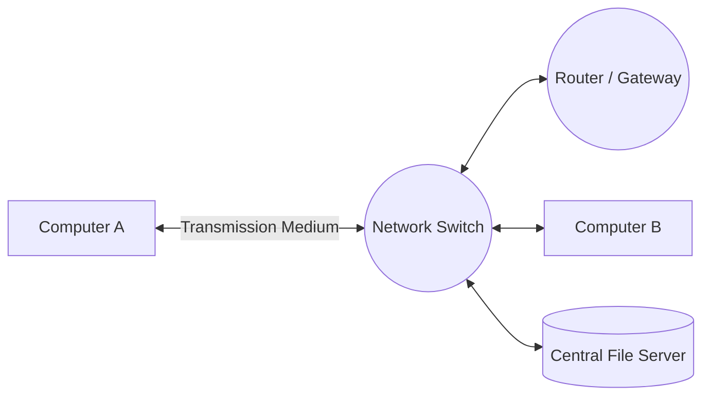
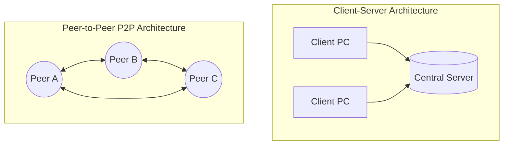
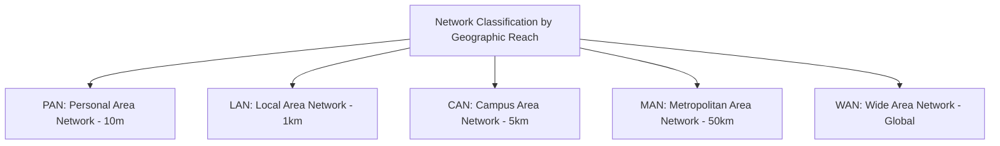
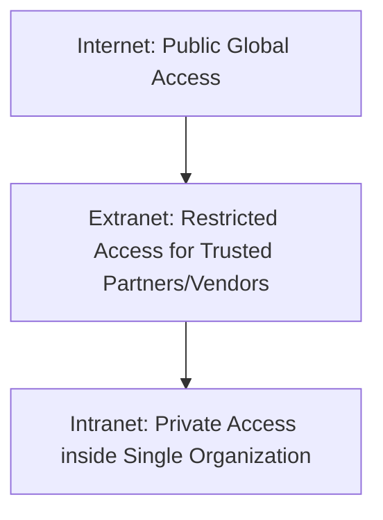
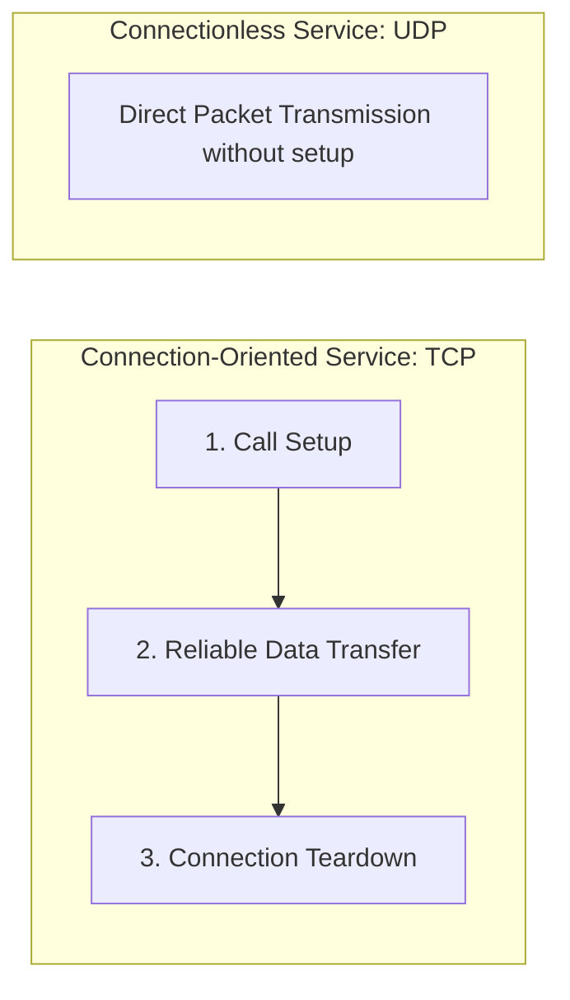
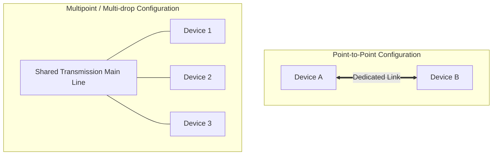

# Unit 1: Introduction to Computer Networks - Term End Exam Notes (All 7 Marks Questions)

---

## Q1. What is a Computer Network? Discuss the History, Uses, and Real-World Applications of Computer Networks. (7 Marks)

**Answer:**

A **Computer Network** is an interconnected collection of autonomous computing devices (computers, servers, smartphones, IoT devices) capable of sharing resources, exchanging data, and communicating via physical wires or wireless media following standardized protocols.

### 1. Evolution and History of Computer Networks:
- **1960s (ARPANET):** Advanced Research Projects Agency Network (ARPANET) funded by the US Dept of Defense created the world's first packet-switching network.
- **1970s (TCP/IP Development):** Vint Cerf and Bob Kahn developed TCP/IP protocols to interconnect disparate networks.
- **1980s (Ethernet & DNS):** Metcalfe invented Ethernet for LANs; Paul Mockapetris introduced Domain Name System (DNS).
- **1990s (World Wide Web):** Tim Berners-Lee invented HTTP, HTML, and the World Wide Web, transforming the Internet into a global public utility.
- **2000s–Present (Cloud & Mobile Networks):** Wireless networks (4G/5G, Wi-Fi 6), Cloud Infrastructures (AWS, GCP), and IoT.

### 2. Primary Uses of Computer Networks:
- **Resource Sharing:** Sharing high-cost hardware (printers, storage SANs) and software licenses across an organization.
- **Data & Information Sharing:** Centralized databases, cloud drives, and instant files access.
- **Communication & Collaboration:** Email, VoIP, video conferencing (Zoom, Teams), instant messaging.
- **High Availability & Reliability:** Replicated data across multiple geographical servers prevents single points of failure.
- **Cost Reduction:** Client-server model lowers computing costs compared to legacy mainframes.

---

## Q2. Differentiate between Client-Server and Peer-to-Peer (P2P) Architectures. Explain the role and various types of Servers in detail. (7 Marks)

**Answer:**

Network architectures define how network hosts share responsibilities and workload.

### 1. Client-Server vs Peer-to-Peer (P2P) Comparison:

| Feature | Client-Server Architecture | Peer-to-Peer (P2P) Architecture |
| :--- | :--- | :--- |
| **Control** | Centralized control via dedicated server | Decentralized; all nodes have equal privileges |
| **Server Requirement**| Requires high-performance dedicated server | No dedicated central server required |
| **Scalability** | Highly scalable (Add servers as load grows) | Degrades if peer nodes leave unexpectedly |
| **Data Backup** | Easy (Centralized database backup) | Difficult (Data distributed across peers) |
| **Security** | High (Centralized authentication & firewalls) | Low (Individual nodes manage security) |
| **Example** | Web browsing, Corporate SQL databases | BitTorrent, Blockchain, Skype P2P |

### 2. Types of Servers and Their Roles:
- **File Server:** Stores and manages files centrally (NFS, SMB/CIFS).
- **Web Server:** Delivers web pages to clients over HTTP/HTTPS (Nginx, Apache, IIS).
- **Mail Server:** Handles sending, receiving, and storing emails (Post Office Protocol, SMTP, IMAP - Exchange, Postfix).
- **Database Server:** Runs Relational/NoSQL database management engines (PostgreSQL, MySQL, Oracle).
- **Proxy Server:** Acts as an intermediary between clients and destination servers for caching, privacy, and security filtering.
- **DNS Server:** Resolves human-readable domain names into IP addresses.
- **DHCP Server:** Automatically assigns IP addresses, gateway, and subnet masks to network hosts.

---

## Q3. Explain Types of Computer Networks based on geographical scale (PAN, LAN, CAN, MAN, WAN) with a detailed comparison. (7 Marks)

**Answer:**

Networks are categorized according to their geographic coverage area and physical scope.

### Detailed Comparison Matrix:

| Feature | PAN | LAN | CAN | MAN | WAN |
| :--- | :--- | :--- | :--- | :--- | :--- |
| **Geographic Scope** | Up to 10 meters (Room) | 10m to 1 km (Building/Office) | 1 km to 5 km (University/Base) | 5 km to 50 km (Entire City) | Country / Continent / Global |
| **Data Transmission Speed**| High (Short distance) | Extremely High (1-10 Gbps) | High (1-10 Gbps Fiber) | Moderate (100 Mbps - 1 Gbps) | Lower (High propagation delay) |
| **Error Rate** | Very Low | Lowest | Low | Moderate | Highest |
| **Ownership** | Personal / Single User | Private Organization | Single Institution | Public Cable / Telecom | Multiple Telecom Carriers |
| **Technology** | Bluetooth, Zigbee, USB | Ethernet (IEEE 802.3), Wi-Fi (802.11) | Optical Fiber Backbones | Cable TV Net, Fiber Ring | Leased Lines, MPLS, Satellite, IP |
| **Example** | Wireless Headset to Phone | Office Wi-Fi / Computer Lab | University Campus Net | Cable TV Net in City | The Internet, ATM Networks |

---

## Q4. Compare Internet vs Intranet vs Extranet. Explain Connection-Oriented vs Connectionless Services. (7 Marks)

**Answer:**

### 1. Internet vs Intranet vs Extranet:

| Criterion | Internet | Intranet | Extranet |
| :--- | :--- | :--- | :--- |
| **Target Audience** | General Public worldwide | Employees inside an organization | Trusted external business partners & vendors |
| **Accessibility** | Public & Unrestricted | Private (Internal network/VPN) | Restricted Private (Login credentials + Firewall) |
| **Security** | Lowest (Requires firewalls/encryption) | Highest (Protected behind corporate gateway) | High (Encrypted channels & role-based access) |
| **Example** | `www.google.com` | Internal HR Payroll Portal (`hr.company.local`) | Vendor Supply Chain Portal |

---

### 2. Connection-Oriented vs Connectionless Services:

| Criterion | Connection-Oriented Service (e.g., TCP) | Connectionless Service (e.g., UDP / IP) |
| :--- | :--- | :--- |
| **Handshake Phase** | Requires explicit setup handshake (3-Way Handshake) | No prior connection setup; packets sent immediately |
| **Packet Path** | Packets follow a established logical path | Each packet (datagram) routed independently |
| **Reliability** | Guaranteed delivery (Acknowledgements & Retransmissions) | Best-effort delivery; packets can be lost/out-of-order |
| **Overhead** | Higher header overhead and state tracking | Lower overhead, minimal latency |
| **Use Cases** | Web browsing (HTTP/S), Email (SMTP), File transfer (FTP) | Video streaming, DNS queries, Online Gaming |

---

## Q5. Explain Line Configuration (Point-to-Point vs Multipoint), Network Hardware, Software, and Network Simulators. (7 Marks)

**Answer:**

### 1. Line Configuration (Topology Link Types):
Line configuration defines how two or more communication devices connect to a transmission link.

- **Point-to-Point:** A dedicated link connects exactly two devices. The entire capacity of the channel is reserved for transmission between those two nodes (e.g., Microwave link, direct serial connection).
- **Multipoint (Multi-drop):** More than two specific devices share a single physical link capacity simultaneously or via time-sharing (e.g., Traditional Bus topology, Wi-Fi channel).

---

### 2. Network Hardware vs Network Software vs Network Simulators:

- **Network Hardware:** Physical components required to establish network connectivity (NIC cards, cables, switches, routers, access points).
- **Network Software:** Operating systems and protocols running on network nodes (Network Operating Systems like Cisco IOS, Linux networking stack, Protocol implementations).
- **Network Simulators:** Software platforms used by engineers to design, model, and test network topologies and protocol behavior without purchasing physical hardware.
  - *Popular Network Simulators:*
    1. **Cisco Packet Tracer:** Visual simulator for learning CCNA Cisco networking.
    2. **GNS3 (Graphical Network Simulator-3):** Emulates real router hardware images.
    3. **NS-2 / NS-3 (Network Simulator 2/3):** Discrete-event research simulator widely used in academia.
    4. **Wireshark:** Packet analyzer and sniffer used to inspect network traffic in real-time.
