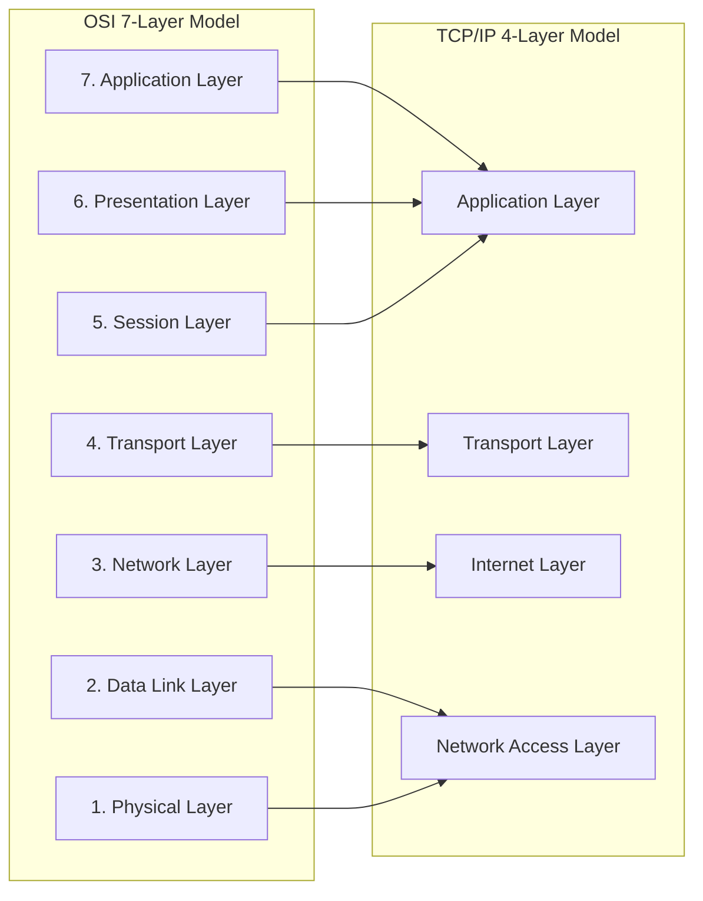
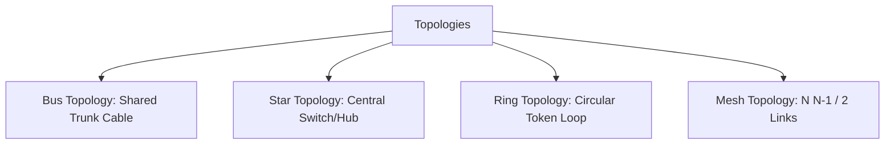
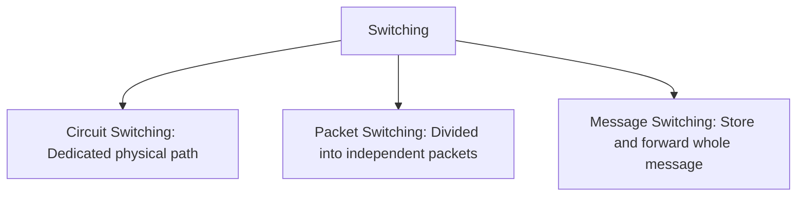
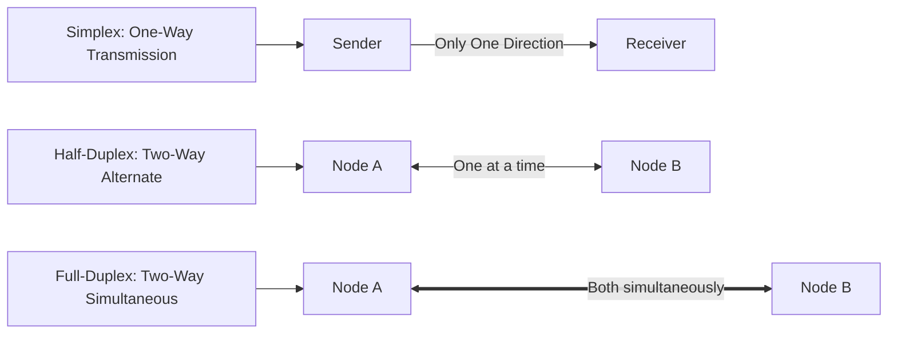
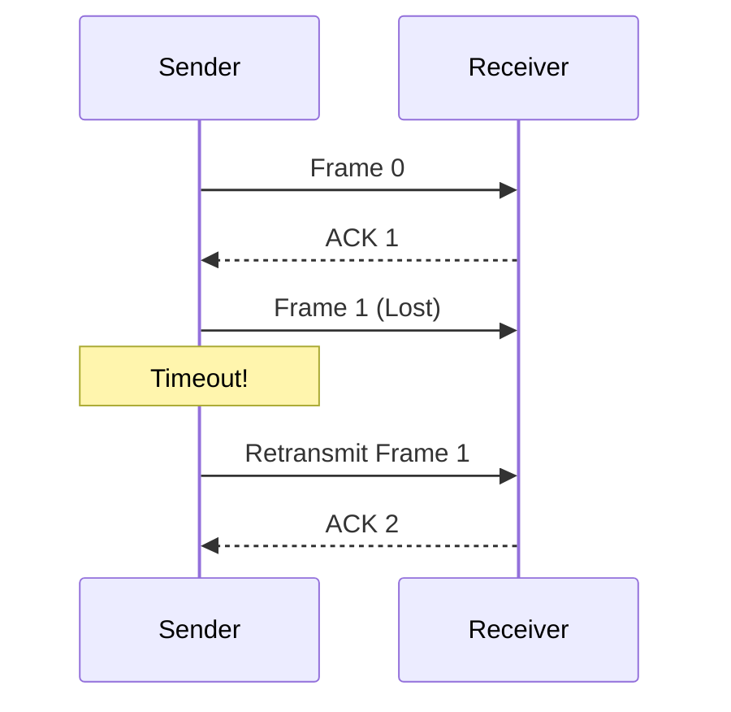
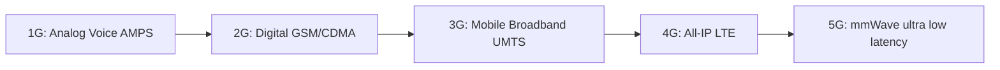

# Unit 2: The Reference Model, Topologies & Switching - Term End Exam Notes (All 7 Marks Questions)

---

## Q1. Compare OSI 7-Layer Reference Model and TCP/IP 4-Layer Model in detail. Explain Encapsulation and PDU. (7 Marks)

**Answer:**

Network protocols use layered architectures to split complex networking functions into manageable independent modules.

### 1. Functions of OSI Layers & Protocol Data Units (PDUs):

1. **Application Layer (Data):** User network interface services (HTTP, FTP, SMTP, DNS).
2. **Presentation Layer (Data):** Encryption, compression, formatting, data translation.
3. **Session Layer (Data):** Session establishment, dialogue control, synchronization.
4. **Transport Layer (Segment/Datagram):** End-to-end reliability, segmentation, port addressing (TCP, UDP).
5. **Network Layer (Packet):** Logical IP addressing and routing across networks.
6. **Data Link Layer (Frame):** Framing, physical MAC addressing, hop-to-hop error/flow control.
7. **Physical Layer (Bits):** Physical transmission of raw bitstreams over copper/optical/wireless media.

---

### 2. Detailed OSI vs TCP/IP Comparison Matrix:

| Feature | OSI Reference Model | TCP/IP Model |
| :--- | :--- | :--- |
| **Origin** | Theoretical model created by ISO | Practical standard created by ARPANET/DoD |
| **Layer Count** | 7 Layers | 4 Layers |
| **Transport Layer** | Supports both connection-oriented & connectionless | Connection-oriented (TCP) & Connectionless (UDP) |
| **Network Layer** | Connection-oriented & connectionless | Connectionless (IP) |
| **Protocol Independence**| Protocols fit into layers neatly | Protocols created first; model fits protocols |

---

## Q2. Explain Network Topologies (Bus, Star, Ring, Mesh, Tree, Hybrid) with structural diagrams, pros, and cons. (7 Marks)

**Answer:**

A **Network Topology** defines the geometric layout or arrangement of connected nodes in a computer network.

### Detailed Topology Comparison:

1. **Bus Topology:** All nodes connected to a single central cable ("backbone").
   - *Pros:* Low cost, minimal cabling.
   - *Cons:* Single point of failure (backbone break drops entire net), packet collisions.

2. **Star Topology:** Every node connects directly to a central switch/hub.
   - *Pros:* Easy fault identification; failure of one cable affects only that node.
   - *Cons:* If central switch fails, entire network goes down.

3. **Ring Topology:** Nodes connected in a circular loop; data flows in one direction via token.
   - *Pros:* No data collisions; deterministic access.
   - *Cons:* Breaking one node/cable breaks the entire ring.

4. **Mesh Topology:** Every device has a dedicated point-to-point link to every other device ($N(N-1)/2$ links).
   - *Pros:* Maximum privacy, security, and redundancy; no traffic congestion.
   - *Cons:* Extremely expensive, complex wiring.

5. **Tree & Hybrid Topologies:** Hierarchical combination of Star and Bus networks.

---

## Q3. Compare Switching Techniques: Circuit Switching vs Packet Switching vs Message Switching. (7 Marks)

**Answer:**

**Switching** is the mechanism of forwarding data from source to destination across intermediate network nodes.

### Comparison Matrix:

| Criterion | Circuit Switching | Packet Switching | Message Switching |
| :--- | :--- | :--- | :--- |
| **Dedicated Physical Path**| Yes (Call setup phase required) | No (Dynamic packet routing) | No |
| **Store & Forward** | No | Yes (At packet level) | Yes (Whole message level) |
| **Resource Reservation**| Reserved bandwidth upfront | Shared bandwidth dynamically | Shared bandwidth |
| **Delays** | Setup delay, no queuing delay | Queuing & propagation delay | High queuing delay |
| **Usage** | Traditional PSTN Telephone Network | Modern Internet (IP Networks) | Telegraphy |

---

## Q4. Explain Transmission Modes (Simplex, Half-Duplex, Full-Duplex) and Multiplexing Techniques (FDM, TDM, WDM). (7 Marks)

**Answer:**

### 1. Transmission Modes (Direction of Data Flow):

- **Simplex:** Data flows in **one direction only** (e.g., Keyboard to CPU, Radio broadcasting).
- **Half-Duplex:** Data can flow in **both directions, but not at the same time** (e.g., Walkie-Talkies).
- **Full-Duplex:** Data flows in **both directions simultaneously** (e.g., Mobile phone calls, Full-Duplex Ethernet).

---

### 2. Multiplexing Techniques:
Multiplexing combines multiple signals into a single medium capacity.

- **Frequency Division Multiplexing (FDM):** Divides total analog bandwidth into distinct frequency channels (e.g., Radio/Cable TV).
- **Time Division Multiplexing (TDM):** Divides digital channel transmission time into discrete time slots (Synchronous vs Statistical TDM).
- **Wavelength Division Multiplexing (WDM):** Combines multiple optical signals of different light wavelengths over a single optical fiber.

---

## Q5. Explain Data Link Protocols: Stop-and-Wait ARQ, Go-Back-N ARQ, and Selective Repeat ARQ with window diagrams. (7 Marks)

**Answer:**

The Data Link Layer ensures reliable hop-to-hop data transmission using **Flow Control** and **Error Control** (Automatic Repeat Request - ARQ).

### Detailed ARQ Protocol Comparison:

| Protocol | Sender Window ($W_s$) | Receiver Window ($W_r$) | Out-of-Order Buffering | Retransmission Scope | Efficiency ($\eta$) |
| :--- | :--- | :--- | :--- | :--- | :--- |
| **Stop-and-Wait ARQ** | 1 | 1 | No | Retransmits 1 frame after timeout | Very Low ($\frac{1}{1+2a}$) |
| **Go-Back-N ARQ** | $N$ | 1 | No | Retransmits missing frame + **all subsequent frames** | Moderate ($\frac{N}{1+2a}$) |
| **Selective Repeat ARQ** | $2^{m-1}$ | $2^{m-1}$ | **Yes** | Retransmits **ONLY the specific missing frame** | Highest ($\approx 100\%$) |

---

## Q6. Explain Physical MAC Address Architecture and Cellular Mobile Telephone System Generations. (7 Marks)

**Answer:**

### 1. MAC Address (Physical Address):
- A **48-bit (6-byte)** globally unique hardware identifier burned into the Network Interface Card (NIC).
- Written in hexadecimal format (e.g., `00:1A:2B:3C:4D:5E`).
  - First 24 bits: **Organizationally Unique Identifier (OUI)** assigned by IEEE to vendor (Cisco, Intel).
  - Last 24 bits: **Network Interface Controller Specific Serial Number**.

---

### 2. Cellular Mobile Telephone System Generations:

- **1G (1980s):** Analog voice transmission using FDMA (AMPS).
- **2G (1990s):** Digital voice and SMS text messages using GSM (TDMA/CDMA), 64 kbps.
- **3G (2000s):** Mobile Internet broadband, video calling using WCDMA/UMTS (Up to 2 Mbps).
- **4G LTE (2010s):** All-IP unified packet network, high-definition streaming (Up to 100 Mbps).
- **5G (2020s):** Ultra-reliable low-latency communication (URLLC), massive IoT connectivity, gigabit speeds (> 1 Gbps).
