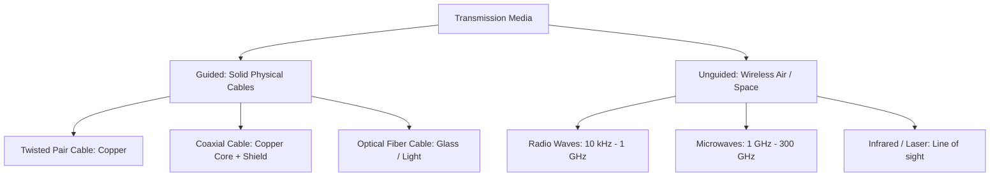
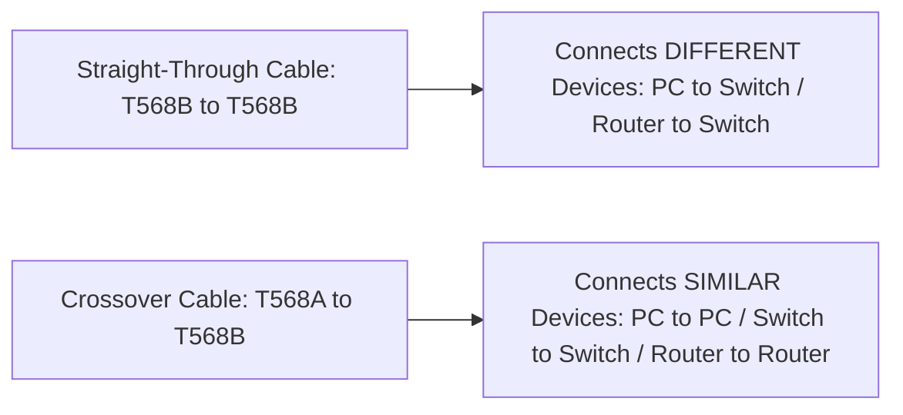
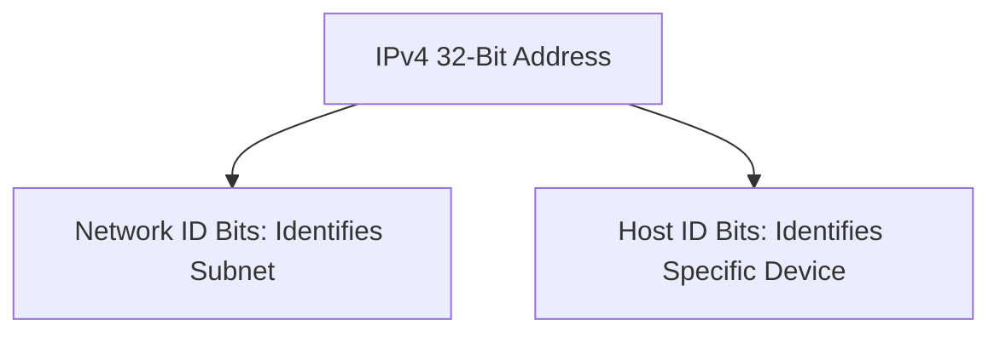
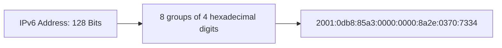
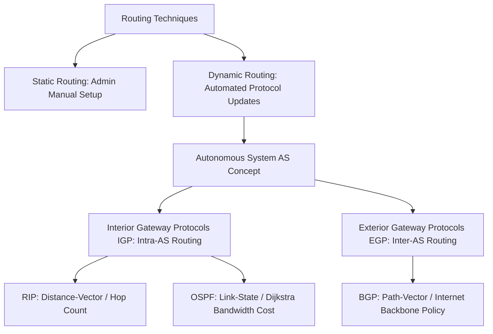

# Unit 3: Transmission Media, IP Addressing, Subnetting & Routing - Term End Exam Notes (All 7 Marks Questions)

---

## Q1. What is Transmission Media? Explain Guided Media (Twisted Pair, Coaxial, Fiber Optic) in detail with Cable Layer Structures, Connectors, and a Comparison Matrix. (7 Marks)

**Answer:**

**Transmission Media** is the physical pathway across a network that carries data signals from a sender to a receiver.



---

### 1. Detailed Breakdown of Guided Media:

#### A. Twisted Pair Cable:
- **Structure:** Pairs of insulated copper wires twisted around each other (standard Ethernet contains 4 pairs / 8 wires). Twisting cancels out **crosstalk** and electromagnetic interference (EMI).
- **Types:**
  - **UTP (Unshielded Twisted Pair):** Relies only on twisting for noise cancellation; lightweight and economical.
  - **STP (Shielded Twisted Pair):** Includes protective foil/braided mesh around pairs for extra EMI shielding.
- **Connector:** **RJ-45** (8-position 8-contact 8P8C modular connector).
- **Max Segment Length:** 100 meters for standard Ethernet.

#### B. Coaxial Cable ("Coax"):
- **Structure (4 Concentric Layers):**
  1. *Inner Copper Core:* Conducts the electrical signal.
  2. *Dielectric Insulating Layer:* Prevents core-shield contact.
  3. *Braided Metal Shield:* Blocks external EMI noise.
  4. *Outer Plastic Jacket:* Physical protection.
- **Connector:** **BNC Connector** (Bayonet Neill–Concelman twist-lock).
- **Applications:** Cable Television (Cable TV) networks, legacy Ethernet (Thinnet 10Base2 / Thicknet 10Base5).

#### C. Fiber Optic Cable:
- **Structure:** Transmits data as **pulses of light** through thin glass/plastic strands using **Total Internal Reflection**.
  1. *Core:* Ultra-thin glass/plastic strand where light travels.
  2. *Cladding:* Surrounds core with lower refractive index to reflect light inward.
  3. *Buffer Coating & Outer Jacket:* Moisture and physical protection.
- **Fiber Types:**
  - *Multimode Fiber:* Larger core size; light bounces at multiple angles; used for short distances (campus/LAN).
  - *Single-mode Fiber:* Thin core; light travels in a straight single mode; used for long-distance ISP backbones.
- **Connectors:** **SC** (Push-pull square), **ST** (Twist bayonet), **LC** (Small form-factor).

---

### 2. Guided Transmission Media Comparison Matrix:

| Parameter | Twisted Pair (UTP / STP) | Coaxial Cable | Fiber Optic Cable |
| :--- | :--- | :--- | :--- |
| **Signal Type** | Electrical Voltage | Electrical Voltage | **Light Pulses** |
| **Bandwidth Capacity**| Low to Moderate (10 Mbps–10 Gbps) | Moderate (10 Mbps–1 Gbps) | **Ultra High (> 100 Gbps)** |
| **EMI Immunity** | Low (UTP) / Moderate (STP) | Moderate to Good | **100% Immune** (No electricity) |
| **Attenuation** | High | Medium | **Extremely Low** |
| **Cost** | Lowest | Moderate | Highest |
| **Max Distance (No Repeater)**| Short (100 m) | Moderate (185 m to 500 m) | Long (~2 km to 40+ km) |
| **Standard Connector** | **RJ-45** | **BNC** | **SC / ST / LC** |
| **Primary Application** | Office / Home LAN Cabling | Cable TV distribution | ISP Backbone / Undersea Links |

---

## Q2. Explain Ethernet Cabling Standards, Cable Wiring Types (Straight-Through vs Crossover), Baseband vs Broadband Transmission, and Signal Attenuation. (7 Marks)

**Answer:**

### 1. Ethernet Cabling Standards Naming Convention:

Ethernet LAN standards follow the naming pattern: **[Speed in Mbps][Signal Type][Medium]**.

| Standard Name | Cable Type Used | Speed | Max Segment Distance | Naming Pattern Breakdown |
| :--- | :--- | :--- | :--- | :--- |
| **10Base-T** | UTP | 10 Mbps | 100 meters | 10 Mbps, Baseband, Twisted Pair |
| **100Base-T (Fast Ethernet)**| Cat 5 UTP | 100 Mbps | 100 meters | 100 Mbps, Baseband, Twisted Pair |
| **10Base2 (Thinnet)** | Thin Coaxial | 10 Mbps | ~185 meters | 10 Mbps, Baseband, ~200m Coax |
| **10Base5 (Thicknet)** | Thick Coaxial | 10 Mbps | ~500 meters | 10 Mbps, Baseband, 500m Coax |
| **100Base-FX** | Fiber Optic | 100 Mbps | ~2,000 meters (2 km) | 100 Mbps, Baseband, Fiber Optic |

---

### 2. Ethernet Cable Wiring Types (Straight-Through vs Crossover):



- **Straight-Through Cable:** Wired identically on both ends (T568B to T568B). Connects **dissimilar network devices** (e.g., PC to Switch, Router to Switch).
- **Crossover Cable:** One end wired T568A and the other T568B (TX and RX pins swapped). Connects **similar network devices** (e.g., PC to PC, Switch to Switch, Router to Router).

---

### 3. Baseband vs Broadband Transmission Comparison:

| Parameter | Baseband Transmission | Broadband Transmission |
| :--- | :--- | :--- |
| **Channel Usage** | Entire bandwidth carries **one single digital signal** at a time. | Bandwidth is divided into **multiple frequency channels** simultaneously. |
| **Multiplexing** | Time Division Multiplexing (TDM). | Frequency Division Multiplexing (FDM). |
| **Signal Type** | Digital signal. | Analog (or multi-channel digital). |
| **Classic Example** | Standard Ethernet LANs (`10Base-T`, `100Base-T`). | Cable Television (Cable TV) networks. |

---

### 4. Signal Attenuation and Repeater Function:

- **Definition of Attenuation:** **Attenuation** is the gradual loss of signal strength (amplitude decay) as an electrical or optical signal travels along a transmission medium over distance.
- **Cause:** Electrical resistance in copper wire or scattering/absorption in glass fiber.
- **Impact on Cable Limits:** Attenuation dictates the maximum segment distance of cabling standards (e.g., 100m limit for UTP). Beyond this distance, signals become unreadable noise.
- **Role of Repeater:** A **Repeater** receives an attenuated signal, cleans out noise, regenerates the signal to its original strength, and retransmits it to extend network reach.

---

## Q3. Explain IPv4 Classful Addressing (Classes A–E), Subnetting, VLSM, and CIDR Notation with Worked Examples. (7 Marks)

**Answer:**

An **IPv4 address** is a 32-bit logical address represented as 4 octets in dotted-decimal format (e.g., `192.168.1.1`).



---

### 1. Classful Architecture Table:

| Class | First Byte Range | Net / Host Bit Split | Default Subnet Mask | Max Usable Hosts / Subnet | Primary Purpose |
| :--- | :--- | :--- | :--- | :--- | :--- |
| **Class A** | `1.0.0.0` - `126.255.255.255` | 8 / 24 | `255.0.0.0` | $2^{24}-2 = 16,777,214$ | Large Corporations |
| **Class B** | `128.0.0.0` - `191.255.255.255` | 16 / 16 | `255.255.0.0` | $2^{16}-2 = 65,534$ | Medium Organizations |
| **Class C** | `192.0.0.0` - `223.255.255.255` | 24 / 8 | `255.255.255.0` | $2^8 - 2 = 254$ | Small Local Networks |
| **Class D** | `224.0.0.0` - `239.255.255.255` | Multicast | N/A | N/A | Multicasting Groups |
| **Class E** | `240.0.0.0` - `255.255.255.255` | Reserved | N/A | N/A | Experimental/Research |

*(Note: Loopback address range `127.0.0.0/8` is reserved for local host testing).*

---

### 2. Subnetting, VLSM & CIDR:

- **Subnetting:** Borrowing $s$ bits from the Host ID field to extend the Network ID, creating $2^s$ smaller subnets from a single IP block.
- **Formula for Usable Hosts:**
  $$\text{Usable Hosts} = 2^{(32 - \text{Prefix Length})} - 2$$
  *(Subtracting 2 for Network Address and Broadcast Address).*
- **VLSM (Variable Length Subnet Masking):** Applying different subnet masks across subnets to match exact host requirements without wasting IP addresses.
- **CIDR (Classless Inter-Domain Routing):** Replaces rigid classful boundaries with a slash prefix notation (e.g., `192.168.1.0/26` $\implies$ 26 network bits, 6 host bits, 62 usable hosts).

---

## Q4. Explain IPv4 Datagram Header Structure and Detail All Field Functions. (7 Marks)

**Answer:**

An IPv4 packet consists of a **20-byte to 60-byte Header** followed by the payload data.

```
 0                   1                   2                   3
 0 1 2 3 4 5 6 7 8 9 0 1 2 3 4 5 6 7 8 9 0 1 2 3 4 5 6 7 8 9 0 1
+-+-+-+-+-+-+-+-+-+-+-+-+-+-+-+-+-+-+-+-+-+-+-+-+-+-+-+-+-+-+-+-+
|Version|  IHL  |Type of Service|          Total Length         |
+-+-+-+-+-+-+-+-+-+-+-+-+-+-+-+-+-+-+-+-+-+-+-+-+-+-+-+-+-+-+-+-+
|         Identification        |Flags|     Fragment Offset     |
+-+-+-+-+-+-+-+-+-+-+-+-+-+-+-+-+-+-+-+-+-+-+-+-+-+-+-+-+-+-+-+-+
|  Time to Live |    Protocol   |        Header Checksum        |
+-+-+-+-+-+-+-+-+-+-+-+-+-+-+-+-+-+-+-+-+-+-+-+-+-+-+-+-+-+-+-+-+
|                       Source IP Address                       |
+-+-+-+-+-+-+-+-+-+-+-+-+-+-+-+-+-+-+-+-+-+-+-+-+-+-+-+-+-+-+-+-+
|                    Destination IP Address                     |
+-+-+-+-+-+-+-+-+-+-+-+-+-+-+-+-+-+-+-+-+-+-+-+-+-+-+-+-+-+-+-+-+
```

---

### Detailed IPv4 Header Field Functions:

1. **Version (4 bits):** Indicates IP version (value = `4`).
2. **IHL (Internet Header Length, 4 bits):** Specifies header length in 32-bit words (Minimum value = 5 $\implies 5 \times 4 = 20$ bytes).
3. **Type of Service (ToS / DiffServ, 8 bits):** Defines packet priority and Quality of Service (QoS).
4. **Total Length (16 bits):** Entire packet size in bytes (Header + Payload, max 65,535 bytes).
5. **Identification (16 bits), Flags (3 bits: DF/MF), Fragment Offset (13 bits):** Used for **packet fragmentation and reassembly** when passing through MTU-constrained links.
6. **Time to Live (TTL, 8 bits):** Hop count limit decremented by 1 at each router to prevent routing loops.
7. **Protocol (8 bits):** Identifies upper-layer payload protocol ($6 = \text{TCP}$, $17 = \text{UDP}$, $1 = \text{ICMP}$).
8. **Header Checksum (16 bits):** Error detection field covering header fields only.
9. **Source & Destination IP Addresses (32 bits each):** Sender and receiver IPv4 addresses.

---

## Q5. Explain IPv6 Architecture, Header Structure, and Compare IPv4 vs IPv6 in Detail. (7 Marks)

**Answer:**

**IPv6** was introduced to eliminate IPv4 address exhaustion and streamline packet processing.



---

### 1. Key Features of IPv6 Architecture:
- **128-Bit Address Space:** Supports $2^{128} \approx 3.4 \times 10^{38}$ unique IP addresses.
- **Fixed 40-Byte Base Header:** Simplifies router processing by eliminating variable-length options from main header.
- **No Header Checksum:** Speeds up packet processing at intermediate routers (relies on Layer 2 and Layer 4 checksums).
- **Stateless Address Auto-Configuration (SLAAC):** Devices self-assign IP addresses without requiring a DHCP server.
- **Built-in IPsec:** Mandatory security framework for authentication and encryption.

---

### 2. Comprehensive IPv4 vs IPv6 Comparison Matrix:

| Feature | IPv4 | IPv6 |
| :--- | :--- | :--- |
| **Address Length** | 32 Bits | **128 Bits** |
| **Address Space** | $2^{32} \approx 4.3 \times 10^9$ | $2^{128} \approx 3.4 \times 10^{38}$ |
| **Notation Format** | Dotted Decimal (`192.168.1.1`) | Hexadecimal (`2001:db8::1`) |
| **Header Size** | Variable (20 to 60 bytes) | **Fixed 40 Bytes** |
| **Checksum Field** | Included in Header | Removed (Handled by L2 & L4) |
| **IP Auto-Configuration**| Manual or DHCP server | Built-in SLAAC (Stateless Auto-config) |
| **Packet Fragmentation**| Handled by Routers & Sender | Handled **ONLY by Sender** |
| **Security Framework** | Optional IPsec | **Mandatory IPsec** built into protocol |

---

## Q6. What is Routing? Differentiate Static Routing vs Dynamic Routing and Explain Routing Protocols (RIP, OSPF, BGP) with Autonomous System Architecture. (7 Marks)

**Answer:**

**Routing** is the Layer 3 process by which a router inspects packet destination IP addresses and consults its **routing table** to select the optimal path for forwarding data across interconnected networks.



---

### 1. Static Routing vs Dynamic Routing Comparison:

| Feature / Aspect | Static Routing | Dynamic Routing |
| :--- | :--- | :--- |
| **Configuration** | Manually entered by Network Administrator. | Automatically calculated by Routing Protocols. |
| **Topology Adaptability**| **Cannot adapt**; routes fail if link goes down. | **Auto-adapts**; recalculates alternate paths. |
| **Overhead** | Zero CPU/Bandwidth overhead on routers. | Consumes CPU, RAM, and periodic bandwidth. |
| **Scalability** | Poor (Suitable only for small networks). | Excellent (Scales to global networks). |
| **Security** | High (Admin controls exact path). | Requires authentication between routers. |

---

### 2. Autonomous Systems & Routing Protocol Breakdown:

- **Autonomous System (AS):** A collection of routers under single administrative control (e.g., ISP, University) sharing a unified routing policy.

#### A. Interior Gateway Protocols (IGP) — Routing Within an AS:
1. **RIP (Routing Information Protocol):**
   - *Category:* Distance-Vector Protocol (Bellman-Ford algorithm).
   - *Metric:* **Hop Count** (Maximum limit = 15 hops).
   - *Characteristics:* Periodic updates every 30s; slow convergence; suitable for small networks.
2. **OSPF (Open Shortest Path First):**
   - *Category:* Link-State Protocol (Dijkstra's Shortest Path First algorithm).
   - *Metric:* **Cost based on Link Bandwidth**.
   - *Characteristics:* Fast convergence; triggers updates on topology change; highly scalable.

#### B. Exterior Gateway Protocols (EGP) — Routing Between ASes:
1. **BGP (Border Gateway Protocol):**
   - *Category:* Path-Vector Protocol.
   - *Metric:* Policy-based path attributes (AS-Path).
   - *Characteristics:* The primary routing protocol powering the **Internet backbone**, making policy decisions across independent Autonomous Systems.

---

### 3. Summary Comparison of RIP, OSPF, and BGP:

| Feature | RIP (Distance-Vector) | OSPF (Link-State) | BGP (Path-Vector) |
| :--- | :--- | :--- | :--- |
| **Algorithm** | Bellman-Ford | Dijkstra SPF | Path Vector |
| **Metric** | Hop Count | Bandwidth Cost | Path Attributes / Policy |
| **Scope** | Small Internal AS | Large Enterprise AS | Inter-AS (Internet Backbone) |
| **Convergence** | Slow | Fast | Fast |
