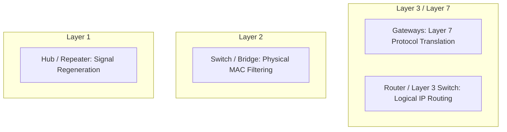
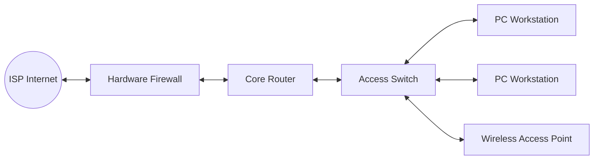
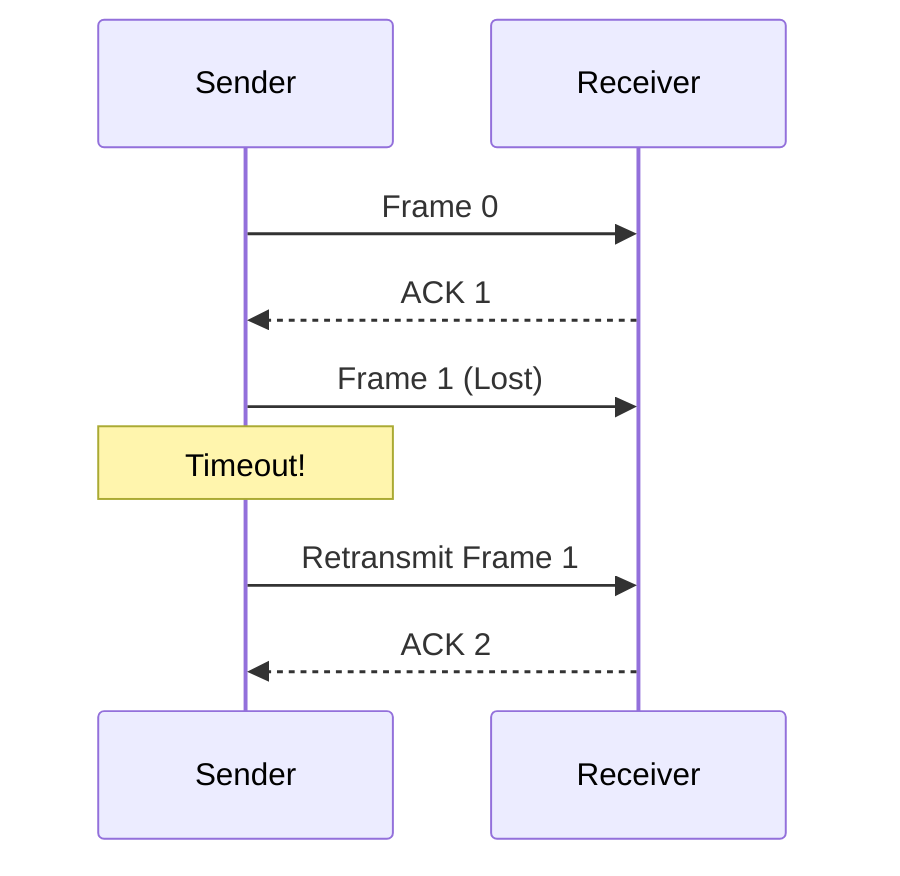
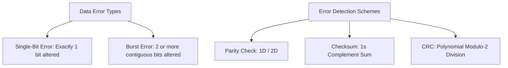
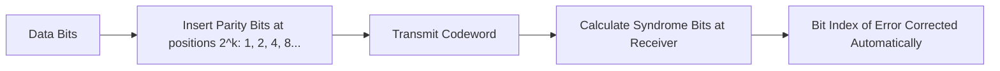

# Unit 4: Network Devices & Flow Control - Term End Exam Notes (All 7 Marks Questions)

---

## Q1. Explain Network Devices (Repeaters, Hubs, Switches, Routers, Bridges, Brouters, Gateways) with a detailed comparison table and OSI Layer Mapping. (7 Marks)

**Answer:**

Network hardware devices connect nodes, segment network traffic, and regenerate signals across OSI layers.

### Detailed Network Devices Comparison Table:

| Device Name | OSI Layer | Processing Entity | Traffic Management | Collision Domains | Broadcast Domains |
| :--- | :--- | :--- | :--- | :--- | :--- |
| **Repeater** | Layer 1 (Physical) | Raw Bits | Regenerates weak physical signals | 1 Domain | 1 Domain |
| **Hub** | Layer 1 (Physical) | Raw Bits | Multi-port repeater; broadcasts to all ports | 1 Domain (Shared) | 1 Domain |
| **Bridge** | Layer 2 (Data Link) | MAC Frames | 2-port device; filters traffic via MAC table | Segments into 2 | 1 Domain |
| **Switch** | Layer 2 (Data Link) | MAC Frames | Multi-port bridge; hardware ASICs filtering | Dedicated per port | 1 Domain (VLAN splits) |
| **Router** | Layer 3 (Network) | IP Packets | Routes traffic across networks using IP table | Dedicated per port | **Splits Broadcast Domains** |
| **Brouter** | Layer 2 & Layer 3 | Frames / Packets | Bridges non-routable traffic, routes IP traffic | Dedicated per port | Splits IP Broadcasts |
| **Gateway** | Layer 4 to Layer 7 | Payload Data | Converts protocol formats between systems | Isolated | Isolated |

---

## Q2. Discuss LAN Implementation Requirements, Components, and Architecture. (7 Marks)

**Answer:**

A **Local Area Network (LAN)** connects computers and peripheral devices within a localized geographical area (office, building).

### Essential Components for LAN Implementation:
1. **Network Interface Cards (NICs):** Installed in every client/server host.
2. **Transmission Medium:** Twisted-pair Category 6/7 copper cables or multimode fiber.
3. **Interconnecting Devices:** Layer 2 Managed Switches and Layer 3 Routers.
4. **Wireless Access Points (WAPs):** Extends LAN access wirelessly via IEEE 802.11 Wi-Fi.
5. **Network Operating System (NOS) & Protocols:** Handles TCP/IP networking, DHCP, DNS, and file sharing.
6. **Security & Power:** Firewalls, VLAN configuration, and Uninterruptible Power Supplies (UPS).

---

## Q3. Explain Flow Control Techniques: Stop-and-Wait vs Sliding Window (Go-Back-N, Selective Repeat). (7 Marks)

**Answer:**

**Flow Control** coordinates data transmission between a fast sender and a slow receiver to prevent receiver memory buffer overflow.

### Detailed Flow Control Protocol Comparison:

| Feature | Stop-and-Wait ARQ | Go-Back-N ARQ | Selective Repeat ARQ |
| :--- | :--- | :--- | :--- |
| **Sender Window ($W_s$)**| 1 | $N$ | $2^{m-1}$ |
| **Receiver Window ($W_r$)**| 1 | 1 | $2^{m-1}$ |
| **Out-of-Order Buffer** | No | No (Discards out-of-order frames) | **Yes (Buffers out-of-order frames)** |
| **Retransmission Scope**| Retransmits 1 frame | Retransmits frame $k$ + **all subsequent frames** | Retransmits **ONLY the missing frame** |
| **Efficiency ($\eta$)** | Lowest | Moderate | **Highest** |

---

## Q4. Discuss Data Errors (Single-Bit vs Burst Errors) and Error Detection Techniques (Parity, Checksum, CRC). (7 Marks)

**Answer:**

Transmission noise can alter bits during transit across physical media.

### 1. Error Detection Schemes:
- **Parity Check:** Appends parity bit to make total number of 1s even or odd. (Fails for even-number bit flips).
- **Checksum:** Sums data words using 1s complement arithmetic and appends 1s complement of sum.
- **Cyclic Redundancy Check (CRC):**
  - Divides data bitstream by a predetermined polynomial generator $G(X)$ using Modulo-2 division.
  - Appends remainder $R$ to data frame. Receiver divides frame by $G(X)$; if remainder $= 0$, frame is valid!

---

## Q5. Explain Hamming Code Error Correction, Hamming Distance, and calculate error detection/correction bounds. (7 Marks)

**Answer:**

Created by Richard Hamming, **Hamming Code** is an Error-Correcting Code (ECC) capable of detecting up to 2-bit errors and correcting single-bit errors.

### 1. Hamming Distance ($d_{\min}$):
The **Hamming Distance** between two binary words of equal length is the number of bit positions in which the two words differ.

- **To Detect $s$ Errors:** Minimum Hamming distance required:
  $$d_{\min} \ge s + 1$$
- **To Correct $t$ Errors:** Minimum Hamming distance required:
  $$d_{\min} \ge 2t + 1$$

### 2. Redundancy Bit Calculation Formula:
For $m$ data bits and $r$ parity (redundancy) bits:
$$2^r \ge m + r + 1$$

- *Example:* To send $m = 7$ data bits, $r = 4$ parity bits are needed because $2^4 = 16 \ge 7 + 4 + 1 = 12$. Parity bits are placed at bit positions $1, 2, 4, 8$ ($2^k$).
