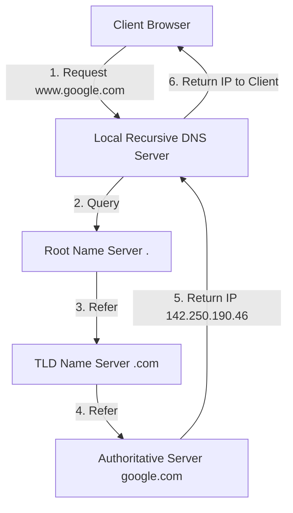
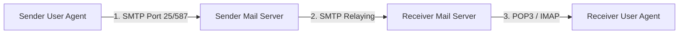
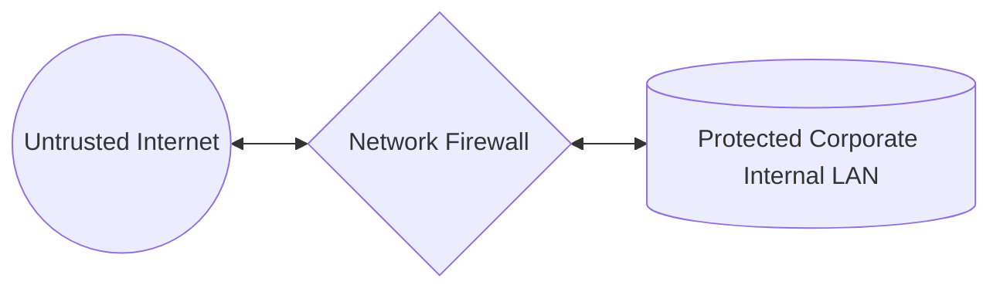
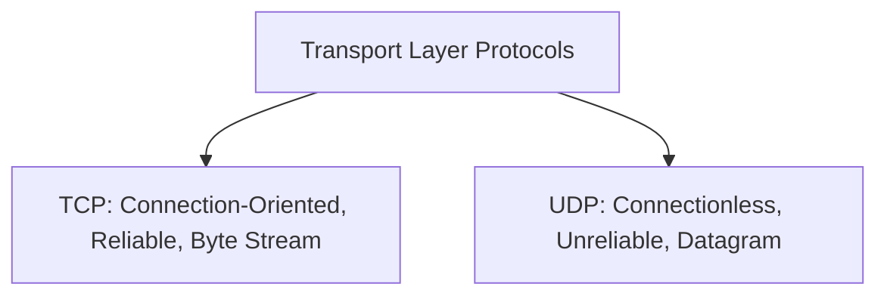
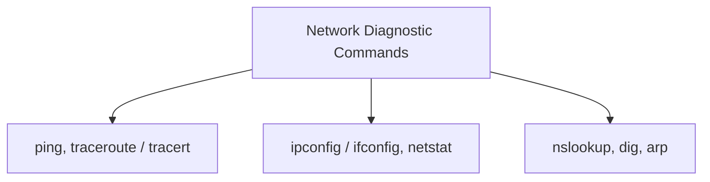

# Unit 5: Application Layer, Security & Network Commands - Term End Exam Notes (All 7 Marks Questions)

---

## Q1. Explain the Domain Name System (DNS), DNS Namespace Hierarchy, Resource Records, Name Servers, and Resolution Process. (7 Marks)

**Answer:**

**DNS (Domain Name System)** is a distributed hierarchical database protocol (Port 53) that translates human-readable domain names (e.g., `www.google.com`) into 32-bit/128-bit IP addresses (`142.250.190.46`).

### 1. DNS Namespace & Server Hierarchy:
- **Root Name Servers (`.`):** 13 logical root server clusters globally.
- **Top-Level Domain (TLD) Servers:** Handles domain extensions (`.com`, `.org`, `.edu`, `.in`).
- **Authoritative Name Servers:** Holds master DNS record mapping for specific domain zones.

### 2. Common DNS Resource Records (RR):
- **A Record:** Maps domain name to IPv4 address.
- **AAAA Record:** Maps domain name to IPv6 address.
- **CNAME (Canonical Name):** Alias for another domain name.
- **MX (Mail Exchange):** Directs email to domain mail servers.
- **PTR (Pointer):** Reverse DNS lookup (IP to domain name).
- **NS (Name Server):** Identifies authoritative name servers for the zone.

---

## Q2. Explain Electronic Mail Architecture, Email Components (User Agent, Message Transfer), and Mail Protocols (SMTP, POP3, IMAP). (7 Marks)

**Answer:**

Email architecture provides store-and-forward asynchronous message delivery across networks.

### 1. Key Components of Email Architecture:
- **User Agent (UA):** Email client program (Outlook, Thunderbird, Gmail web client) allowing users to compose, read, and organize emails.
- **Mail Transfer Agent (MTA):** Server software (Postfix, Sendmail, Exchange) that routes emails across the Internet using SMTP.
- **Message Format (RFC 5322):** Consists of **Header** (`To`, `From`, `Subject`, `Date`) and **Body** text/MIME attachments.

---

### 2. Comparison of Mail Protocols:

| Feature | SMTP (Simple Mail Transfer Protocol) | POP3 (Post Office Protocol v3) | IMAP (Internet Message Access Protocol) |
| :--- | :--- | :--- | :--- |
| **Primary Purpose** | **Push / Send** emails | **Pull / Download** emails | **Sync / Manage** emails on server |
| **Default Port** | Port 25 / 587 (TLS) | Port 110 / 995 (SSL) | Port 143 / 993 (SSL) |
| **Server Storage** | Temporarily queues outbound mail | Downloads and deletes mail from server | Keeps emails **stored centrally on server** |
| **Multi-Device Sync**| N/A | Poor (Emails saved on 1 PC) | **Excellent** (Syncs across phone/laptop) |

---

## Q3. Explain World Wide Web (WWW) Architecture, HTTP vs HTTPS, and File Transfer Protocol (FTP) vs TFTP. (7 Marks)

**Answer:**

### 1. World Wide Web Architecture & HTTP vs HTTPS:

- **HTTP (Port 80):** Unencrypted stateless text protocol using TCP for web browsing.
- **HTTPS (Port 443):** Encrypts HTTP traffic using TLS/SSL protocols to guarantee confidentiality, data integrity, and server authentication.

---

### 2. FTP vs TFTP Comparison:

| Feature | FTP (File Transfer Protocol) | TFTP (Trivial File Transfer Protocol) |
| :--- | :--- | :--- |
| **Transport Protocol** | **TCP** (Port 20 Data, Port 21 Control) | **UDP** (Port 69) |
| **Channels Used** | 2 Channels (Separate Control & Data) | Single Channel |
| **Authentication** | Username & Password required | Anonymous (No authentication) |
| **Features** | Directory listing, file deletion, resume | Simple read/write raw files only |
| **Primary Usage** | Web publishing, large file distribution | Router firmware flashing, PXE network boot |

---

## Q4. Explain Network Security Fundamentals and Types of Firewalls (Packet Filtering, Stateful Inspection, Application Gateway, Next-Gen). (7 Marks)

**Answer:**

**Network Security** involves policies and controls designed to prevent unauthorized access, misuse, or alteration of network resources.

### Types of Network Firewalls:

1. **Packet Filtering Firewall (Stateless - Layer 3/4):**
   - Inspects individual packet headers against ACL rules (Source/Dest IP, Port numbers, Protocol).
   - *Pros:* Extremely fast; low overhead.
   - *Cons:* No state tracking; easily spoofed.

2. **Stateful Inspection Firewall (Layer 3/4):**
   - Maintains a **State Table** tracking active TCP connection states (`SYN_SENT`, `ESTABLISHED`). Permits return traffic automatically.
   - *Pros:* High security; prevents unsolicited incoming connections.

3. **Application-Level Gateway / Proxy Firewall (Layer 7):**
   - Acts as a full proxy intermediary at the Application Layer; inspects actual payload contents (e.g., blocking specific URLs or malicious HTTP commands).
   - *Pros:* Deep content inspection.
   - *Cons:* Slower performance due to deep payload decoding.

4. **Next-Generation Firewall (NGFW):**
   - Combines stateful inspection with Deep Packet Inspection (DPI), Intrusion Prevention Systems (IPS), TLS decryption, and cloud threat intelligence.

---

## Q5. Explain Transport Protocols in Action: TCP vs UDP Segment Structures and Real-World Applications. (7 Marks)

**Answer:**

### Detailed TCP vs UDP Architectural Matrix:

| Feature | TCP (Transmission Control Protocol) | UDP (User Datagram Protocol) |
| :--- | :--- | :--- |
| **Connection Setup** | 3-Way Handshake required | None (Connectionless) |
| **Header Size** | 20 to 60 Bytes | Fixed **8 Bytes** |
| **Reliability** | Guaranteed (ACKs, Retransmission, Checksum) | Best-effort (No ACKs) |
| **Flow Control** | Yes (Sliding Window Protocol) | None |
| **Congestion Control**| Yes (Slow Start, Congestion Avoidance) | None |
| **Real-World Uses** | Web (HTTP/S), Email (SMTP), File Transfer (FTP) | Voice/Video Calls (VoIP, Zoom), Gaming, DNS |

---

## Q6. Explain Essential Network Troubleshooting Commands (`ping`, `traceroute`, `ipconfig/ifconfig`, `netstat`, `nslookup`, `arp`, `route`, `dig`). (7 Marks)

**Answer:**

Network CLI commands are diagnostic tools used by system administrators to troubleshoot connectivity, DNS, routing, and interface status.

### Detailed Network Commands Guide Table:

| Command | Protocol Used | Primary Function / Usage Example |
| :--- | :--- | :--- |
| **`ping <host>`** | ICMP Echo | Tests reachability and measures round-trip time (RTT) to a target host. |
| **`traceroute` / `tracert`**| ICMP / UDP (TTL) | Displays the exact path (list of intermediate router hops) to a destination. |
| **`ipconfig` / `ifconfig`** | System API | Displays active network interface configuration (IP address, Subnet Mask, Gateway). |
| **`netstat -an`** | TCP/UDP Kernel | Displays active network connections, listening ports, and routing tables. |
| **`nslookup <domain>`** | DNS (Port 53) | Queries DNS name servers to resolve IP addresses from domain names. |
| **`dig <domain>`** | DNS (Port 53) | Advanced DNS lookup tool providing detailed DNS record diagnostic outputs. |
| **`arp -a`** | ARP (Layer 2/3) | Displays the local ARP cache table mapping IP addresses to physical MAC addresses. |
| **`route print` / `route -n`**| Routing Table | Displays and modifies the host's local IP routing table. |
