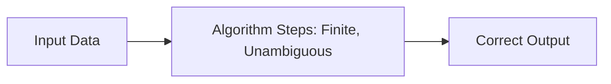
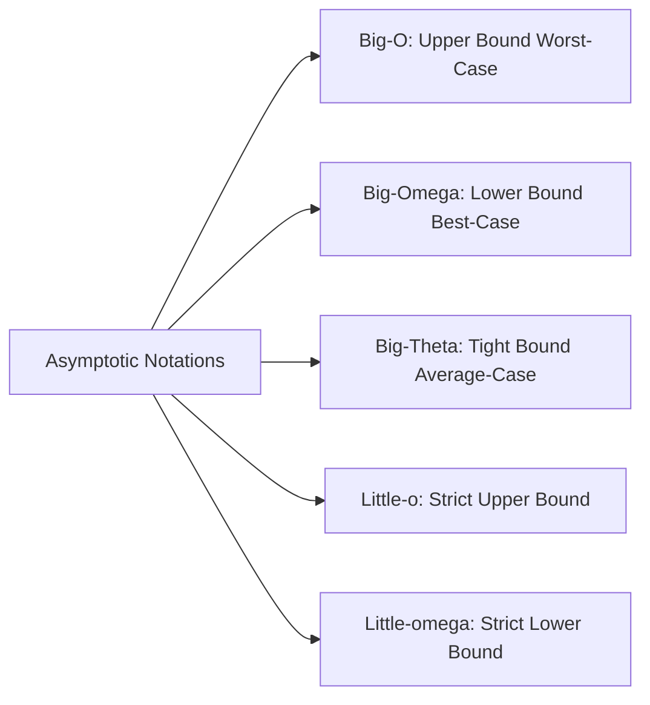
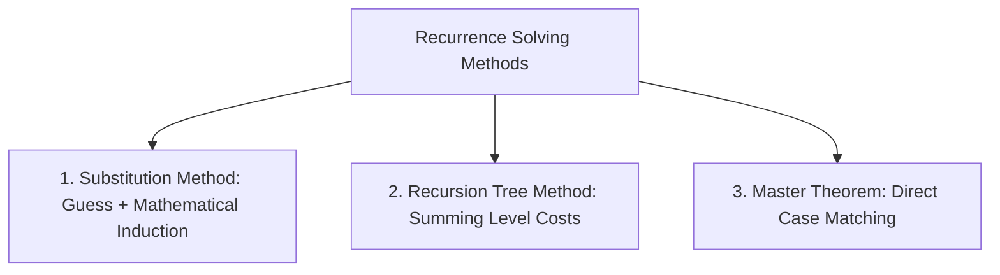
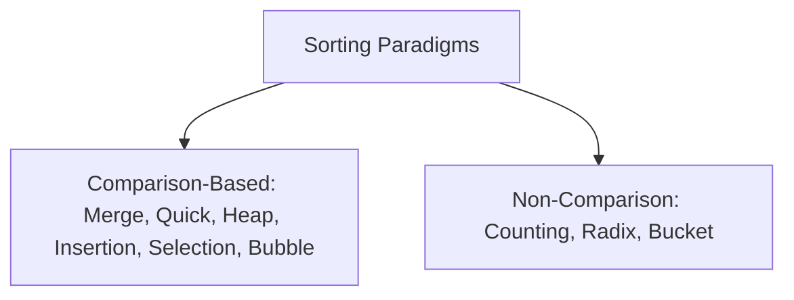

# Unit 1: Algorithm Fundamentals, Asymptotic Notations & Recurrences - Term End Exam Notes (All 7 Marks Questions)

---

## Q1. What is an Algorithm? Explain Algorithm Characteristics, Space & Time Complexity Analysis, and Rate of Growth of Functions. (7 Marks)

**Answer:**

An **Algorithm** is a well-defined sequence of unambiguous computational steps that takes some value or set of values as input and produces a value or set of values as output.



### 1. Essential Characteristics of an Algorithm:
1. **Input:** Zero or more quantities supplied externally.
2. **Output:** At least one quantity produced as a result.
3. **Definiteness:** Each instruction must be clear and unambiguous.
4. **Finiteness:** Algorithm must terminate after a finite number of steps for all test cases.
5. **Effectiveness:** Every operation must be basic enough to be carried out in practice.

---

### 2. Space & Time Complexity Analysis:
- **Space Complexity ($S(P)$):** Total memory required by the algorithm to run to completion.
  $$S(P) = c + S_v(n)$$
  where $c$ is fixed space (variables, constants) and $S_v(n)$ is variable space depending on input size $n$ (dynamic arrays, recursion stack).
- **Time Complexity ($T(n)$):** Number of key operations executed as a function of input size $n$.

---

### 3. Ranking Rates of Growth (Fastest to Slowest Growing):

$$O(1) < O(\log n) < O(\sqrt{n}) < O(n) < O(n \log n) < O(n^2) < O(n^3) < O(2^n) < O(n!)$$

```
  Complexity   | Name           | Example Algorithm
  ─────────────┼────────────────┼───────────────────────────────────
  O(1)         | Constant       | Accessing Array Element by Index
  O(log n)     | Logarithmic    | Binary Search
  O(n)         | Linear         | Linear Search, Single Loop
  O(n log n)   | Linearithmic   | Merge Sort, Heap Sort, Quick Sort
  O(n^2)       | Quadratic      | Bubble Sort, Selection Sort
  O(2^n)       | Exponential    | Fibonacci Recursive, N-Queens
  O(n!)        | Factorial      | Traveling Salesperson Brute Force
```

---

## Q2. Explain Asymptotic Notations ($O, \Omega, \Theta, o, \omega$) with mathematical definitions, formal bounds, and graphical representations. (7 Marks)

**Answer:**

**Asymptotic Notations** describe the growth rate of an algorithm's running time as input size $n \to \infty$.



### Formal Mathematical Definitions:

1. **Big-O Notation ($O$ - Upper Bound):**
   $$f(n) = O(g(n)) \iff \exists \, c > 0, n_0 > 0 \text{ such that } 0 \le f(n) \le c \cdot g(n) \quad \forall n \ge n_0$$
   - Represents the **worst-case** running time.

2. **Big-Omega Notation ($\Omega$ - Lower Bound):**
   $$f(n) = \Omega(g(n)) \iff \exists \, c > 0, n_0 > 0 \text{ such that } 0 \le c \cdot g(n) \le f(n) \quad \forall n \ge n_0$$
   - Represents the **best-case** running time.

3. **Big-Theta Notation ($\Theta$ - Tight Bound):**
   $$f(n) = \Theta(g(n)) \iff \exists \, c_1, c_2 > 0, n_0 > 0 \text{ such that } c_1 \cdot g(n) \le f(n) \le c_2 \cdot g(n) \quad \forall n \ge n_0$$
   - Represents the **average-case** or exact tight bound ($f(n) = O(g(n)) \land f(n) = \Omega(g(n))$).

4. **Little-o ($o$):** Non-tight upper bound ($\lim_{n \to \infty} \frac{f(n)}{g(n)} = 0$).
5. **Little-omega ($\omega$):** Non-tight lower bound ($\lim_{n \to \infty} \frac{f(n)}{g(n)} = \infty$).

---

## Q3. Explain Methods for Solving Recurrence Relations: Substitution Method, Recursion Tree Method, and Master Theorem (All 3 Cases with numerical examples). (7 Marks)

**Answer:**

A **Recurrence Relation** defines a function in terms of its value on smaller inputs:

$$T(n) = a T(n/b) + f(n)$$



### Master Theorem (Form: $T(n) = a T(n/b) + f(n)$ where $a \ge 1, b > 1$):

Compare $f(n)$ with $n^{\log_b a}$:

1. **Case 1 (Heavy Leaves):**
   - If $f(n) = O(n^{\log_b a - \epsilon})$ for constant $\epsilon > 0$, then:
     $$T(n) = \Theta(n^{\log_b a})$$
   - *Example:* $T(n) = 8T(n/2) + n^2 \implies a=8, b=2, n^{\log_2 8} = n^3$. Since $f(n)=O(n^{3-\epsilon})$, $T(n) = \Theta(n^3)$.

2. **Case 2 (Equal Distribution):**
   - If $f(n) = \Theta(n^{\log_b a} \log^k n)$ for $k \ge 0$, then:
     $$T(n) = \Theta(n^{\log_b a} \log^{k+1} n)$$
   - *Example:* Merge Sort $T(n) = 2T(n/2) + \Theta(n) \implies a=2, b=2, n^{\log_2 2} = n^1$. Since $f(n)=\Theta(n)$, $T(n) = \Theta(n \log n)$.

3. **Case 3 (Heavy Root):**
   - If $f(n) = \Omega(n^{\log_b a + \epsilon})$ for $\epsilon > 0$ and $a f(n/b) \le c f(n)$ for $c < 1$, then:
     $$T(n) = \Theta(f(n))$$
   - *Example:* $T(n) = 3T(n/4) + n \log n \implies a=3, b=4, n^{\log_4 3} = n^{0.793}$. Since $f(n)=\Omega(n)$, $T(n) = \Theta(n \log n)$.

---

## Q4. Compare Searching and Sorting Algorithms in detail (Complexity, Stability, Memory, In-Place Nature Summary Table). (7 Marks)

**Answer:**



### Complete Summary Matrix:

| Algorithm | Best Case Time | Average Case Time | Worst Case Time | Space Complexity | Stable? | In-Place? | Paradigm |
| :--- | :--- | :--- | :--- | :--- | :--- | :--- | :--- |
| **Linear Search** | $O(1)$ | $O(n)$ | $O(n)$ | $O(1)$ | Yes | Yes | Brute Force |
| **Binary Search** | $O(1)$ | $O(\log n)$ | $O(\log n)$ | $O(1)$ | Yes | Yes | Divide & Conquer |
| **Bubble Sort** | $O(n)$ | $O(n^2)$ | $O(n^2)$ | $O(1)$ | **Yes** | **Yes** | Exchange |
| **Selection Sort**| $O(n^2)$ | $O(n^2)$ | $O(n^2)$ | $O(1)$ | No | **Yes** | Selection |
| **Insertion Sort**| $O(n)$ | $O(n^2)$ | $O(n^2)$ | $O(1)$ | **Yes** | **Yes** | Incremental |
| **Merge Sort** | $O(n \log n)$ | $O(n \log n)$ | $O(n \log n)$ | $O(n)$ | **Yes** | No | Divide & Conquer |
| **Quick Sort** | $O(n \log n)$ | $O(n \log n)$ | $O(n^2)$ | $O(\log n)$ | No | **Yes** | Divide & Conquer |
| **Heap Sort** | $O(n \log n)$ | $O(n \log n)$ | $O(n \log n)$ | $O(1)$ | No | **Yes** | Heap Tree |
