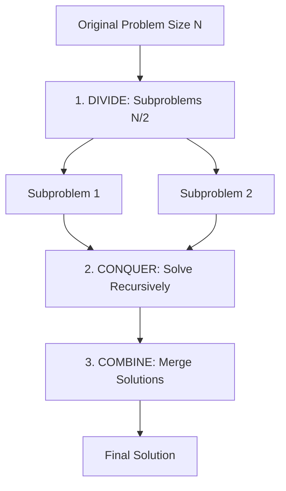
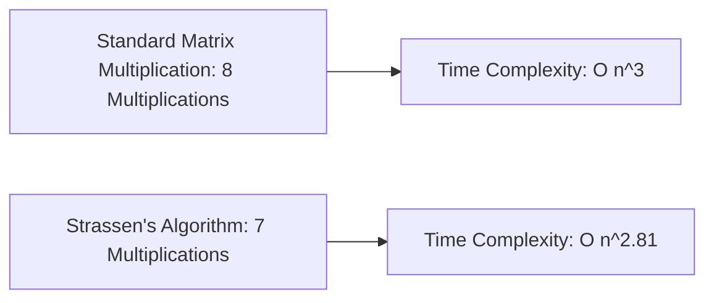
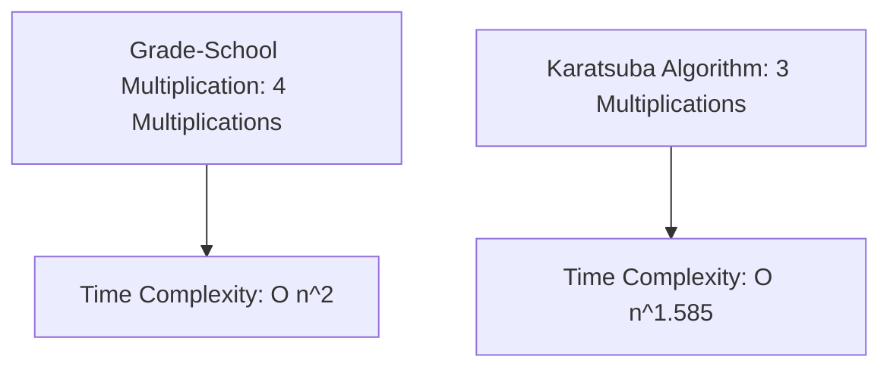

# Unit 2: Divide and Conquer Paradigm & Matrix Multiplication - Term End Exam Notes (All 7 Marks Questions)

---

## Q1. Explain the Divide and Conquer Paradigm. Compare Partition Schemes in Quick Sort (Lomuto vs Hoare) and Analyze Best, Average, and Worst Cases. (7 Marks)

**Answer:**

The **Divide and Conquer** paradigm solves a problem by breaking it into smaller subproblems, solving them recursively, and combining solutions.

### 1. Quick Sort Partition Schemes:
- **Lomuto Partition:** Chooses the last element as pivot. Traverses array with two indices $i, j$. Performs $\approx n$ comparisons.
- **Hoare Partition:** Chooses the first element as pivot. Uses two pointers moving towards each other from both ends. Performs $\approx 3\times$ fewer swaps than Lomuto.

### 2. Quick Sort Time Complexity Recurrences:
- **Best / Average Case:** $T(n) = 2T(n/2) + \Theta(n) \implies \Theta(n \log n)$.
- **Worst Case (Sorted Array):** $T(n) = T(n-1) + \Theta(n) \implies \Theta(n^2)$.
- **Randomized Quick Sort:** Picks a random pivot to guarantee expected $O(n \log n)$ time.

---

## Q2. Explain Strassen's Matrix Multiplication Algorithm ($O(n^{2.81})$) vs Standard Matrix Multiplication ($O(n^3)$). Detail the 7 Formulas $P_1 \dots P_7$. (7 Marks)

**Answer:**

Standard matrix multiplication of two $n \times n$ matrices requires **8 recursive multiplications** and 4 additions.

### 1. Standard Multiplication Recurrence:
$$T(n) = 8T(n/2) + \Theta(n^2) \implies \Theta(n^{\log_2 8}) = \Theta(n^3)$$

---

### 2. Strassen's 7 Scalar Multiplications ($P_1$ to $P_7$):
Given matrices $A = \begin{bmatrix} A_{11} & A_{12} \\ A_{21} & A_{22} \end{bmatrix}$ and $B = \begin{bmatrix} B_{11} & B_{12} \\ B_{21} & B_{22} \end{bmatrix}$:

1. $P_1 = (A_{11} + A_{22})(B_{11} + B_{22})$
2. $P_2 = (A_{21} + A_{22}) B_{11}$
3. $P_3 = A_{11}(B_{12} - B_{22})$
4. $P_4 = A_{22}(B_{21} - B_{11})$
5. $P_5 = (A_{11} + A_{12}) B_{22}$
6. $P_6 = (A_{21} - A_{11})(B_{11} + B_{12})$
7. $P_7 = (A_{12} - A_{22})(B_{21} + B_{22})$

Reconstruction of $C = A \times B$:
- $C_{11} = P_1 + P_4 - P_5 + P_7$
- $C_{12} = P_3 + P_5$
- $C_{21} = P_2 + P_4$
- $C_{22} = P_1 - P_2 + P_3 + P_6$

### Strassen's Recurrence & Complexity:
$$T(n) = 7T(n/2) + \Theta(n^2) \implies \Theta(n^{\log_2 7}) \approx \Theta(n^{2.807})$$

---

## Q3. Explain Karatsuba Algorithm for Large Integer Multiplication ($O(n^{1.585})$). (7 Marks)

**Answer:**

Standard grade-school multiplication of two $n$-digit numbers requires 4 single-digit multiplications, taking $O(n^2)$ time.

Given $X = X_1 \cdot 10^{n/2} + X_0$ and $Y = Y_1 \cdot 10^{n/2} + Y_0$:

$$X \cdot Y = X_1 Y_1 \cdot 10^n + (X_1 Y_0 + X_0 Y_1) \cdot 10^{n/2} + X_0 Y_0$$

Karatsuba computes **3 multiplications** instead of 4:
1. $P_1 = X_1 \times Y_1$
2. $P_2 = X_0 \times Y_0$
3. $P_3 = (X_1 + X_0) \times (Y_1 + Y_0)$

Middle term calculation: $X_1 Y_0 + X_0 Y_1 = P_3 - P_1 - P_2$.

$$\text{Recurrence: } T(n) = 3T(n/2) + \Theta(n) \implies \Theta(n^{\log_2 3}) \approx \Theta(n^{1.585})$$
