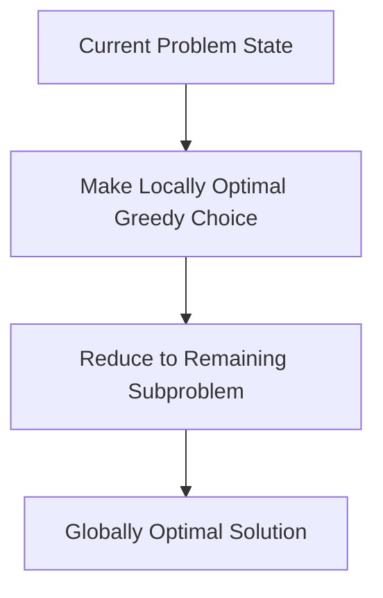
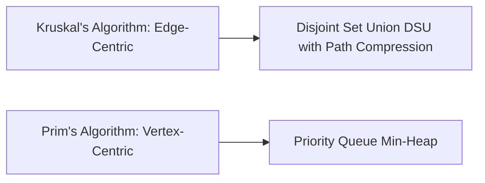
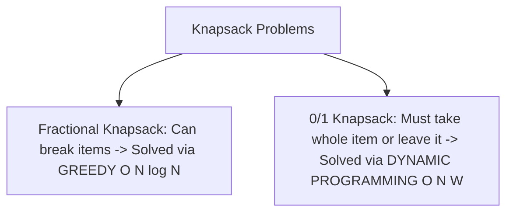

# Unit 3: Greedy Approach, Minimum Spanning Trees & Shortest Paths - Term End Exam Notes (All 7 Marks Questions)

---

## Q1. Explain Greedy Algorithmic Paradigm. What are Greedy Choice Property and Optimal Substructure? (7 Marks)

**Answer:**

A **Greedy Algorithm** builds a solution step-by-step, always making the **locally optimal choice** at each stage without reconsidering past decisions.

### Two Essential Properties:
1. **Greedy Choice Property:** A global optimum can be arrived at by making locally optimal choices.
2. **Optimal Substructure:** An optimal solution to the problem contains optimal solutions to subproblems.

---

## Q2. Compare Prim's vs Kruskal's Minimum Spanning Tree (MST) Algorithms with step-by-step traces and Data Structures. (7 Marks)

**Answer:**

A **Minimum Spanning Tree (MST)** of a connected weighted graph $G=(V,E)$ is a tree that connects all $V$ vertices with minimum total edge weight.

### Detailed Comparison Table:

| Feature | Kruskal's Algorithm | Prim's Algorithm |
| :--- | :--- | :--- |
| **Approach** | Edge-centric | Vertex-centric |
| **Data Structure** | Disjoint Set Union (DSU) with Path Compression | Priority Queue (Min-Heap / Fibonacci Heap) |
| **Graph Preference** | Sparse Graphs ($E \approx V$) | Dense Graphs ($E \approx V^2$) |
| **Time Complexity** | $O(E \log E)$ or $O(E \log V)$ | $O(E \log V)$ (Binary Heap) / $O(E + V \log V)$ (Fibonacci Heap) |

---

## Q3. Explain Dijkstra's Single Source Shortest Path Algorithm and Huffman Coding. (7 Marks)

**Answer:**

### 1. Dijkstra's Shortest Path Algorithm:
- Finds shortest path from source node $S$ to all nodes in a weighted graph with **non-negative edge weights**.
- Uses Min-Heap priority queue; relaxes edges $d[v] > d[u] + w(u,v)$. Time Complexity: $O((V+E) \log V)$.
- *Limitation:* Fails on graphs with negative edge weights (Bellman-Ford algorithm must be used instead).

---

### 2. Huffman Coding (Greedy Data Compression):
- A greedy algorithm for lossless data compression that builds an optimal binary prefix code tree based on character frequencies.
- Characters with higher frequencies get shorter bit codes; characters with lower frequencies get longer bit codes. Time Complexity: $O(n \log n)$.

---

## Q4. Compare Fractional Knapsack vs 0/1 Knapsack Problem with numerical example and complexity analysis. (7 Marks)

**Answer:**

### Direct Comparison Matrix:

| Feature | Fractional Knapsack Problem | 0/1 Knapsack Problem |
| :--- | :--- | :--- |
| **Item Division** | Items can be divided into fractions | Items **cannot** be divided (0 or 1 choice) |
| **Algorithmic Paradigm**| **Greedy Approach** (Sort by $v_i/w_i$ ratio) | **Dynamic Programming** |
| **Time Complexity** | $O(n \log n)$ | $O(n \cdot W)$ |
| **Optimality Guarantee**| Greedy guarantees global optimum | Greedy **FAILS**; DP required |
