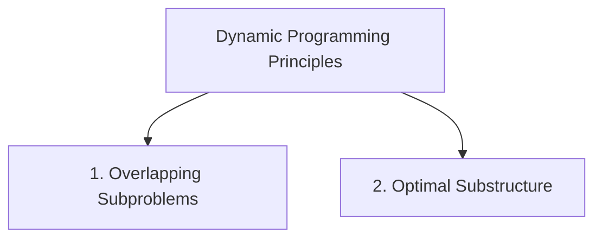
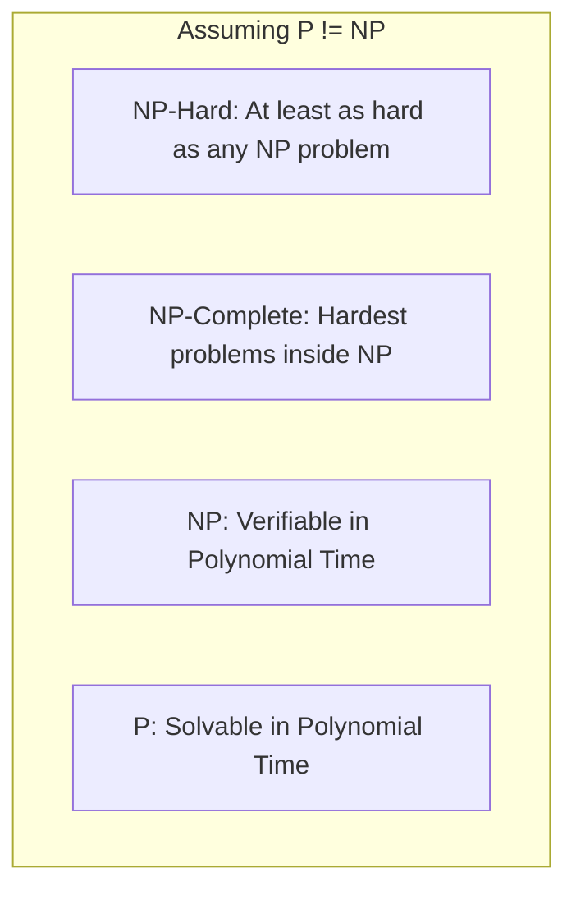

# Unit 4: Dynamic Programming, Backtracking & Complexity Classes - Term End Exam Notes (All 7 Marks Questions)

---

## Q1. Explain Dynamic Programming (DP) Paradigm vs Divide & Conquer and Greedy. Contrast Top-Down Memoization vs Bottom-Up Tabulation. (7 Marks)

**Answer:**

**Dynamic Programming (DP)** solves complex problems by breaking them down into overlapping subproblems, solving each subproblem **only once**, and storing the results in a lookup table.

### 1. Paradigm Comparison:

| Feature | Greedy Approach | Divide & Conquer | Dynamic Programming |
| :--- | :--- | :--- | :--- |
| **Subproblems** | Independent | Independent | **Overlapping** |
| **Choice** | Made upfront locally | Solves all subproblems | Evaluates subproblem combinations |
| **Re-computation** | Never | Solves same subproblems repeatedly | Solves each subproblem **once** (Stores result) |

---

### 2. Top-Down Memoization vs Bottom-Up Tabulation:
- **Top-Down Memoization:** Uses recursion + lookup table (cache). Computes subproblems on demand.
- **Bottom-Up Tabulation:** Iteratively fills an $n$-dimensional DP table from smallest base cases to target solution. Avoids recursion stack overhead.

---

## Q2. Explain 0/1 Knapsack Problem using Dynamic Programming with state transition equation and table formulation. (7 Marks)

**Answer:**

In 0/1 Knapsack, item $i$ with weight $w[i-1]$ and value $v[i-1]$ cannot be split.

### DP State Transition Recurrence:

$$K[i][j] = \begin{cases} 
K[i-1][j] & \text{if } w[i-1] > j \\
\max(v[i-1] + K[i-1][j - w[i-1]], \; K[i-1][j]) & \text{if } w[i-1] \le j 
\end{cases}$$

- **Time Complexity:** $O(n \cdot W)$ (Pseudo-polynomial time).
- **Space Complexity:** $O(n \cdot W)$ (Can be space-optimized to $O(W)$ using 1D DP array).

---

## Q3. Explain Longest Common Subsequence (LCS) and Matrix Chain Multiplication Algorithms. (7 Marks)

**Answer:**

### 1. Longest Common Subsequence (LCS):
- Finds the longest sequence appearing in the same relative order in two strings $X$ (length $m$) and $Y$ (length $n$).
- **Recurrence:**
  $$L[i][j] = \begin{cases} 1 + L[i-1][j-1] & \text{if } X[i] == Y[j] \\ \max(L[i-1][j], L[i][j-1]) & \text{if } X[i] \neq Y[j] \end{cases}$$
- Time & Space Complexity: $O(m \cdot n)$. Used in `git diff`.

---

### 2. Matrix Chain Multiplication (MCM):
- Determines the optimal parenthesization order to minimize scalar multiplications for multiplying a sequence of matrices $A_1 \times A_2 \times \dots \times A_n$.
- Recurrence: $m[i,j] = \min_{i \le k < j} (m[i,k] + m[k+1,j] + p_{i-1}p_kp_j)$. Time Complexity: $O(n^3)$.

---

## Q4. Explain Complexity Classes: P, NP, NP-Hard, and NP-Complete with a Euler diagram and Polynomial-Time Reductions. (7 Marks)

**Answer:**

Computational complexity theory categorizes decision problems based on the time required to solve or verify them.

### Definitions & Classification:

1. **Class P (Polynomial Time):** Decision problems solvable by a deterministic machine in polynomial time $O(n^k)$ (e.g., Shortest Path, MST, Sorting).
2. **Class NP (Nondeterministic Polynomial Time):** Decision problems whose solution can be **verified** in polynomial time $O(n^k)$.
3. **Class NP-Hard:** Problems to which any problem in NP can be reduced in polynomial time ($A \le_P B$). Need not be in NP.
4. **Class NP-Complete (NPC):** The hardest problems in NP. A problem $X$ is NP-Complete if:
   1. $X \in NP$, and
   2. $X$ is NP-Hard.
   - *Examples:* 3-SAT, Clique Problem, Vertex Cover, Traveling Salesperson Problem (TSP), Hamiltonian Cycle.
