# Unit 5: String Matching Algorithms - Term End Exam Notes (All 7 Marks Questions)

---

## Q1. What is the Naive String Matching Algorithm? Explain its sliding window mechanism, best and worst-case time complexity, worked execution traces, and complete C++ implementation. (7 Marks)

**Answer:**

The **Naive String Matching Algorithm** (also known as the Brute-Force Pattern Searching Algorithm) is the fundamental technique for finding all occurrences of a pattern string $P$ of length $m$ within a larger text string $T$ of length $n$.

It operates by testing every possible starting alignment position (called a **shift** $s$) from index $0$ up to $n - m$ without any preprocessing or past comparison memory.

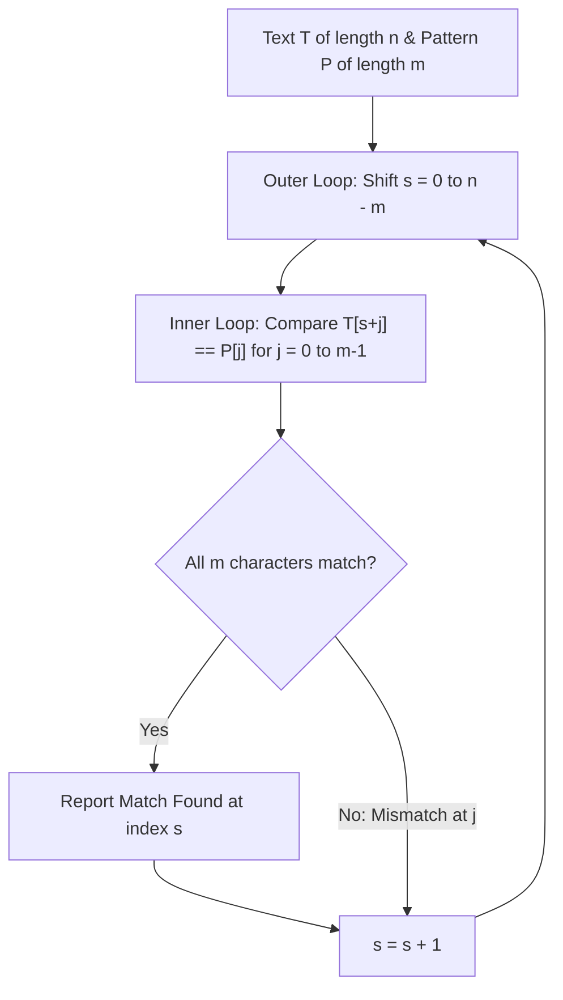

---

### 1. Algorithm Step-by-Step Mechanism:

1. Let $n = \text{length}(T)$ and $m = \text{length}(P)$.
2. The maximum valid starting index for pattern $P$ in text $T$ is $n - m$.
3. For each shift index $s \in [0, n - m]$:
   - Compare $T[s + j]$ with $P[j]$ for $j = 0, 1, \dots, m - 1$.
   - If a mismatch occurs at any character $j$, immediately break the inner loop and increment shift to $s + 1$.
   - If $j$ reaches $m$, all $m$ characters matched $\implies$ output shift $s$ as a valid match position.

---

### 2. Time & Space Complexity Analysis:

| Case | Time Complexity | Cause / Condition |
| :--- | :--- | :--- |
| **Best Case** | $\Theta(n)$ | Mismatch occurs on the very first character ($j = 0$) at every shift position $s$. |
| **Worst Case** | $O((n - m + 1) \cdot m) \approx O(n \cdot m)$ | Pattern and text consist of repeated characters (e.g., $T = \text{"AAAAAAAAAB"}$, $P = \text{"AAAB"}$), forcing $m$ comparisons per shift. |
| **Average Case** | $O(n)$ | On random alphabets, mismatches happen quickly after $1$ or $2$ character checks. |
| **Auxiliary Space** | $O(1)$ | Operates in-place with zero additional memory allocation. |

---

### 3. Worked Execution Trace Example:

- **Text ($T$):** `"AAAAABAAAB"` ($n = 10$)
- **Pattern ($P$):** `"AAAB"` ($m = 4$)
- **Valid Shifts:** $s \in [0, 6]$

| Shift $s$ | Text Window $T[s \dots s+3]$ | Comparison Trace | Outcome | Total Comparisons |
| :-: | :-- | :-- | :-- | :-: |
| **0** | `AAAA` | `A`=`A` $\checkmark$, `A`=`A` $\checkmark$, `A`=`A` $\checkmark$, `A` vs `B` $\boldsymbol{\times}$ | Mismatch at $j=3$ | 4 |
| **1** | `AAAA` | `A`=`A` $\checkmark$, `A`=`A` $\checkmark$, `A`=`A` $\checkmark$, `A` vs `B` $\boldsymbol{\times}$ | Mismatch at $j=3$ | 4 |
| **2** | `AAAB` | `A`=`A` $\checkmark$, `A`=`A` $\checkmark$, `A`=`A` $\checkmark$, `B`=`B` $\checkmark$ | **MATCH FOUND AT 2** | 4 |
| **3** | `AABA` | `A`=`A` $\checkmark$, `A`=`A` $\checkmark$, `B` vs `A` $\boldsymbol{\times}$ | Mismatch at $j=2$ | 3 |
| **4** | `ABAA` | `A`=`A` $\checkmark$, `B` vs `A` $\boldsymbol{\times}$ | Mismatch at $j=1$ | 2 |
| **5** | `BAAA` | `B` vs `A` $\boldsymbol{\times}$ | Mismatch at $j=0$ | 1 |
| **6** | `AAAB` | `A`=`A` $\checkmark$, `A`=`A` $\checkmark$, `A`=`A` $\checkmark$, `B`=`B` $\checkmark$ | **MATCH FOUND AT 6** | 4 |

- **Total Character Comparisons:** $4 + 4 + 4 + 3 + 2 + 1 + 4 = 22$ comparisons.
- **Matches Found:** Indices $2$ and $6$.

---

### 4. Verified C++ Implementation:

```cpp
#include <iostream>
#include <string>
using namespace std;

void naiveStringMatch(const string& text, const string& pattern) {
    int n = text.length();
    int m = pattern.length();
    int totalComparisons = 0;
    bool found = false;

    // Slide pattern across text from shift 0 to n - m
    for (int s = 0; s <= n - m; s++) {
        int j;
        for (j = 0; j < m; j++) {
            totalComparisons++;
            if (text[s + j] != pattern[j]) {
                break; // Mismatch found -> shift window by 1
            }
        }
        // If pattern loop completed full length m
        if (j == m) {
            cout << "Pattern found at shift index: " << s << endl;
            found = true;
        }
    }

    if (!found) {
        cout << "Pattern not found in text." << endl;
    }
    cout << "Total Character Comparisons: " << totalComparisons << endl;
}

int main() {
    string text = "AAAAABAAAB";
    string pattern = "AAAB";
    naiveStringMatch(text, pattern);
    return 0;
}
```

---

### 5. Advantages & Disadvantages:

| Advantages | Disadvantages |
| :-- | :-- |
| **Zero Preprocessing:** Starts searching immediately without setup phase. | **High Worst-Case Cost:** $O(n \cdot m)$ time on highly redundant text. |
| **$O(1)$ Space:** Requires no auxiliary tables or memory buffers. | **Redundant Re-checking:** Forgets past matches and slides by only $1$ shift. |
| **Simplicity:** Easy to code and debug for short texts. | Unsuitable for large text corpora (e.g., DNA sequencing, search engines). |

---

## Q2. Explain the Rabin-Karp String Matching Algorithm in detail. Discuss the Base-26 rolling hash function, spurious hits, rolling hash update formula, worked lowercase/uppercase traces, and C++ implementation. (7 Marks)

**Answer:**

The **Rabin-Karp Algorithm** is an advanced probabilistic string-matching algorithm that replaces character-by-character comparisons with **numeric hash value comparisons**. 

Instead of checking characters at every shift, Rabin-Karp computes a **hash value** for the pattern and for each window of text. A full character-by-character check is triggered **only when hash values match**.

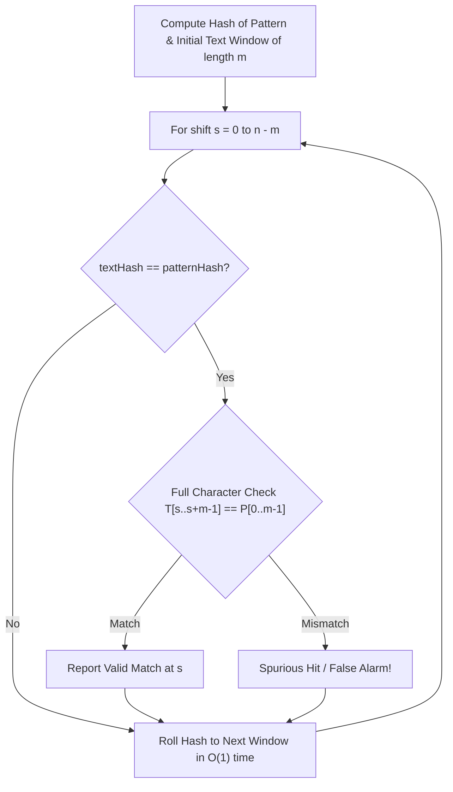

---

### 1. Hash Function & Rolling Hash Mathematics:

For an alphabet size $d$ (e.g., $d = 26$ for English letters) and a prime modulus $q$ (to prevent integer overflow and minimize collisions):

#### A. Polynomial Hash Function:
$$p = \left( \sum_{j=0}^{m-1} d^{m-1-j} \cdot P[j] \right) \pmod q$$

#### B. Rolling Hash Update Formula (Constant Time $O(1)$):
When sliding from shift $s$ to shift $s + 1$, the leftmost character $T[s]$ leaves the window and character $T[s + m]$ enters:

$$t_{s+1} = \left( d \cdot (t_s - T[s] \cdot h) + T[s + m] \right) \pmod q$$

where $h = d^{m-1} \pmod q$ is precomputed. If $t_{s+1} < 0$, add $q$ to ensure a positive modulus.

---

### 2. Spurious Hits (Hash Collisions):
- **Definition:** A **Spurious Hit** occurs when $t_s = p$, but $T[s \dots s+m-1] \neq P[0 \dots m-1]$.
- **Handling:** Rabin-Karp performs a direct character-by-character verification step whenever $t_s = p$ to eliminate false positives.

---

### 3. Worked Numerical Trace (Lowercase Text Example):

- **Text ($T$):** `"abcabdabc"` ($n = 9$)
- **Pattern ($P$):** `"abc"` ($m = 3$)
- **Alphabet Base ($d$):** $26$, **Prime Modulus ($q$):** $101$, Mapping: `a=0, b=1, c=2, ...`
- **Precomputed Constant $h$:** $h = 26^{3-1} \pmod{101} = 676 \pmod{101} = 70$.
- **Pattern Hash ($p$):** $p = (0 \cdot 26^2 + 1 \cdot 26^1 + 2 \cdot 26^0) \pmod{101} = 28 \pmod{101} = 28$.

| Shift $s$ | Text Window | Calculated Hash $t_s$ | $t_s == p$ (28)? | Character Verification | Result |
| :-: | :-- | :-: | :-: | :-- | :-- |
| **0** | `abc` | **28** | **Yes** | `a`=`a`, `b`=`b`, `c`=`c` | **Match at Index 0** |
| **1** | `bca` | 21 | No | (Skipped) | No Match |
| **2** | `cab` | 40 | No | (Skipped) | No Match |
| **3** | `abd` | 29 | No | (Skipped) | No Match |
| **4** | `bda` | 47 | No | (Skipped) | No Match |
| **5** | `dab` | 9 | No | (Skipped) | No Match |
| **6** | `abc` | **28** | **Yes** | `a`=`a`, `b`=`b`, `c`=`c` | **Match at Index 6** |

---

### 4. Verified C++ Implementation:

```cpp
#include <iostream>
#include <string>
using namespace std;

const int D = 26;   // Base for alphabet (a-z)
const int Q = 101;  // Prime modulus

void rabinKarpSearch(const string& text, const string& pattern) {
    int n = text.length();
    int m = pattern.length();
    int p = 0; // Pattern hash
    int t = 0; // Text window hash
    int h = 1;

    // Precompute h = D^(m-1) % Q
    for (int i = 0; i < m - 1; i++) {
        h = (h * D) % Q;
    }

    // Compute initial hash values for pattern and first window
    for (int i = 0; i < m; i++) {
        p = (D * p + (pattern[i] - 'a')) % Q;
        t = (D * t + (text[i] - 'a')) % Q;
    }

    // Slide window over text
    for (int s = 0; s <= n - m; s++) {
        // Check hash equality
        if (p == t) {
            bool match = true;
            for (int j = 0; j < m; j++) {
                if (text[s + j] != pattern[j]) {
                    match = false;
                    break;
                }
            }
            if (match) {
                cout << "Pattern found at index: " << s << endl;
            } else {
                cout << "Spurious Hit detected at index: " << s << endl;
            }
        }

        // Calculate hash for next window in O(1)
        if (s < n - m) {
            t = (D * (t - (text[s] - 'a') * h) + (text[s + m] - 'a')) % Q;
            if (t < 0) {
                t += Q; // Keep hash positive
            }
        }
    }
}

int main() {
    string text = "abcabdabc";
    string pattern = "abc";
    rabinKarpSearch(text, pattern);
    return 0;
}
```

---

### 5. Time Complexity Summary:

- **Average / Best Case Time:** $O(n + m)$ when hash collisions (spurious hits) are rare.
- **Worst Case Time:** $O(n \cdot m)$ if prime $q$ causes collisions at almost every shift.
- **Space Complexity:** $O(1)$ auxiliary space.

---

## Q3. Explain the Knuth-Morris-Pratt (KMP) String Matching Algorithm. How does the Prefix Function / LPS Table eliminate redundant comparisons? Provide step-by-step LPS table construction and full execution trace. (7 Marks)

**Answer:**

The **Knuth-Morris-Pratt (KMP) Algorithm** is a deterministic linear-time string-matching algorithm with a guaranteed worst-case complexity of **$O(n + m)$**.

Unlike Naive and Rabin-Karp algorithms, KMP **never re-evaluates characters in the text that have already been matched**. It achieves this by preprocessing the pattern $P$ into a **Longest Proper Prefix which is also Suffix (LPS) Array** (also called the **Prefix Function** $\pi$).

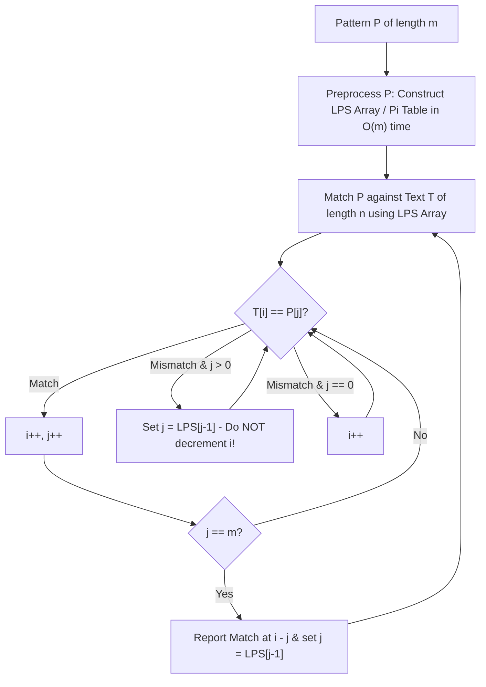

---

### 1. The Prefix Function / LPS Array Definition:

- **Definition:** $\text{LPS}[i]$ stores the length of the **longest proper prefix** of $P[0 \dots i]$ that is also a **suffix** of $P[0 \dots i]$.
- **Proper Prefix:** A prefix that is not equal to the full string itself.
- **Purpose:** When a mismatch occurs at $P[j]$, we do not reset the text index $i$. Instead, we set $j = \text{LPS}[j - 1]$, skipping redundant comparisons.

---

### 2. Step-by-Step LPS Construction Trace for Pattern $P = \text{"ABABAC"}$:

- Length $m = 6$, Indices $0 \dots 5$.
- Initialization: $\text{LPS}[0] = 0$, $len = 0$, $i = 1$.

| $i$ | $P[i]$ | $len$ | $P[len]$ | Match Condition | LPS Update | Next State |
| :-: | :-: | :-: | :-: | :-- | :-- | :-- |
| **1** | `B` | 0 | `A` | `B` $\neq$ `A` $\land len == 0$ | $\text{LPS}[1] = 0$ | $i = 2$ |
| **2** | `A` | 0 | `A` | `A` == `A` $\checkmark$ | $len = 1, \text{LPS}[2] = 1$ | $i = 3$ |
| **3** | `B` | 1 | `B` | `B` == `B` $\checkmark$ | $len = 2, \text{LPS}[3] = 2$ | $i = 4$ |
| **4** | `A` | 2 | `A` | `A` == `A` $\checkmark$ | $len = 3, \text{LPS}[4] = 3$ | $i = 5$ |
| **5** | `C` | 3 | `B` | `C` $\neq$ `B` $\implies len = \text{LPS}[2] = 1$ | Retry: `C` $\neq P[1]$ (`B`) $\implies len = \text{LPS}[0] = 0$ | $\text{LPS}[5] = 0$, $i = 6$ |

#### Final Calculated LPS Table:

| Index $i$ | 0 | 1 | 2 | 3 | 4 | 5 |
| :--- | :-: | :-: | :-: | :-: | :-: | :-: |
| **Char $P[i]$** | **A** | **B** | **A** | **B** | **A** | **C** |
| **$\text{LPS}[i]$** | **0** | **0** | **1** | **2** | **3** | **0** |

---

### 3. KMP Full Search Execution Trace:

- **Text ($T$):** `"ABABABACABA"` ($n = 11$)
- **Pattern ($P$):** `"ABABAC"` ($m = 6$)
- **LPS Array:** `[0, 0, 1, 2, 3, 0]`

```
Step 1: Compare T[0..4] "ABABA" with P[0..4] "ABABA" -> All Match! (j=5)
        Compare T[5] 'B' with P[5] 'C' -> MISMATCH at j=5!
        Shift Rule: Do NOT change i (stay at 5). Set j = LPS[4] = 3.

Step 2: Resume comparison from T[5] 'B' with P[3] 'B' -> Match! (j=4)
        Compare T[6] 'A' with P[4] 'A' -> Match! (j=5)
        Compare T[7] 'C' with P[5] 'C' -> Match! (j=6 == m)
        MATCH FOUND AT INDEX: i - j = 7 - 6 = 1!
```

---

### 4. Verified C++ Implementation:

```cpp
#include <iostream>
#include <vector>
#include <string>
using namespace std;

// Function to construct LPS (Longest Proper Prefix which is also Suffix) Array
vector<int> computeLPSArray(const string& pattern) {
    int m = pattern.length();
    vector<int> lps(m, 0);
    int len = 0; // Length of previous longest prefix suffix
    int i = 1;

    while (i < m) {
        if (pattern[i] == pattern[len]) {
            len++;
            lps[i] = len;
            i++;
        } else {
            if (len != 0) {
                len = lps[len - 1]; // Fallback to smaller prefix
            } else {
                lps[i] = 0;
                i++;
            }
        }
    }
    return lps;
}

// KMP Search Function
void KMPSearch(const string& text, const string& pattern) {
    int n = text.length();
    int m = pattern.length();
    vector<int> lps = computeLPSArray(pattern);

    int i = 0; // Index for text
    int j = 0; // Index for pattern

    while (i < n) {
        if (pattern[j] == text[i]) {
            i++;
            j++;
        }

        if (j == m) {
            cout << "Pattern found at index: " << (i - j) << endl;
            j = lps[j - 1]; // Find next potential match
        } else if (i < n && pattern[j] != text[i]) {
            if (j != 0) {
                j = lps[j - 1]; // Shift pattern using LPS table without moving i
            } else {
                i++;
            }
        }
    }
}

int main() {
    string text = "ABABABACABA";
    string pattern = "ABABAC";
    KMPSearch(text, pattern);
    return 0;
}
```

---

### 5. Complexity Summary:

- **Preprocessing Time:** $O(m)$ to construct the LPS array.
- **Matching Time:** $O(n)$ text traversal time.
- **Total Time Complexity:** $O(n + m)$ **Strictly Linear Worst-Case**.
- **Auxiliary Space:** $O(m)$ for storing the LPS array.

---

## Q4. Compare String Matching Algorithms (Naive vs Rabin-Karp vs KMP vs Finite Automata vs Boyer-Moore) across pre-processing time, matching time complexity, auxiliary space, matching mechanism, and best application domains. (7 Marks)

**Answer:**

String matching algorithms vary significantly based on whether they preprocess the pattern or text, how they shift the searching window upon mismatch, and their worst-case theoretical guarantees.

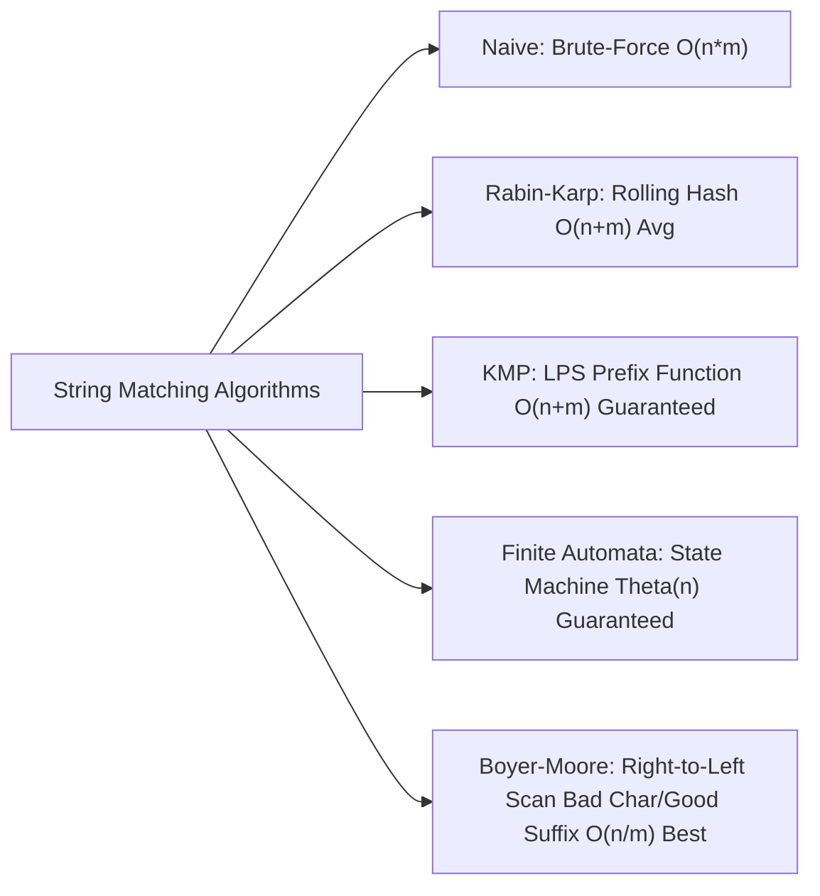

---

### Master Comparison Matrix across all Dimensions:

| Feature / Dimension | Naive String Matching | Rabin-Karp Algorithm | Knuth-Morris-Pratt (KMP) | Finite Automata (FA) | Boyer-Moore Algorithm |
| :--- | :--- | :--- | :--- | :--- | :--- |
| **Preprocessing Time** | $O(0)$ (None) | $O(m)$ (Pattern Hash) | $O(m)$ (LPS Table) | $O(m \cdot \Sigma)$ (Transition Table) | $O(m + \Sigma)$ (Bad Char & Good Suffix Tables) |
| **Best-Case Matching Time** | $O(n)$ | $O(n + m)$ | $O(n)$ | **$\Theta(n)$ (Linear)** | $O(n / m)$ (Sub-linear!) |
| **Average-Case Matching Time** | $O(n)$ | $O(n + m)$ | $O(n)$ | **$\Theta(n)$ (Linear)** | $O(n)$ |
| **Worst-Case Matching Time** | $O(n \cdot m)$ | $O(n \cdot m)$ | **$O(n + m)$ (Linear)** | **$\Theta(n)$ (Strictly Linear)** | $O(n \cdot m)$ (without Horspool refinement) |
| **Auxiliary Space** | $O(1)$ | $O(1)$ | $O(m)$ | $O(m \cdot \Sigma)$ | $O(m + \Sigma)$ |
| **Comparison Direction** | Left-to-Right ($0 \to m-1$) | Left-to-Right (Numeric Hash) | Left-to-Right ($0 \to m-1$) | Left-to-Right (State Machine) | **Right-to-Left ($m-1 \to 0$)** |
| **Shift Strategy** | Always shift by $+1$ | Shift by $+1$ using $O(1)$ rolling hash | Shift using $\text{LPS}[j-1]$ skip table | State transition $q' = \delta(q, T[i])$ | Max of Bad Character & Good Suffix heuristics |
| **Susceptibility to Collisions** | N/A | High (Spurious Hits depending on prime $q$) | Zero (Deterministic) | Zero (Deterministic) | Zero (Deterministic) |
| **Ideal Application Domain** | Small text strings, simple one-off searches. | Multiple pattern matching simultaneously, plagiarism detection. | Real-time streaming data, network packet inspection (no backtracking). | Hardware FPGA/ASIC implementation, lexical analyzers (lex/flex). | Text editors (Ctrl+F), large static text files, gene sequencing. |

---

### Detailed Architectural Comparison Highlights:

1. **Preprocessing Overhead vs Search Speed:**
   - **Naive** requires zero setup time but performs redundant comparisons on repetitive text.
   - **KMP** invests $O(m)$ time preprocessing the pattern to build the LPS array, guaranteeing zero backtracking over text characters ($i$ only moves forward).
   - **Finite Automata** invests $O(m \cdot \Sigma)$ time to precompute a full state transition table, guaranteeing exact $\Theta(n)$ linear execution with zero backtracking.

2. **Numeric Hashing vs Direct Symbol Comparison:**
   - **Rabin-Karp** transforms strings into integers modulo $q$. It excels at multi-pattern matching because one text window hash can be checked against a hash table of multiple patterns in $O(1)$ average time.

3. **Sub-linear Search Potential (Boyer-Moore):**
   - **Boyer-Moore** scans characters from **right-to-left**. On large alphabets, it frequently skips up to $m$ characters in a single step, yielding sub-linear $O(n / m)$ performance in practice.

---

## Q5. Explain String Matching Using Finite Automata (FA) in detail. How is the State Transition Function $\delta(q, a)$ defined using the Suffix Function $\sigma(x)$? Provide a complete transition table construction, state transition diagram, worked execution trace, C++ code, and complexity analysis. (7 Marks)

**Answer:**

**String Matching using Finite Automata (FA)** is an efficient pattern-matching technique that constructs a **Deterministic Finite Automaton (DFA)** from a given pattern string $P$ of length $m$. 

Once the automaton is built, it processes a text string $T$ of length $n$ character-by-character in a **single pass**, maintaining the state that represents the length of the longest prefix of $P$ that is also a suffix of the text scanned so far.

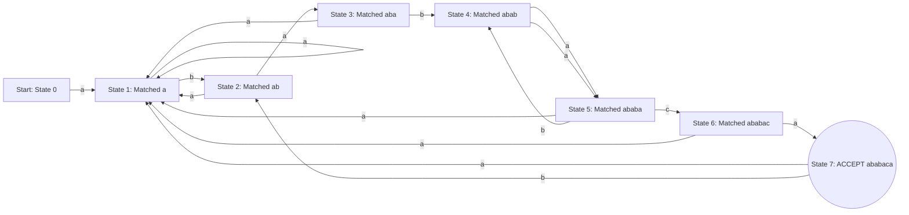

---

### 1. Formal Mathematical Definition of the Finite Automaton:

A String-Matching Automaton for pattern $P[0 \dots m-1]$ over alphabet $\Sigma$ is a 5-tuple $M = (Q, q_0, A, \Sigma, \delta)$:

1. **States ($Q$):** $Q = \{0, 1, 2, \dots, m\}$. State $k \in Q$ indicates that $k$ characters of pattern $P$ have been matched continuously.
2. **Start State ($q_0$):** State $0$ (zero characters matched).
3. **Accepting / Final State ($A$):** State $m$ (the full pattern $P$ of length $m$ has been matched).
4. **Input Alphabet ($\Sigma$):** The set of characters appearing in $T$ and $P$.
5. **Suffix Function ($\sigma(x)$):** Maps any string $x \in \Sigma^*$ to the length of the longest prefix of $P$ that is a suffix of $x$:
   $$\sigma(x) = \max \{ k : P_k \sqsubset x \}$$
   *(where $P_k$ denotes the prefix $P[0 \dots k-1]$ and $\sqsubset$ denotes the suffix relation).*
6. **State Transition Function ($\delta(q, a)$):** Defines the next state after reading character $a \in \Sigma$ in state $q$:
   $$\delta(q, a) = \sigma(P_q a)$$

---

### 2. Transition Table Construction — Worked Example:

- **Pattern ($P$):** `"ababaca"` ($m = 7$)
- **Alphabet ($\Sigma$):** $\{a, b, c\}$
- **States ($Q$):** $\{0, 1, 2, 3, 4, 5, 6, 7\}$

#### Transition Table Matrix ($\delta$):

| Current State $q$ | Matched Prefix $P_q$ | Next State on `'a'` | Next State on `'b'` | Next State on `'c'` | State Role |
| :-: | :-- | :-: | :-: | :-: | :-- |
| **0** | $\epsilon$ (Empty) | **1** | **0** | **0** | Initial State |
| **1** | `"a"` | **1** | **2** | **0** | Intermediate |
| **2** | `"ab"` | **3** | **0** | **0** | Intermediate |
| **3** | `"aba"` | **1** | **4** | **0** | Intermediate |
| **4** | `"abab"` | **5** | **0** | **0** | Intermediate |
| **5** | `"ababa"` | **1** | **4** | **6** | Intermediate |
| **6** | `"ababac"` | **7** | **0** | **0** | Intermediate |
| **7** | `"ababaca"` | **1** | **2** | **0** | **Accepting State** |

- **Partial Credit Logic Highlights:**
  - **State 5 on `'b'`:** We matched `"ababa"`. On input `'b'`, $P_5 b = \text{"ababab"}$. Longest matching prefix of $P$ is `"abab"` (length 4) $\implies \mathbf{\delta(5, b) = 4}$.
  - **State 7 on `'a'`:** Reaching state 7 matches `"ababaca"`. On input `'a'`, $P_7 a = \text{"ababacaa"}$. Longest matching prefix is `"a"` (length 1) $\implies \mathbf{\delta(7, a) = 1}$.

---

### 3. Worked Search Trace on Text $T = \text{"abababacaba"}$:

- **Text ($T$):** `"abababacaba"` ($n = 11$)
- **Pattern ($P$):** `"ababaca"` ($m = 7$)

| Text Index $i$ | Input Char $T[i]$ | Current State $q$ | Next State $q' = \delta(q, T[i])$ | Matched Substring / Action |
| :-: | :-: | :-: | :-: | :-- |
| **-** | Start | - | **0** | Initialize Automaton at State 0 |
| **0** | `a` | 0 | **1** | Matched `"a"` |
| **1** | `b` | 1 | **2** | Matched `"ab"` |
| **2** | `a` | 2 | **3** | Matched `"aba"` |
| **3** | `b` | 3 | **4** | Matched `"abab"` |
| **4** | `a` | 4 | **5** | Matched `"ababa"` |
| **5** | `b` | 5 | **4** | Expected `'c'`, got `'b'` $\implies$ Fallback to State 4 (`"abab"`) |
| **6** | `a` | 4 | **5** | Matched `"ababa"` again |
| **7** | `c` | 5 | **6** | Matched `"ababac"` |
| **8** | `a` | 6 | **7** | **State 7 (ACCEPT)! Full Pattern Matched ending at Index 8** |
| **9** | `b` | 7 | **2** | Overlap check: Fallback to State 2 (`"ab"`) |
| **10** | `a` | 2 | **3** | Matched `"aba"` |

- **Result:** Pattern `"ababaca"` found spanning text indices **2 to 8** (`text[2..8] = "ababaca"`).

---

### 4. Verified C++ Implementation:

```cpp
#include <iostream>
#include <vector>
#include <string>
using namespace std;

// Helper to compute longest proper prefix which is also a suffix of (str + c)
int maxSame(string str) {
    int ans = 0;
    int n = str.size();
    for (int len = 1; len < n; len++) {
        string pre = str.substr(0, len);
        string suf = str.substr(n - len, len);
        if (pre == suf) {
            ans = len;
        }
    }
    return ans;
}

void processFA(string text, string target) {
    int n = target.size();
    vector<vector<int>> slots(n + 1, vector<int>(26, 0));
    string updatedString = "";

    // Build transition table delta[state][char]
    for (int i = 0; i <= n; i++) {
        string originalCpy = updatedString;
        for (int c = 0; c < 26; c++) {
            char curr = 'a' + c;
            if (i < n && curr == target[i]) {
                slots[i][c] = i + 1; // Advance match
            } else {
                slots[i][c] = maxSame(originalCpy + curr); // Fallback match
            }
        }
        if (i < n) {
            updatedString += target[i];
        }
    }

    // Search text in O(n) single pass
    int m = text.size();
    int q = 0; // Current state
    for (int i = 0; i < m; i++) {
        int qnext = text[i] - 'a';
        q = slots[q][qnext];
        if (q == n) {
            cout << "Pattern found from index " << (i - n + 1) << " to " << i << endl;
            cout << "Matched Substring: " << text.substr(i - n + 1, n) << endl;
        }
    }
}

int main() {
    string text = "abababacaba";
    string pattern = "ababaca";
    processFA(text, pattern);
    return 0;
}
```

---

### 5. Time & Space Complexity Analysis:

- **Matching Time Complexity:** $\Theta(n)$ **Strictly Linear**. Each character of $T$ is read exactly once without any backtracking.
- **Transition Table Preprocessing Time:**
  - Naive approach (using `maxSame` prefix-suffix matching): $O(m^3 \cdot \Sigma)$.
  - Optimized approach (using KMP $\pi$ function): $O(m \cdot \Sigma)$.
- **Auxiliary Space Complexity:** $O(m \cdot \Sigma)$ to store the 2D Transition Matrix `TF[m+1][Σ]`.

---

### 6. Advantages & Disadvantages of Finite Automata String Matching:

| Advantages | Disadvantages |
| :-- | :-- |
| **Strictly Linear Search:** Guarantees $\Theta(n)$ text processing time regardless of text structure. | **Preprocessing Cost:** Building the transition table takes $O(m \cdot \Sigma)$ extra time. |
| **Zero Backtracking:** Ideal for streaming network traffic (e.g., DPI, Intrusion Detection Systems). | **High Memory Overhead:** Large alphabets $\Sigma$ (e.g. Unicode/UTF-8) consume huge matrix memory. |
| **Hardware Execution:** Easily synthesized directly into FPGA / ASIC logic gates. | More complex to implement compared to Naive or KMP algorithms. |

---

## Q6. Worked Numerical Problem: Construct the Finite Automaton for Pattern P = "abcabcabe" over Alphabet Σ = {a, b, c, e}. Derive all state transitions δ(q, x), draw the Transition Table and State Diagram, and trace Text T = "abcabcababcabe". (7 Marks)

**Answer:**

### 1. Problem Configuration:
- **Pattern ($P$):** `"abcabcabe"`
- **Pattern Length ($m$):** $9$
- **Alphabet ($\Sigma$):** $\{a, b, c, e\}$
- **Total States ($Q$):** $m + 1 = 10$ states $\implies Q = \{q_0, q_1, q_2, q_3, q_4, q_5, q_6, q_7, q_8, q_9\}$
- **Initial State:** $q_0$ ($\epsilon$)
- **Accepting State:** $q_9$ (`"abcabcabe"`)

---

### 2. State Transition Function Calculations ($\delta(q, x) = \sigma(P_q x)$):

- **State $q_0$ ($\epsilon$):** $\delta(q_0, a)=q_1$, $\delta(q_0, b)=q_0$, $\delta(q_0, c)=q_0$, $\delta(q_0, e)=q_0$.
- **State $q_1$ (`"a"`):** $\delta(q_1, a)=q_1$, $\delta(q_1, b)=q_2$, $\delta(q_1, c)=q_0$, $\delta(q_1, e)=q_0$.
- **State $q_2$ (`"ab"`):** $\delta(q_2, a)=q_1$, $\delta(q_2, b)=q_0$, $\delta(q_2, c)=q_3$, $\delta(q_2, e)=q_0$.
- **State $q_3$ (`"abc"`):** $\delta(q_3, a)=q_4$, $\delta(q_3, b)=q_0$, $\delta(q_3, c)=q_0$, $\delta(q_3, e)=q_0$.
- **State $q_4$ (`"abca"`):** $\delta(q_4, a)=q_1$, $\delta(q_4, b)=q_5$, $\delta(q_4, c)=q_0$, $\delta(q_4, e)=q_0$.
- **State $q_5$ (`"abcab"`):** $\delta(q_5, a)=q_1$, $\delta(q_5, b)=q_0$, $\delta(q_5, c)=q_6$, $\delta(q_5, e)=q_0$.
- **State $q_6$ (`"abcabc"`):** $\delta(q_6, a)=q_7$, $\delta(q_6, b)=q_0$, $\delta(q_6, c)=q_0$, $\delta(q_6, e)=q_0$.
- **State $q_7$ (`"abcabca"`):** $\delta(q_7, a)=q_1$, $\delta(q_7, b)=q_8$, $\delta(q_7, c)=q_0$, $\delta(q_7, e)=q_0$.
- **State $q_8$ (`"abcabcab"`):** $\delta(q_8, a)=q_1$, $\delta(q_8, b)=q_0$, $\delta(q_8, c)=q_6$, $\delta(q_8, e)=q_9$ **(ACCEPT)**.
- **State $q_9$ (`"abcabcabe"` - Accept):** $\delta(q_9, a)=q_1$, $\delta(q_9, b)=q_0$, $\delta(q_9, c)=q_0$, $\delta(q_9, e)=q_0$.

---

### 3. Complete State Transition Table ($\delta$):

| State $q$ | Matched Prefix $P_q$ | Next State on `'a'` | Next State on `'b'` | Next State on `'c'` | Next State on `'e'` | State Role |
| :-: | :-- | :-: | :-: | :-: | :-: | :-- |
| **$q_0$** | $\epsilon$ (Empty) | **$q_1$** | **$q_0$** | **$q_0$** | **$q_0$** | Initial State |
| **$q_1$** | `"a"` | **$q_1$** | **$q_2$** | **$q_0$** | **$q_0$** | Intermediate |
| **$q_2$** | `"ab"` | **$q_1$** | **$q_0$** | **$q_3$** | **$q_0$** | Intermediate |
| **$q_3$** | `"abc"` | **$q_4$** | **$q_0$** | **$q_0$** | **$q_0$** | Intermediate |
| **$q_4$** | `"abca"` | **$q_1$** | **$q_5$** | **$q_0$** | **$q_0$** | Intermediate |
| **$q_5$** | `"abcab"` | **$q_1$** | **$q_0$** | **$q_6$** | **$q_0$** | Intermediate |
| **$q_6$** | `"abcabc"` | **$q_7$** | **$q_0$** | **$q_0$** | **$q_0$** | Intermediate |
| **$q_7$** | `"abcabca"` | **$q_1$** | **$q_8$** | **$q_0$** | **$q_0$** | Intermediate |
| **$q_8$** | `"abcabcab"` | **$q_1$** | **$q_0$** | **$q_6$** | **$q_9$** | Pre-Accepting |
| **$q_9$** | `"abcabcabe"` | **$q_1$** | **$q_0$** | **$q_0$** | **$q_0$** | **Accepting State** |

---

### 4. State Transition Diagram:

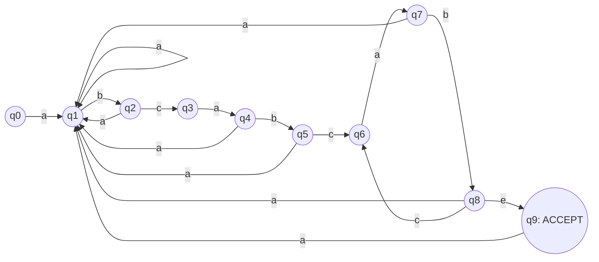

---

### 5. Execution Trace on Text $T = \text{"abcabcababcabe"}$:

| Index $i$ | Input Char $T[i]$ | Current State | Next State $\delta(q, T[i])$ | Matched Prefix |
| :-: | :-: | :-: | :-: | :-- |
| **-** | Start | - | **$q_0$** | $\epsilon$ |
| **0** | `a` | $q_0$ | **$q_1$** | `"a"` |
| **1** | `b` | $q_1$ | **$q_2$** | `"ab"` |
| **2** | `c` | $q_2$ | **$q_3$** | `"abc"` |
| **3** | `a` | $q_3$ | **$q_4$** | `"abca"` |
| **4** | `b` | $q_4$ | **$q_5$** | `"abcab"` |
| **5** | `c` | $q_5$ | **$q_6$** | `"abcabc"` |
| **6** | `a` | $q_6$ | **$q_7$** | `"abcabca"` |
| **7** | `b` | $q_7$ | **$q_8$** | `"abcabcab"` |
| **8** | `a` | $q_8$ | **$q_1$** | `"a"` |
| **9** | `b` | $q_1$ | **$q_2$** | `"ab"` |
| **10** | `c` | $q_2$ | **$q_3$** | `"abc"` |
| **11** | `a` | $q_3$ | **$q_4$** | `"abca"` |
| **12** | `b` | $q_4$ | **$q_5$** | `"abcab"` |
| **13** | `e` | $q_5$ | **$q_0$** | $\epsilon$ |

---

## Q7. What are Class P and Class NP in computational complexity theory? Explain Decision vs Optimization problems, Deterministic vs Nondeterministic Polynomial time, real-world analogies (Bank Vault, Sudoku, Jigsaw), standard NP examples, the relationship $P \subseteq NP$, and the $P$ vs $NP$ Millennium Prize Problem. (7 Marks)

**Answer:**

In computational complexity theory, **Class P** and **Class NP** categorize decision problems according to the computational resources (time) required to **solve** them or **verify** their proposed solutions on deterministic and nondeterministic computing models.

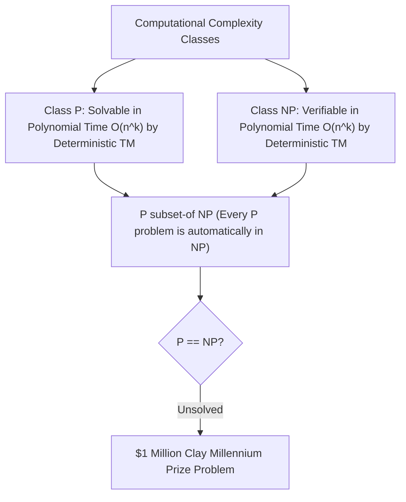

---

### 1. Decision Problems vs Optimization Problems:

Theoretical complexity classes are formally defined strictly over **Decision Problems** (problems requiring a binary **YES** or **NO** answer).

| Feature / Dimension | Optimization Problem | Decision Problem (Complexity Model) |
| :--- | :--- | :--- |
| **Goal / Output** | Find the absolute best or optimal value (e.g., shortest route, maximum profit). | Determine whether a solution exists satisfying a given threshold $K$ (**YES/NO**). |
| **TSP Example** | "Find the route visiting all $n$ cities with minimum total distance." | "Is there a route visiting all $n$ cities with total distance $\le K$ miles?" |
| **Mathematical Role** | Hard to standardize mathematically. | Provides clean formal language recognition models ($\Sigma^*$). |

*Rule:* If the decision version of a problem can be solved in polynomial time, the problem belongs to Class P.

---

### 2. Class P (Polynomial Time):

- **Formal Definition:** Class P is the set of all decision problems solvable by a **Deterministic Turing Machine (DTM)** in polynomial time $O(n^k)$ for some constant $k \ge 0$.
- **Tractability:** Class P represents the threshold of **tractable (feasible)** computation.

#### Key Characteristics of Class P:
1. **Deterministic Solvability:** Given identical inputs, a deterministic algorithm executes the exact same deterministic sequence of steps.
2. **Polynomial Growth Rate:** Functions such as $O(n)$, $O(n \log n)$, $O(n^2)$, and $O(n^3)$ scale reasonably as input size $n$ grows, unlike exponential functions like $O(2^n)$.
3. **Closure Properties:** Polynomial time is closed under addition, multiplication, and composition (combining polynomial algorithms yields a polynomial algorithm).

#### Standard Examples of Problems in Class P:
- **Searching:** Linear Search $O(n)$, Binary Search $O(\log n)$.
- **Sorting:** Merge Sort, Quick Sort, Heap Sort (all $O(n \log n)$).
- **Graph Algorithms:** Shortest Path (Dijkstra's Algorithm $O(V^2)$ / $O(E + V \log V)$), Minimum Spanning Tree (Kruskal's / Prim's Algorithm).
- **Linear Algebra:** Matrix Multiplication (Strassen's Algorithm $O(n^{2.81})$).

---

### 3. Class NP (Nondeterministic Polynomial Time):

- **Formal Definition:** Class NP is the set of all decision problems whose proposed solution (**certificate** or **hint**) can be **verified** by a Deterministic Turing Machine in polynomial time $O(n^k)$.
- **Alternative Definition:** Class NP is the set of decision problems solvable in polynomial time by a theoretical **Nondeterministic Turing Machine (NDTM)**, which non-deterministically "guesses" a candidate solution and deterministically verifies it in polynomial time.
- **Misconception Alert:** NP does **NOT** mean "Non-Polynomial". It stands for **Nondeterministic Polynomial time**.

#### Everyday Analogies for Class NP:

| Analogy | Hard to Solve from Scratch | Easy to Verify Given a Certificate |
| :--- | :--- | :--- |
| **The Bank Vault** | Guessing a 20-digit combination brute-force takes millions of years ($O(10^n)$). | Entering a whispered 4-digit code and checking if the handle turns takes 5 seconds ($O(1)$). |
| **Sudoku Puzzle** | Filling an empty $9 \times 9$ or $N \times N$ grid requires extensive backtracking search. | Scanning a completed grid row-by-row, column-by-column to confirm digits 1–9 takes $O(N^2)$ time. |
| **Jigsaw Puzzle** | Assembling 10,000 blank chaotic pieces takes days. | Looking at a fully assembled picture instantly confirms if all pieces fit. |
| **Wedding Seating Chart** | Arranging 100 guests while honoring enemy/friend constraints is a combinatorial headache. | Scanning a completed chart to ensure no conflicting pairs share a table is instant. |

---

### 4. Standard Examples of Problems in Class NP:

1. **Travelling Salesperson Problem (TSP Decision Version):**
   - *Question:* Is there a tour visiting all $n$ cities with total cost $\le K$?
   - *Verification:* Add the edge weights along the candidate tour and verify total sum $\le K$ in $O(n)$ time.
2. **Subset Sum Problem:**
   - *Question:* Given a set of integers, is there a non-empty subset summing to zero?
   - *Verification:* Add up the elements in the given subset and check if sum equals $0$ in $O(n)$ time.
3. **Graph Coloring (3-Coloring):**
   - *Question:* Can a graph $G$ be colored using $3$ colors such that no adjacent vertices share a color?
   - *Verification:* Iterate over all edges $(u, v)$ and check if $\text{color}(u) \neq \text{color}(v)$ in $O(V + E)$ time.

---

### 5. Mathematical Proof of $P \subseteq NP$:

**Theorem:** Every problem in Class P is also in Class NP ($P \subseteq NP$).

**Proof:**
1. Let $L \in P$. By definition, there exists a deterministic algorithm $A$ that decides whether an input $x \in L$ in polynomial time $O(n^k)$.
2. To prove $L \in NP$, we must show there exists a polynomial-time verifier $V(x, y)$ that verifies a certificate $y$ for input $x$.
3. We construct verifier $V(x, y)$ as follows:
   - Ignore the certificate $y$.
   - Run algorithm $A$ on input $x$.
   - If $A(x)$ returns YES, output ACCEPT; otherwise output REJECT.
4. Since $A(x)$ runs in polynomial time $O(n^k)$, verifier $V(x, y)$ also runs in polynomial time.
5. Hence, any decision problem solvable in polynomial time is automatically verifiable in polynomial time $\implies P \subseteq NP$. $\blacksquare$

---

### 6. The $P$ vs $NP$ Millennium Prize Problem:

- **The Question:** Does $P = NP$ or $P \neq NP$?
- **Implications:**
  - If $P = NP$: Finding a solution from scratch is computationally no harder than verifying a solution. Cryptography (RSA/AES) would collapse, optimization would be instantaneous.
  - If $P \neq NP$ (widely believed): Problems exist that are fundamentally hard to solve from scratch, despite being easy to check.
- **Millennium Prize:** The Clay Mathematics Institute listed $P \text{ vs } NP$ as one of the 7 Millennium Prize Problems, offering a **$1 Million reward** for a correct proof.

---

### 7. Summary Points to Remember:

| Concept | Key Definition | Complexity / Relation |
| :--- | :--- | :--- |
| **Class P** | Decision problems solvable in polynomial time by a deterministic TM. | $O(n^k)$ Search / Sort / Shortest Path |
| **Class NP** | Decision problems verifiable in polynomial time given a certificate. | $O(n^k)$ Verification / TSP / Subset Sum |
| **Subsets** | $P \subseteq NP$ | Solvable $\implies$ Verifiable |
| **P vs NP** | Open Millennium Prize Problem ($1 Million) | Most computer scientists believe $P \neq NP$ |

---

## Q8. What is Polynomial-Time Reduction ($A \le_P B$)? Define NP-Hard and NP-Complete problems, state the Cook-Levin Theorem, outline the 4-step NP-Completeness proof framework, and present a complete worked example reducing Parcel Delivery to TSP. (7 Marks)

**Answer:**

**Polynomial-Time Reduction** is a fundamental theoretical technique used to compare the relative difficulty of computational problems. It allows computer scientists to prove that a new problem is "at least as hard as" a known hard problem without solving either problem from scratch.


---

### 1. Formal Definition of Polynomial-Time Reduction ($A \le_P B$):

A decision problem $A$ is **polynomial-time reducible** to a decision problem $B$ (denoted as $A \le_P B$, read "$A$ reduces to $B$ in polynomial time") if there exists a polynomial-time computable function $f: \Sigma^* \to \Sigma^*$ such that for every input instance $x$:

$$x \in A \iff f(x) \in B$$

and the transformation function $f(x)$ runs in $O(n^k)$ time for some constant $k \ge 0$.

#### Meaning of $A \le_P B$:
- Problem $B$ is **at least as hard as** Problem $A$.
- If we have an efficient solver for $B$, we can use it to solve $A$ efficiently.
- If $A$ is known to be hard, then $B$ **must also be hard**.

---

### 2. Definitions of NP-Hard and NP-Complete:

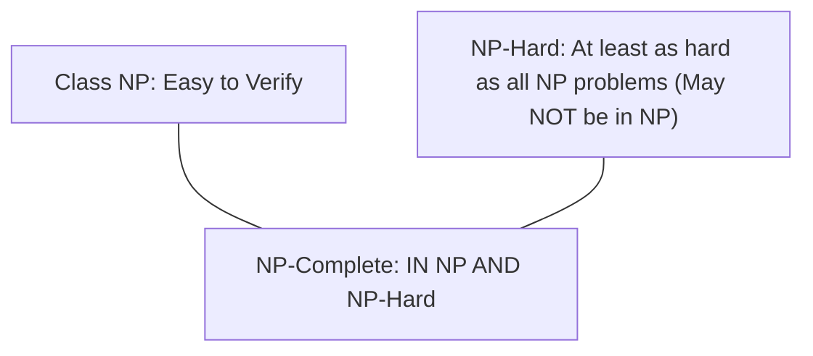

#### A. NP-Hard:
A decision or optimization problem $B$ is **NP-Hard** if every problem $L \in NP$ can be polynomial-time reduced to $B$:
$$\forall L \in NP, \quad L \le_P B$$
*Note:* An NP-Hard problem does **not** need to belong to Class NP (it can be an optimization problem or undecidable problem like the Halting Problem).

#### B. NP-Complete (NPC):
A decision problem $B$ is **NP-Complete** if it satisfies **two strict conditions**:
1. **$B \in NP$** (a candidate solution can be verified in polynomial time).
2. **$B$ is NP-Hard** ($\forall L \in NP, L \le_P B$, or for a known NP-Complete problem $X$, $X \le_P B$).

---

### 3. The Cook-Levin Theorem:

- **Theorem Statement:** The **Boolean Satisfiability Problem (SAT)** is NP-Complete.
- **Historical Significance:** Proven independently by Stephen Cook (1971) and Leonid Levin (1973), this theorem established the **first ever NP-Complete problem** without needing an existing NP-Complete problem to reduce from.
- **Impact:** Cook showed that any Nondeterministic Turing Machine running in polynomial time can be encoded into a massive Boolean logic formula. If SAT could be solved in polynomial time, then $P = NP$.

---

### 4. The 4-Step Framework to Prove Problem $B$ is NP-Complete:

To prove a new problem $B$ is NP-Complete, follow this mandatory 4-step proof structure:

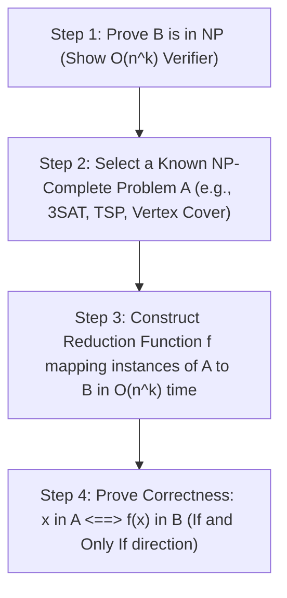

1. **Step 1 (NP Membership):** Prove $B \in NP$ by showing that a given certificate $y$ for instance $x$ can be verified in polynomial time $O(n^k)$.
2. **Step 2 (Select Known Hard Problem):** Select an established NP-Complete problem $A$ (e.g., 3SAT, Clique, Vertex Cover, TSP).
3. **Step 3 (Construct Reduction Function):** Define a polynomial-time mapping function $f$ that transforms any instance $x$ of $A$ into an instance $f(x)$ of $B$ in $O(n^k)$ time.
4. **Step 4 (Prove Equivalence):** Prove that instance $x$ has a YES answer in $A$ **if and only if** instance $f(x)$ has a YES answer in $B$ ($x \in A \iff f(x) \in B$).

---

### 5. Worked Real-World Reduction Example: Parcel Delivery to TSP

#### A. Problem Setup:
- **Known Hard Problem ($A$):** Travelling Salesperson Problem (TSP Decision Version) — Given $N$ cities, distance matrix $D$, and threshold $K$, is there a tour visiting every city once with distance $\le K$?
- **New Unknown Problem ($B$):** Parcel Delivery Time Limit Problem — Given $N$ delivery stops, time matrix $T$, and time limit $L$, can a driver complete all deliveries and return to base within total time $\le L$?

#### B. Reduction Steps ($A \le_P B$):
1. **Instance Mapping ($f$):**
   - Map each city in TSP to a delivery stop in Parcel Delivery.
   - Map the travel distance $D[i][j]$ between cities directly to travel time $T[i][j] = D[i][j]$ between stops.
   - Set total time limit $L = K$.
2. **Polynomial Time Check:** The conversion step copies $N$ nodes and $N^2$ matrix entries, taking $O(N^2)$ polynomial time.
3. **Equivalence Proof:**
   - If TSP has a tour of distance $\le K$, the driver can follow the exact same city sequence to complete deliveries in time $\le L$ (**YES $\implies$ YES**).
   - If Parcel Delivery has a valid route in time $\le L$, that exact route forms a valid TSP tour of distance $\le K$ (**YES $\impliedby$ YES**).

*Conclusion:* Since TSP $\le_P$ Parcel Delivery in $O(N^2)$ time, **Parcel Delivery is NP-Hard** (and since it is in NP, it is **NP-Complete**).

---

### 6. Summary Comparison Matrix of Complexity Classes:

| Complexity Class | Defined By | Solvable in $O(n^k)$? | Verifiable in $O(n^k)$? | Canonical Example |
| :--- | :--- | :--- | :--- | :--- |
| **Class P** | Deterministic TM | **Yes** | **Yes** | Shortest Path (Dijkstra), Sorting |
| **Class NP** | Verifier / Nondeterministic TM | Unknown (No known algorithm) | **Yes** | TSP Decision, Subset Sum |
| **NP-Hard** | Reduction from all NP problems | **No** (unless $P=NP$) | Not necessarily | Halting Problem, TSP Optimization |
| **NP-Complete** | In NP + NP-Hard | Unknown (No known algorithm) | **Yes** | 3SAT, TSP Decision, Vertex Cover |

---

## Q9. What is an NP-Hard Problem? Explain its formal definition using polynomial-time reduction, key characteristics (no fast verification requirement, optimization versions, unbounded difficulty ceiling), real-world examples (TSP Optimization, Knapsack Optimization, Halting Problem), side-by-side comparison with NP-Complete problems, and the 4-class Venn Diagram. (7 Marks)

**Answer:**

An **NP-Hard Problem** (Non-deterministic Polynomial-time Hard) is a computational problem that is **at least as hard as the hardest problems in Class NP**. 

Formally, a problem $X$ (which may be a decision, optimization, or search problem) is **NP-Hard** if **every problem $L \in NP$ can be reduced to $X$ in polynomial time** ($L \le_P X$).

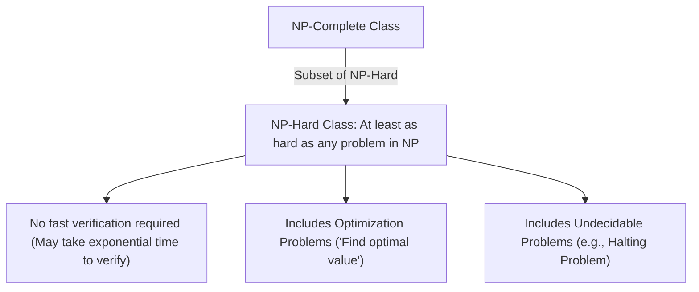

---

### 1. The Magic Machine Analogy for NP-Hardness:

Suppose you possess a hypothetical **"Magic Machine"** (an oracle) that solves Problem $X$ in $O(1)$ time. If you can take any problem $Y \in NP$ and transform it in polynomial time into an instance of $X$, then $X$ **must be at least as hard as $Y$**. Since this transformation holds for *every* problem in NP, Problem $X$ sits at the absolute ceiling of difficulty.

```
NP-HARDness via REDUCTION

   Arbitrary Problem Y in NP
             |
             |  Polynomial-Time Reduction f(Y) in O(n^k)
             v
   Input for Magic Machine solving Problem X
             |
             v
   Result for Problem Y obtained for free!

   Conclusion: Problem X is AT LEAST AS HARD as all NP problems combined.
```

---

### 2. Key Characteristics of NP-Hard Problems:

| # | Characteristic | Technical Breakdown & Meaning |
| :-: | :-- | :-- |
| **(i)** | **No Fast Verification Requirement** | Unlike Class NP, an NP-Hard problem does **NOT** require a proposed solution to be verifiable in polynomial time $O(n^k)$. Verifying a solution may take exponential time $O(2^n)$ or be mathematically impossible. |
| **(ii)** | **Beyond Binary Decision Problems** | While P, NP, and NP-Complete are strictly restricted to **Decision Problems** (YES/NO answers), NP-Hard encompasses **Optimization Problems** ("Find the absolute minimum distance or maximum value"). |
| **(iii)** | **Unbounded Difficulty Ceiling** | There is no upper bound to how hard an NP-Hard problem can be. It includes **undecidable problems** (such as Alan Turing's **Halting Problem**) which no computer can ever solve for all inputs. |
| **(iv)** | **Superset Relationship** | Every NP-Complete problem is NP-Hard, but **NOT** every NP-Hard problem is NP-Complete ($NPC = NP \cap NP\text{-Hard}$). |

---

### 3. Real-World Examples of NP-Hard Problems:

#### A. Travelling Salesperson Problem (Optimization Version):
- **Problem:** Given $N$ cities and distance matrix $D$, find the **absolute shortest route** visiting every city exactly once and returning home.
- **Why it is NP-Hard:** If someone hands you a route and claims "this is the shortest," you **cannot verify** their claim in polynomial time without exhaustively searching all $(N-1)! / 2$ routes to prove no shorter route exists.

#### B. Knapsack Optimization Problem:
- **Problem:** Given a backpack capacity $W$ and $N$ items with weights $w_i$ and values $v_i$, find the **exact combination of items** that maximizes total value without exceeding capacity $W$.
- **Why it is NP-Hard:** It requires finding the absolute peak value. Verifying optimality requires exploring the full combination tree.

#### C. The Halting Problem (Undecidable Problem):
- **Problem:** Given an arbitrary computer program $P$ and input $x$, determine whether $P$ will eventually halt or loop infinitely.
- **Why it is NP-Hard:** Proven by Alan Turing (1936) to be **undecidable** (impossible to solve by any algorithm). It lies strictly outside NP, yet mathematically satisfies the reduction condition $L \le_P \text{Halting}$, placing it firmly in NP-Hard.

---

### 4. Side-by-Side Comparison: Decision (NP-Complete) vs Optimization (NP-Hard):

| Base Problem | NP-Complete Version (Decision) | NP-Hard Version (Optimization) |
| :--- | :--- | :--- |
| **Travelling Salesperson** | "Is there a route of total distance $\le 5,000 \text{ km}$?" $\implies$ **Easy to verify** given a route. | "What is the *absolute shortest* route possible?" $\implies$ **Cannot verify** without searching all routes. |
| **Knapsack Problem** | "Can we fit items worth at least $\$100$ within $15 \text{ kg}$?" $\implies$ **Easy to verify** by sum. | "What is the *maximum possible* value combination?" $\implies$ **Cannot verify** without exhaustive search. |

*Core Rule:* Asking **"Is there a solution under limit K?"** (Decision) $\to$ **NP-Complete**. Asking **"What is the absolute best solution?"** (Optimization) $\to$ **NP-Hard**.

---

### 5. The 4-Class Complexity Venn Diagram:

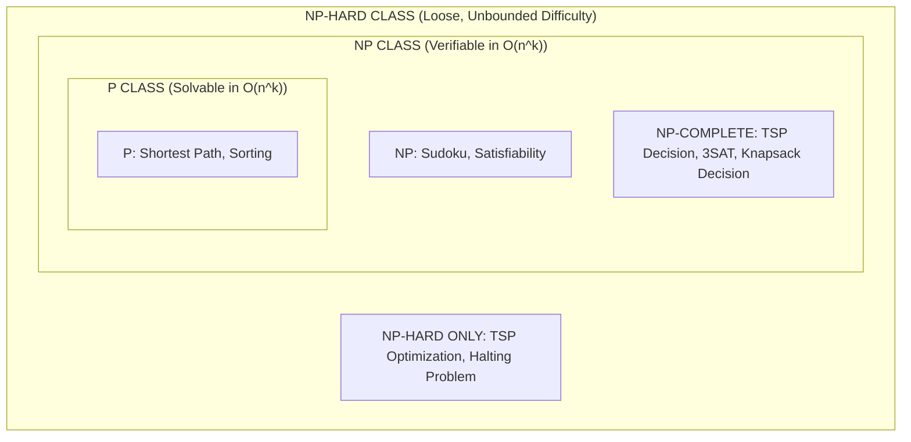

- **P:** Solvable from scratch in $O(n^k)$.
- **NP:** Verifiable given a certificate in $O(n^k)$.
- **NP-Complete ($NPC = NP \cap NP\text{-Hard}$):** Intersection of NP and NP-Hard (hardest problems in NP).
- **NP-Hard Outside NP:** Problems that are hard to solve AND hard (or impossible) to verify.

---

### 6. Summary Points to Remember:

| Concept | Key Fact |
| :--- | :--- |
| **NP-Hard Definition** | $\forall L \in NP, L \le_P X$. At least as hard as any problem in NP. |
| **Verification** | Does **NOT** require $O(n^k)$ verification. |
| **Problem Types** | Includes Decision, Optimization, and Undecidable problems. |
| **NP-Complete Relation** | $NP\text{-Complete} = NP \cap NP\text{-Hard}$. |

---

## Q10. What is an NP-Complete Problem? Explain its formal two-step criteria, the universal link of reducibility, real-world decision examples (TSP Decision, Knapsack Decision, Clique Problem), and how industry copes with NP-Completeness using Heuristics and Approximation Algorithms. (7 Marks)

**Answer:**

An **NP-Complete Problem** represents the **absolute hardest class of decision problems inside Class NP**. They represent a single, unified computational frontier: if a polynomial-time algorithm is ever discovered for *any single* NP-Complete problem, then *every* problem in NP can be solved in polynomial time ($P = NP$).

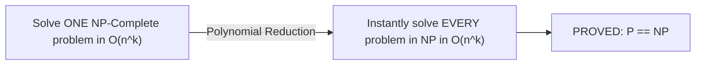

---

### 1. Formal Definition & The Two Strict Criteria:

A decision problem $B$ is **NP-Complete** if and only if it satisfies **both** of the following conditions:

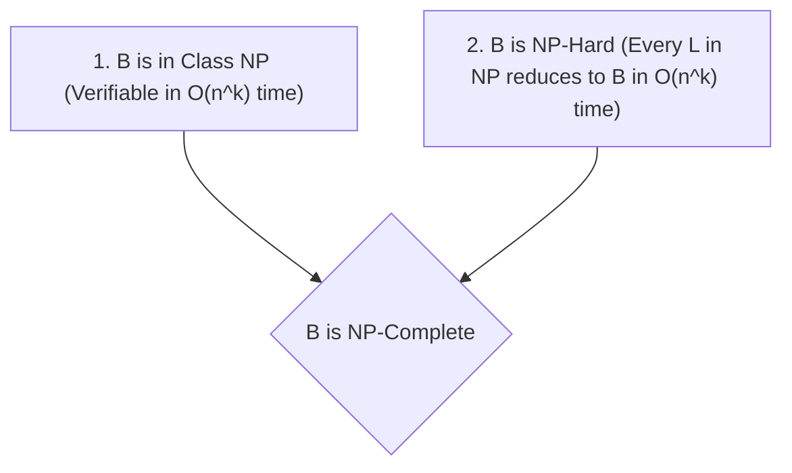

1. **NP Membership ($B \in NP$):** Given a candidate solution (certificate $y$), a deterministic computer can verify whether $y$ is valid in polynomial time $O(n^k)$.
2. **NP-Hardness ($B \in NP\text{-Hard}$):** Every problem $L \in NP$ can be reduced to $B$ in polynomial time ($L \le_P B$).

---

### 2. Key Characteristics of NP-Complete Problems:

| # | Characteristic | Meaning & Significance |
| :-: | :-- | :-- |
| **(i)** | **The Universal Link (Reducibility)** | All NP-Complete problems are equivalent up to polynomial-time reduction. They form an interconnected web where solving one solves all. |
| **(ii)** | **Exponential Solving Time** | Currently, all known exact algorithms for NP-Complete problems require exponential time $O(2^n)$ or $O(n!)$. |
| **(iii)** | **Asymmetry of Computation** | Massive gap between exponential creation time $O(2^n)$ and instantaneous polynomial verification time $O(n^k)$. |
| **(iv)** | **P vs NP Pivot** | NP-Complete problems are the exact pivot point of the $P \text{ vs } NP$ question. |

---

### 3. Detailed Real-World NP-Complete Decision Examples:

#### A. Travelling Salesperson Problem (Decision Version):
- **Scenario:** A delivery driver has $N = 20$ cities.
- **Decision Question:** Is there a route visiting all 20 cities with total travel distance $\le 5,000 \text{ km}$?
- **Hard Part (Solving):** Exhaustively searching $(N-1)! / 2$ permutations ($O(N!)$).
- **Easy Part (Verifying):** Given an ordered list of cities, sum the distances in $O(N)$ time and check if sum $\le 5,000$.

#### B. Knapsack Decision Problem:
- **Scenario:** Hiker with a $15 \text{ kg}$ weight capacity backpack and $N$ items.
- **Decision Question:** Can we select a subset of items that weighs $\le 15 \text{ kg}$ and yields total value $\ge \$100$?
- **Hard Part (Solving):** Checking $2^N$ possible item subsets ($O(2^N)$).
- **Easy Part (Verifying):** Given a subset of items, add their weights and values in $O(N)$ time.

#### C. The Clique Problem (Social Network Graph):
- **Scenario:** A social network graph $G = (V, E)$ where vertices represent users and edges represent friendships.
- **Decision Question:** Does there exist a clique (fully connected subgraph) of size $K = 10$?
- **Hard Part (Solving):** Searching $\binom{|V|}{K}$ vertex combinations ($O(|V|^K)$).
- **Easy Part (Verifying):** Given 10 usernames, check all $\binom{10}{2} = 45$ edge pairs in $O(1)$ time to confirm all are friends.

#### Summary Comparison Matrix of Examples:

| Problem | Decision Question (YES/NO) | Exact Solving Complexity | Certificate Verification Complexity |
| :--- | :--- | :--- | :--- |
| **TSP Decision** | Total distance $\le K$? | $O(N!) / O(2^N N^2)$ | $O(N)$ |
| **Knapsack Decision** | Weight $\le W$ and Value $\ge V$? | $O(2^N)$ | $O(N)$ |
| **Clique Problem** | Is there a mutual friendship group of size $K$? | $O(|V|^K)$ | $O(K^2)$ |

---

### 4. Practical Engineering Workarounds in Industry:

Because real-world applications (Amazon logistics routing, airline flight scheduling, VLSI chip layout) face NP-Complete problems daily, engineers use two primary practical strategies instead of exact exponential algorithms:

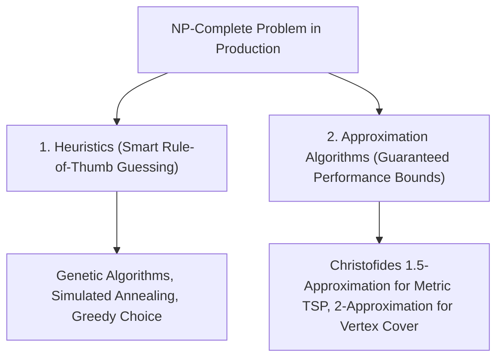

1. **Heuristics (Smart Rule-of-Thumb Search):**
   - *Concept:* Domain-specific search rules (e.g., Genetic Algorithms, Simulated Annealing, A* Search with admissible heuristics).
   - *Trade-off:* Finds excellent solutions very quickly in practice, but offers **no mathematical guarantee** of optimality or worst-case execution bounds.
2. **Approximation Algorithms (Provable Quality Guarantees):**
   - *Concept:* Polynomial-time algorithms that do not find the exact optimal value $OPT$, but guarantee a solution within a factor $\alpha$ of $OPT$ (e.g., $1.5 \cdot OPT$).
   - *Examples:*
     - **Christofides Algorithm:** Guarantees a tour distance $\le 1.5 \cdot OPT$ for Metric TSP in $O(n^3)$ polynomial time.
     - **2-Approximation for Vertex Cover:** Finds a vertex cover at most twice the optimal size ($2 \cdot OPT$) in linear $O(V + E)$ time.

---

### 5. Summary Comparison Matrix of all Complexity Classes:

| Class | Definition | Easy to Solve? | Easy to Verify? | Canonical Example |
| :--- | :--- | :-: | :-: | :--- |
| **P** | Solvable in $O(n^k)$ by DTM | **YES** | **YES** | Dijkstra Shortest Path, Merge Sort |
| **NP** | Verifiable in $O(n^k)$ by DTM | Unknown | **YES** | Sudoku, Subset Sum |
| **NP-Complete** | In NP AND NP-Hard | No (Needs $O(2^n)$) | **YES** | 3SAT, TSP Decision, Clique |
| **NP-Hard** | At least as hard as any NP problem | No (Needs $O(2^n)$) | **NO** (Not required) | TSP Optimization, Halting Problem |

---


