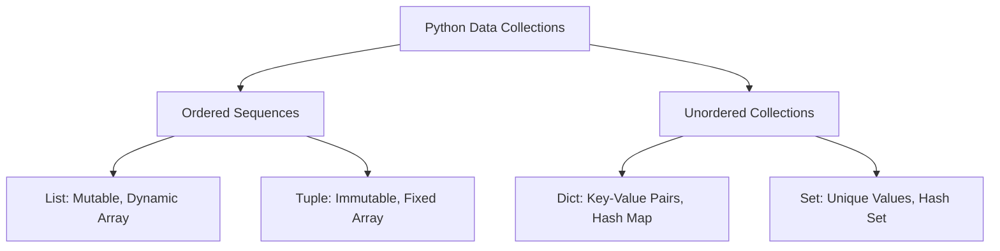
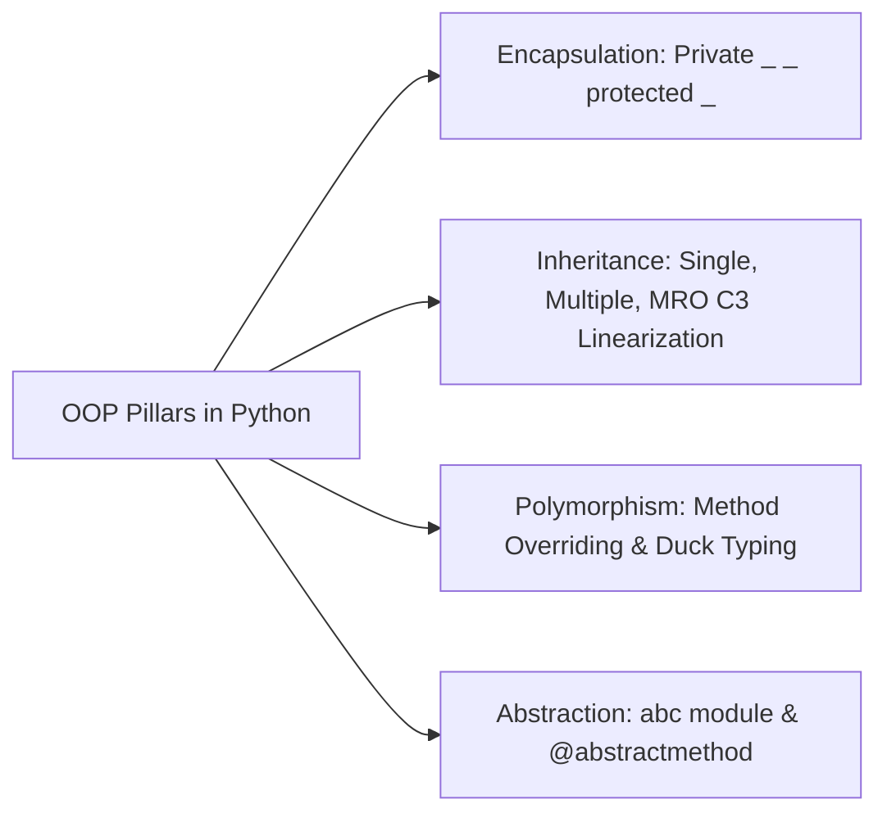
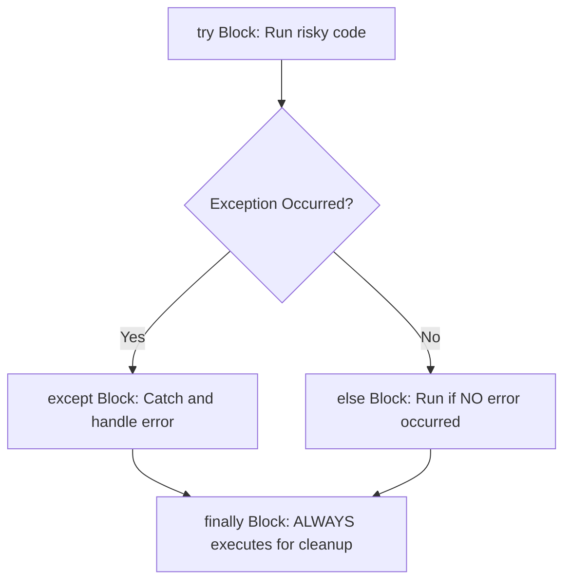

# Unit 1: Python Core, OOP & Advanced Fundamentals - Term End Exam Notes (All 7 Marks Questions)

---

## Q1. Compare Python Built-in Collections (List, Tuple, Dict, Set) in detail. Explain Memory Allocation and Slicing syntax. (7 Marks)

**Answer:**

Python provides four primary built-in collection data types for managing groups of values.



### 1. Direct Comparison Matrix:

| Criterion | List | Tuple | Dictionary (Dict) | Set |
| :--- | :--- | :--- | :--- | :--- |
| **Syntax** | `[1, 2, 3]` | `(1, 2, 3)` | `{"a": 1, "b": 2}` | `{1, 2, 3}` |
| **Mutability** | **Mutable** | **Immutable** | **Mutable** | **Mutable** |
| **Ordering** | Ordered | Ordered | Ordered (3.7+) | Unordered |
| **Duplicates** | Allowed | Allowed | Keys must be unique | **No Duplicates** |
| **Access Method**| Index `lst[0]` | Index `tup[0]` | Key `dct["key"]` | Iteration / `in` |
| **Lookup Time** | $O(n)$ search | $O(n)$ search | **$O(1)$ Hash Map** | **$O(1)$ Hash Set** |

---

### 2. Advanced Slicing Syntax:
```python
sequence[start:stop:step]
```
- `start`: Inclusive starting index.
- `stop`: Exclusive ending index.
- `step`: Step increment (negative step reverses sequence, e.g., `s[::-1]`).

---

## Q2. Explain Object-Oriented Programming (OOP) Pillars in Python (Inheritance, Polymorphism, Encapsulation, Decorators) with code. (7 Marks)

**Answer:**

Python is an object-oriented language where everything is an object.



```python
class Animal:
    def __init__(self, name):
        self._name = name  # Protected attribute (Encapsulation)

    def make_sound(self):  # Polymorphic method
        pass

class Dog(Animal):  # Inheritance
    def make_sound(self):
        return f"{self._name} says Woof!"

# Python Decorator Example
def log_execution(func):
    def wrapper(*args, **kwargs):
        print(f"Executing {func.__name__}...")
        return func(*args, **kwargs)
    return wrapper

@log_execution
def add(a, b):
    return a + b
```

- **MRO (Method Resolution Order):** Python resolves multiple inheritance attribute lookup using **C3 Linearization algorithm** (`Class.mro()`).

---

## Q3. Explain Exception Handling and File I/O in Python with Context Managers (`with` statement). (7 Marks)

**Answer:**



### Complete Code Example:

```python
# Custom Exception
class InvalidAgeException(Exception):
    pass

try:
    age = int(input("Enter age: "))
    if age < 18:
        raise InvalidAgeException("Must be 18 or older.")
except InvalidAgeException as e:
    print(f"Custom Error: {e}")
except ValueError:
    print("Error: Invalid numeric input.")
else:
    print("Age verified successfully!")
finally:
    print("Cleanup completed.")

# Resource Management via Context Manager
with open("data.txt", "w", encoding="utf-8") as f:
    f.write("Term End Exam Notes for Python & Django\n")
```

- The `with` statement calls `__enter__()` and guarantees calling `__exit__()` to close file resources even if exceptions occur.
