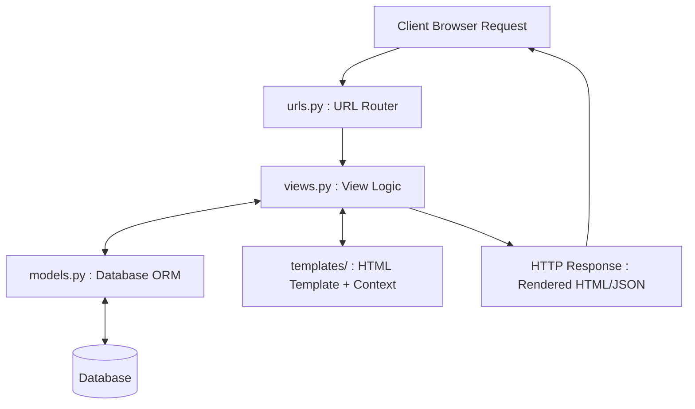
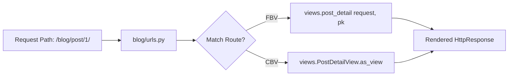

# Unit 2: Django Web Architecture, Views, URLs & Templates - Term End Exam Notes (All 7 Marks Questions)

---

## Q1. Explain Django Architecture: MVT (Model-View-Template) vs traditional MVC. (7 Marks)

**Answer:**

**Django** is a high-level Python web framework following the **MVT (Model-View-Template)** architectural pattern.



### MVT vs MVC Comparison:

| Feature | Traditional MVC Architecture | Django MVT Architecture |
| :--- | :--- | :--- |
| **Model** | Data & DB Layer | Data & DB Layer |
| **View** | UI Presentation Layer | Business Logic Layer (Acts like MVC Controller) |
| **Controller** | Business Logic & Routing | Django Framework itself handles routing (`urls.py`) |
| **Template** | Handled by View components | UI Presentation Layer (HTML + DTL) |

---

## Q2. Explain Django Project Structure, App Concept, and `settings.py` Configuration. (7 Marks)

**Answer:**

A **Project** is a collection of configurations and apps that make up a complete website. An **App** is a self-contained web application module performing a specific task.

```
myproject/
├── manage.py                # Command-line utility tool
├── myproject/               # Project configuration package
│   ├── settings.py          # Main settings & database configurations
│   ├── urls.py              # Root URL routing
│   ├── wsgi.py              # WSGI server entry point
│   └── asgi.py              # Async ASGI server entry point
└── blog/                    # Independent Django App
    ├── migrations/          # Database migration blueprint files
    ├── admin.py / apps.py / models.py / views.py / urls.py
```

### Key Configurations in `settings.py`:
- `INSTALLED_APPS`: List of active Django apps.
- `MIDDLEWARE`: Pipeline components processing requests/responses.
- `DATABASES`: Connection parameters for databases.
- `STATIC_URL` & `MEDIA_URL`: Locations for static files (CSS/JS) and user uploads.

---

## Q3. Discuss Function-Based Views (FBV) vs Class-Based Views (CBV) and URL Routing. (7 Marks)

**Answer:**



### 1. Function-Based Views (FBV):
Functions taking `request` as parameter and returning an `HttpResponse`.
```python
def post_detail(request, pk):
    post = get_object_or_404(Post, pk=pk)
    return render(request, 'blog/post_detail.html', {'post': post})
```

### 2. Class-Based Views (CBV):
Classes inheriting from generic views (`ListView`, `DetailView`, `CreateView`, `DeleteView`) to eliminate boilerplate code.
```python
class PostDetailView(DetailView):
    model = Post
    template_name = 'blog/post_detail.html'
    context_object_name = 'post'
```

---

## Q4. Explain Django Template Language (DTL): Variables, Tags, Filters, and Template Inheritance. (7 Marks)

**Answer:**

**Django Template Language (DTL)** allows embedding logic into HTML files securely.

### Key DTL Components:
- **Variables `{{ variable }}`:** Renders context data (e.g., `{{ user.username }}`).
- **Tags ``:** Controls loops, conditionals, and inheritance (``, ``, ``).
- **Filters `{{ variable|filter }}`:** Transforms values before display (e.g., `{{ date|date:"Y-m-d" }}`, `{{ title|upper }}`).
- **Template Inheritance:** Builds a base layout shell (`base.html`) extended by child templates via `` and ``.
