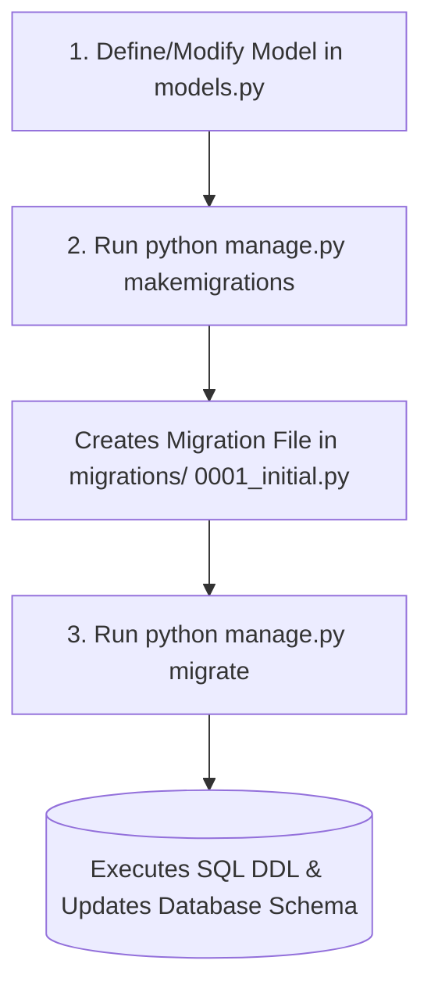
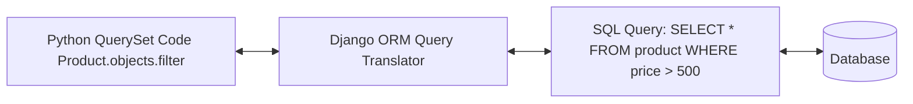
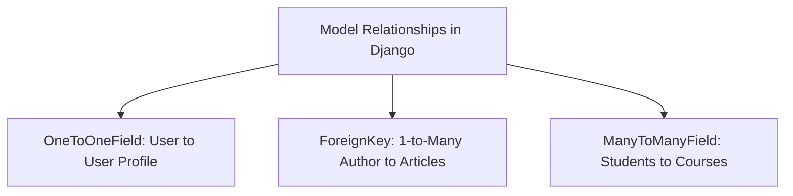

# Unit 3: Django ORM, Models, Migrations & Database Operations - Term End Exam Notes (All 7 Marks Questions)

---

## Q1. What are Django Models & Migrations? Explain the 3-Step Migration Process. (7 Marks)

**Answer:**

A **Django Model** is a Python class inheriting from `models.Model` where each attribute maps to a database column.



### The 3 Migration Steps:
1. **Define/Edit Model:** Write Python class definitions in `models.py`.
2. **`python manage.py makemigrations`:** Inspects models and generates migration blueprint files.
3. **`python manage.py migrate`:** Executes SQL DDL queries (`CREATE TABLE`, `ALTER TABLE`) to update the live database schema.

---

## Q2. Explain Django ORM & QuerySet CRUD Operations with code examples. (7 Marks)

**Answer:**

Django's **Object-Relational Mapper (ORM)** translates Python code into SQL queries transparently.



### CRUD Code Examples:
- **Create:** `Product.objects.create(title="Laptop", price=75000, category=cat)`
- **Read:** `Product.objects.filter(price__gt=50000)` / `Product.objects.get(id=1)`
- **Update:** `Product.objects.filter(stock=0).update(is_active=False)`
- **Delete:** `Product.objects.filter(is_active=False).delete()`

---

## Q3. Explain Model Relationships in Django (OneToOne, ForeignKey, ManyToMany) with real-world examples. (7 Marks)

**Answer:**



1. **OneToOneField:** Each record in Table A maps to exactly one record in Table B (e.g., `User` and `UserProfile`).
2. **ForeignKey:** 1-to-Many relationship (e.g., `Category` and `Product`).
3. **ManyToManyField:** Many-to-Many relationship (e.g., `Student` and `Course`).

---

## Q4. Explain Django Admin Interface Customization and how to solve the ORM N+1 Query Problem in Production. (7 Marks)

**Answer:**

### 1. Django Admin Customization:
```python
# admin.py
from django.contrib import admin
from .models import Product

@admin.register(Product)
class ProductAdmin(admin.ModelAdmin):
    list_display = ('id', 'title', 'price', 'stock', 'is_active', 'created_at')
    list_filter = ('is_active', 'category')
    search_fields = ('title',)
    list_editable = ('price', 'stock')
```

---

### 2. Solving the N+1 Query Problem in Production:
The **N+1 Query Problem** occurs when Django executes 1 query to fetch $N$ items, and then executes $N$ additional separate database queries to fetch related foreign key data inside a loop.

- **`select_related(*fields)`:** Used for **Single-Value Relationships** (`ForeignKey`, `OneToOne`). Performs an **SQL INNER JOIN** in a single database query.
- **`prefetch_related(*fields)`:** Used for **Multi-Value Relationships** (`ManyToManyField`, Reverse `ForeignKey`). Performs a separate batch lookup query and joins results in Python memory.

```python
# OPTIMIZED: 1 single SQL JOIN query instead of N+1 queries!
products = Product.objects.select_related('category').all()
for p in products:
    print(p.category.name) # Zero additional SQL queries executed!
```
